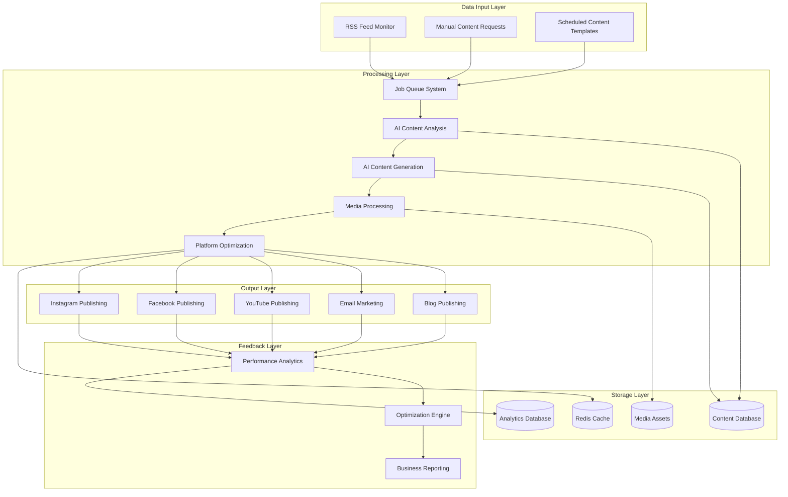

# AquaScene Data Flow Architecture
## Complete Content Generation to Social Media Posting Pipeline

**Document Version:** 1.0  
**Date:** August 6, 2025  
**Purpose:** Technical specification for end-to-end data flow  
**Audience:** Development team and technical stakeholders

---

## Overview

This document defines the complete data flow architecture for the AquaScene ecosystem, detailing how content moves from RSS feed discovery through AI generation to multi-platform social media posting, with comprehensive tracking and optimization feedback loops.

**Core Flow**: RSS Monitoring → AI Analysis → Content Generation → Media Processing → Multi-Platform Publishing → Analytics → Optimization

---

## System Architecture Overview



---

## Data Flow Stages

### Stage 1: Content Discovery and Ingestion

#### RSS Feed Monitoring
**Process**: Automated monitoring of aquascaping RSS feeds every hour

**Data Sources:**
- AGA (Aquatic Gardeners Association) news feed
- IAPLC (International Aquatic Plants Layout Contest) updates
- Green Aqua blog RSS
- Aquarium Co-Op content feed
- PlantedTank.net forum RSS
- Aquascaping subreddit RSS
- Industry news aggregators

**Data Structure:**
```javascript
interface RSSItem {
  id: string                    // Generated UUID
  feedId: string               // Source feed identifier
  title: string                // Original article title
  description: string          // Article summary/excerpt
  link: string                // Original article URL
  publishedAt: Date           // Publication timestamp
  author?: string             // Article author
  categories: string[]        // RSS categories
  content?: string            // Full article content (if available)
  images: string[]            // Extracted image URLs
  rawData: object             // Complete RSS item data
  discoveredAt: Date          // When we found this item
  processingStatus: 'pending' | 'processing' | 'completed' | 'failed'
}
```

**Processing Logic:**
```javascript
const processRSSFeeds = async () => {
  const activeFeeds = await database.rssFeeds.findActive();
  
  for (const feed of activeFeeds) {
    try {
      const parser = new Parser({
        customFields: {
          item: ['media:content', 'content:encoded', 'dc:creator']
        }
      });
      
      const feedData = await parser.parseURL(feed.url);
      const newItems = feedData.items.filter(item => 
        !await database.feedItems.exists(item.link)
      );
      
      for (const item of newItems) {
        const rssItem = {
          id: generateUUID(),
          feedId: feed.id,
          title: item.title,
          description: item.description,
          link: item.link,
          publishedAt: new Date(item.pubDate),
          author: item['dc:creator'] || item.creator,
          categories: item.categories || [],
          content: item['content:encoded'] || item.content,
          images: extractImages(item),
          rawData: item,
          discoveredAt: new Date(),
          processingStatus: 'pending'
        };
        
        await database.feedItems.insert(rssItem);
        await jobQueue.add('analyze-content', { rssItemId: rssItem.id });
      }
      
      await database.rssFeeds.updateLastPolled(feed.id, new Date());
    } catch (error) {
      logger.error(`RSS feed processing failed for ${feed.url}:`, error);
      await database.rssFeeds.markError(feed.id, error.message);
    }
  }
};
```

### Stage 2: AI Content Analysis and Relevance Scoring

#### Relevance Analysis
**Purpose**: Determine if RSS content is suitable for aquascaping audience

**AI Analysis Process:**
```javascript
const analyzeContentRelevance = async (rssItem) => {
  const prompt = `
    Analyze this aquascaping-related content for relevance and educational value:
    
    Title: ${rssItem.title}
    Description: ${rssItem.description}
    Content: ${rssItem.content?.substring(0, 2000)}
    
    Please provide:
    1. Relevance score (0-100): How relevant is this to aquascaping enthusiasts?
    2. Content type: competition, tutorial, news, product, showcase, technique
    3. Target audience: beginner, intermediate, advanced, all
    4. Key topics: Extract 3-5 key aquascaping topics
    5. Educational value: What can readers learn from this?
    6. Content angle suggestions: How to present this to our audience
    
    Format as JSON.
  `;
  
  const analysis = await openai.chat.completions.create({
    model: 'gpt-4',
    messages: [{ role: 'user', content: prompt }],
    temperature: 0.3
  });
  
  const result = JSON.parse(analysis.choices[0].message.content);
  
  // Store analysis results
  await database.feedItems.update(rssItem.id, {
    relevanceScore: result.relevanceScore,
    contentType: result.contentType,
    targetAudience: result.targetAudience,
    keyTopics: result.keyTopics,
    educationalValue: result.educationalValue,
    contentAngles: result.contentAngleSuggestions,
    processingStatus: result.relevanceScore >= 70 ? 'approved' : 'rejected'
  });
  
  // Queue high-relevance content for generation
  if (result.relevanceScore >= 70) {
    await jobQueue.add('generate-content', { 
      rssItemId: rssItem.id,
      priority: result.relevanceScore 
    });
  }
  
  return result;
};
```

**Data Enhancement:**
```javascript
interface AnalyzedContent extends RSSItem {
  relevanceScore: number       // 0-100 relevance score
  contentType: 'competition' | 'tutorial' | 'news' | 'product' | 'showcase' | 'technique'
  targetAudience: 'beginner' | 'intermediate' | 'advanced' | 'all'
  keyTopics: string[]         // Extracted key topics
  educationalValue: string    // What readers can learn
  contentAngles: string[]     // Suggested content approaches
  processingStatus: 'approved' | 'rejected' | 'pending_review'
  keyInsights: {
    techniques: string[]      // Specific techniques mentioned
    equipment: string[]       // Equipment or products mentioned
    species: string[]         // Plant/fish species mentioned
    difficulty: string        // Difficulty level assessment
  }
}
```

### Stage 3: Multi-Platform Content Generation

#### Content Generation Pipeline
**Process**: Create platform-optimized content from analyzed RSS items

**Platform-Specific Generation:**
```javascript
const generatePlatformContent = async (analyzedItem, platforms) => {
  const basePrompt = createBasePrompt(analyzedItem);
  const contentResults = {};
  
  for (const platform of platforms) {
    const platformPrompt = customizePlatformPrompt(basePrompt, platform);
    
    const content = await openai.chat.completions.create({
      model: 'gpt-4',
      messages: [{ role: 'user', content: platformPrompt }],
      temperature: 0.7
    });
    
    const generatedContent = JSON.parse(content.choices[0].message.content);
    
    // Post-process content for platform requirements
    contentResults[platform] = await postProcessContent(generatedContent, platform);
    
    // Store generated content
    await database.contentItems.insert({
      id: generateUUID(),
      sourceId: analyzedItem.id,
      platform: platform,
      contentType: generatedContent.type,
      title: generatedContent.title,
      body: generatedContent.body,
      hashtags: generatedContent.hashtags,
      mediaRequirements: generatedContent.mediaRequirements,
      publishingSchedule: generatedContent.optimalTiming,
      status: 'generated',
      createdAt: new Date()
    });
  }
  
  return contentResults;
};

const createBasePrompt = (item) => `
  You are an expert aquascaping content creator. Create educational, engaging content based on:
  
  Source: ${item.title}
  Key Topics: ${item.keyTopics.join(', ')}
  Target Audience: ${item.targetAudience}
  Educational Value: ${item.educationalValue}
  
  Focus on:
  - Educational value for aquascaping enthusiasts
  - Practical tips and techniques
  - Community engagement
  - Appropriate difficulty level for audience
  - SEO optimization for aquascaping keywords
`;

const customizePlatformPrompt = (basePrompt, platform) => {
  const platformSpecs = {
    instagram_post: {
      format: 'Instagram post with 5-10 slides',
      length: '2200 characters max per slide',
      hashtags: '20-30 aquascaping hashtags',
      callToAction: 'Encourage saves and shares'
    },
    instagram_reel: {
      format: 'Instagram Reel script',
      length: '30-60 seconds of content',
      hooks: 'Strong opening hook for stopping scroll',
      visualCues: 'Specific visual instructions'
    },
    facebook_post: {
      format: 'Facebook post',
      length: '1-3 paragraphs',
      engagement: 'Questions to encourage comments',
      linking: 'Include relevant external links'
    },
    blog_post: {
      format: 'Blog article',
      length: '1500-2500 words',
      structure: 'H1, H2, H3 headers with SEO keywords',
      sections: 'Introduction, main content, conclusion, FAQ'
    },
    email_newsletter: {
      format: 'Email newsletter section',
      length: '150-300 words',
      subject: 'Compelling subject line',
      personalization: 'Personalized greeting'
    }
  };
  
  return `${basePrompt}
  
  Platform: ${platform}
  Requirements: ${JSON.stringify(platformSpecs[platform], null, 2)}
  
  Return as JSON with all required fields for this platform.`;
};
```

**Generated Content Structure:**
```javascript
interface GeneratedContent {
  id: string
  sourceId: string             // Original RSS item ID
  platform: Platform
  contentType: ContentType
  title: string
  body: string
  hashtags: string[]
  mediaRequirements: {
    images: number             // Number of images needed
    imageStyle: string         // Image style requirements
    videos: number             // Number of videos needed
    videoLength: number        // Video length in seconds
    musicMood: string          // Background music mood
  }
  seoData: {
    metaTitle: string
    metaDescription: string
    keywords: string[]
    slug: string
  }
  publishingSchedule: {
    optimalDay: string         // Best day to publish
    optimalTime: string        // Best time to publish
    frequency: string          // Suggested posting frequency
  }
  engagement: {
    callToAction: string
    questions: string[]        // Engagement questions
    polls: string[]            // Suggested polls
  }
  status: 'generated' | 'media_processed' | 'scheduled' | 'published'
  createdAt: Date
  publishedAt?: Date
}
```

### Stage 4: Media Processing and Enhancement

#### Media Asset Management
**Process**: Select, optimize, and enhance media for generated content

**Image Processing Pipeline:**
```javascript
const processImageAssets = async (contentItem) => {
  const { mediaRequirements } = contentItem;
  const processedAssets = [];
  
  // 1. Select appropriate images
  const selectedImages = await selectImagesForContent(contentItem);
  
  for (const image of selectedImages) {
    // 2. Download and optimize
    const originalPath = await downloadImage(image.url);
    const optimizedPath = await optimizeImage(originalPath, {
      platform: contentItem.platform,
      dimensions: getPlatformDimensions(contentItem.platform),
      quality: 85,
      format: 'webp'
    });
    
    // 3. Add aquascaping-specific enhancements
    const enhancedPath = await enhanceAquascapeImage(optimizedPath, {
      brightness: 1.1,
      contrast: 1.05,
      saturation: 1.1,
      watermark: contentItem.platform !== 'instagram_reel'
    });
    
    // 4. Store processed asset
    const asset = await database.mediaAssets.insert({
      id: generateUUID(),
      contentId: contentItem.id,
      type: 'image',
      originalUrl: image.url,
      filePath: enhancedPath,
      fileName: path.basename(enhancedPath),
      fileSize: await getFileSize(enhancedPath),
      mimeType: 'image/webp',
      dimensions: await getImageDimensions(enhancedPath),
      processingMetadata: {
        platform: contentItem.platform,
        optimizations: ['resize', 'compress', 'enhance', 'watermark'],
        quality: 85
      },
      createdAt: new Date()
    });
    
    processedAssets.push(asset);
  }
  
  return processedAssets;
};

const selectImagesForContent = async (contentItem) => {
  // 1. Check for source images from RSS item
  const sourceItem = await database.feedItems.findById(contentItem.sourceId);
  let candidates = sourceItem.images || [];
  
  // 2. Search stock image databases
  const stockImages = await searchStockImages({
    keywords: contentItem.seoData.keywords,
    style: contentItem.mediaRequirements.imageStyle,
    license: 'creative_commons',
    minResolution: '1920x1080'
  });
  
  candidates = [...candidates, ...stockImages];
  
  // 3. Use AI to select best images
  const imageAnalysis = await analyzeImageSuitability(candidates, contentItem);
  
  // 4. Return top N images based on requirements
  return imageAnalysis
    .sort((a, b) => b.suitabilityScore - a.suitabilityScore)
    .slice(0, contentItem.mediaRequirements.images);
};
```

**Music Selection and Integration:**
```javascript
const selectBackgroundMusic = async (contentItem) => {
  if (!contentItem.mediaRequirements.musicMood) return null;
  
  // 1. Search YouTube Audio Library
  const ytMusic = await searchYouTubeAudioLibrary({
    mood: contentItem.mediaRequirements.musicMood,
    duration: contentItem.mediaRequirements.videoLength,
    genre: 'ambient',
    license: 'creative_commons'
  });
  
  // 2. Search Freesound API
  const freeSounds = await searchFreesound({
    tags: `aquarium water peaceful ${contentItem.mediaRequirements.musicMood}`,
    duration: `[0 TO ${contentItem.mediaRequirements.videoLength + 10}]`,
    license: 'Creative Commons 0'
  });
  
  // 3. Combine and score options
  const allOptions = [...ytMusic, ...freeSounds];
  const scoredOptions = await scoreMusicOptions(allOptions, contentItem);
  
  // 4. Download and process best option
  const bestMusic = scoredOptions[0];
  const musicPath = await downloadAndProcessAudio(bestMusic, {
    duration: contentItem.mediaRequirements.videoLength,
    fadeIn: 2,
    fadeOut: 3,
    normalize: true
  });
  
  return {
    id: generateUUID(),
    contentId: contentItem.id,
    type: 'audio',
    filePath: musicPath,
    fileName: path.basename(musicPath),
    duration: contentItem.mediaRequirements.videoLength,
    license: bestMusic.license,
    attribution: bestMusic.attribution,
    createdAt: new Date()
  };
};
```

### Stage 5: Platform Optimization and Scheduling

#### Multi-Platform Optimization
**Process**: Adapt content for each platform's specific requirements and audience

**Platform-Specific Optimization:**
```javascript
const optimizeForPlatforms = async (contentItem, mediaAssets) => {
  const optimizations = {};
  
  switch (contentItem.platform) {
    case 'instagram_post':
      optimizations.instagram_post = await optimizeForInstagram(contentItem, mediaAssets);
      break;
    
    case 'instagram_reel':
      optimizations.instagram_reel = await optimizeForReels(contentItem, mediaAssets);
      break;
    
    case 'facebook_post':
      optimizations.facebook_post = await optimizeForFacebook(contentItem, mediaAssets);
      break;
    
    case 'youtube_short':
      optimizations.youtube_short = await optimizeForYouTubeShorts(contentItem, mediaAssets);
      break;
    
    case 'blog_post':
      optimizations.blog_post = await optimizeForBlog(contentItem, mediaAssets);
      break;
  }
  
  return optimizations;
};

const optimizeForInstagram = async (content, assets) => {
  return {
    post: {
      caption: truncateText(content.body, 2200),
      hashtags: content.hashtags.slice(0, 30),
      location: await findAquascapeLocation(),
      images: assets
        .filter(a => a.type === 'image')
        .map(a => ({
          path: a.filePath,
          alt_text: generateAltText(content, a)
        })),
      publishTime: await calculateOptimalPostTime('instagram'),
      engagementBoosts: {
        firstComment: generateFirstComment(content),
        storyTeasers: generateStoryTeasers(content),
        pollQuestions: content.engagement.polls
      }
    },
    stories: generateStorySequence(content, assets),
    reels: assets.find(a => a.type === 'video') ? {
      video: assets.find(a => a.type === 'video').filePath,
      captions: generateReelCaptions(content),
      music: assets.find(a => a.type === 'audio')?.filePath,
      hashtags: content.hashtags.slice(0, 5),
      cover: generateReelCover(assets)
    } : null
  };
};

const calculateOptimalPostTime = async (platform) => {
  // Analyze historical engagement data
  const engagementHistory = await database.analytics.getEngagementByTime(platform);
  
  // Get audience timezone distribution
  const audienceTimezones = await database.analytics.getAudienceTimezones(platform);
  
  // Calculate optimal time based on:
  // 1. Historical performance
  // 2. Audience availability
  // 3. Platform-specific best practices
  // 4. Day of week patterns
  
  const optimalTimes = analyzeOptimalTiming({
    historical: engagementHistory,
    audience: audienceTimezones,
    platform: platform,
    contentType: content.contentType
  });
  
  return optimalTimes.nextBestTime;
};
```

#### Intelligent Scheduling System
**Process**: Schedule content for optimal engagement and audience reach

**Scheduling Logic:**
```javascript
const scheduleContent = async (optimizedContent) => {
  const schedulingStrategy = await determineSchedulingStrategy(optimizedContent);
  
  for (const [platform, content] of Object.entries(optimizedContent)) {
    const schedule = {
      contentId: content.id,
      platform: platform,
      scheduledFor: calculateNextOptimalSlot(platform, schedulingStrategy),
      priority: content.priority || 'normal',
      retryPolicy: {
        maxRetries: 3,
        backoffMultiplier: 2,
        initialDelay: 5 * 60 * 1000 // 5 minutes
      },
      publishingRules: {
        requireApproval: content.contentType === 'promotion',
        autoPublish: content.contentType === 'educational',
        crossPostDelay: 15 * 60 * 1000, // 15 minutes between platforms
        engagementTracking: true
      }
    };
    
    await database.scheduledPosts.insert(schedule);
    await jobQueue.add('publish-content', schedule, {
      delay: new Date(schedule.scheduledFor) - new Date()
    });
  }
};

const determineSchedulingStrategy = async (content) => {
  const strategies = {
    educational: {
      frequency: 'daily',
      optimalDays: ['tuesday', 'wednesday', 'thursday'],
      timingSpread: 2 // hours between similar content
    },
    showcase: {
      frequency: 'twice_weekly',
      optimalDays: ['friday', 'saturday', 'sunday'],
      timingSpread: 4
    },
    news: {
      frequency: 'immediate',
      optimalDays: 'any',
      timingSpread: 0 // Post ASAP
    },
    product: {
      frequency: 'weekly',
      optimalDays: ['monday', 'friday'],
      timingSpread: 6
    }
  };
  
  // Analyze content type distribution
  const contentAnalysis = await analyzeRecentContent();
  
  // Balance content types across platforms
  return balanceContentStrategy(strategies, contentAnalysis);
};
```

### Stage 6: Multi-Platform Publishing

#### Publishing System
**Process**: Automated publishing to multiple social media platforms

**Instagram Publishing:**
```javascript
const publishToInstagram = async (scheduledPost) => {
  try {
    const { content, assets } = await getPublishingData(scheduledPost);
    
    // 1. Upload media assets
    const mediaIds = [];
    for (const asset of assets.images) {
      const mediaId = await instagram.uploadPhoto({
        image_path: asset.path,
        caption: content.caption,
        alt_text: asset.alt_text
      });
      mediaIds.push(mediaId);
    }
    
    // 2. Create carousel post if multiple images
    let postId;
    if (mediaIds.length > 1) {
      postId = await instagram.createCarouselPost({
        media_ids: mediaIds,
        caption: content.caption,
        location_id: content.location?.id
      });
    } else {
      postId = await instagram.createSinglePost({
        media_id: mediaIds[0],
        caption: content.caption,
        location_id: content.location?.id
      });
    }
    
    // 3. Publish post
    const publishResult = await instagram.publishPost(postId);
    
    // 4. Schedule immediate engagement boosts
    await scheduleEngagementBoosts(publishResult, content.engagementBoosts);
    
    // 5. Update database with results
    await database.publications.update(scheduledPost.id, {
      status: 'published',
      platformId: publishResult.id,
      publishedAt: new Date(),
      publishingMetadata: publishResult
    });
    
    // 6. Start analytics tracking
    await startAnalyticsTracking(publishResult.id, 'instagram');
    
    return publishResult;
    
  } catch (error) {
    await handlePublishingError(scheduledPost, error);
    throw error;
  }
};

const scheduleEngagementBoosts = async (publishResult, boosts) => {
  // 1. Schedule first comment (immediate)
  if (boosts.firstComment) {
    await jobQueue.add('post-comment', {
      postId: publishResult.id,
      comment: boosts.firstComment
    }, { delay: 30000 }); // 30 seconds
  }
  
  // 2. Schedule story teasers (5 minutes)
  if (boosts.storyTeasers) {
    await jobQueue.add('post-story-teasers', {
      postId: publishResult.id,
      stories: boosts.storyTeasers
    }, { delay: 5 * 60 * 1000 });
  }
  
  // 3. Schedule polls (30 minutes)
  if (boosts.pollQuestions) {
    await jobQueue.add('post-story-polls', {
      postId: publishResult.id,
      polls: boosts.pollQuestions
    }, { delay: 30 * 60 * 1000 });
  }
};
```

**Multi-Platform Publishing Coordination:**
```javascript
const publishToAllPlatforms = async (contentBatch) => {
  const results = {};
  const publishingQueue = [];
  
  // 1. Group by publishing priority
  const priorityGroups = groupByPriority(contentBatch);
  
  // 2. Stagger publishing to avoid spam
  let delay = 0;
  for (const [priority, posts] of priorityGroups) {
    for (const post of posts) {
      publishingQueue.push({
        ...post,
        publishAt: new Date(Date.now() + delay)
      });
      delay += getDelayBetweenPosts(post.platform);
    }
  }
  
  // 3. Execute publishing queue
  for (const queueItem of publishingQueue) {
    const publishingJob = await jobQueue.add('publish-single-post', queueItem, {
      delay: queueItem.publishAt - new Date()
    });
    
    results[queueItem.platform] = {
      jobId: publishingJob.id,
      scheduledFor: queueItem.publishAt,
      status: 'queued'
    };
  }
  
  return results;
};

const getDelayBetweenPosts = (platform) => {
  const delays = {
    'instagram': 15 * 60 * 1000,    // 15 minutes
    'facebook': 10 * 60 * 1000,     // 10 minutes
    'youtube': 20 * 60 * 1000,      // 20 minutes
    'email': 5 * 60 * 1000,         // 5 minutes
    'blog': 0                        // No delay needed
  };
  
  return delays[platform] || 10 * 60 * 1000;
};
```

### Stage 7: Analytics and Performance Tracking

#### Real-Time Analytics Collection
**Process**: Collect engagement data from all platforms for optimization

**Analytics Data Collection:**
```javascript
const collectEngagementData = async (publications) => {
  const analyticsData = {};
  
  for (const publication of publications) {
    try {
      let platformData;
      
      switch (publication.platform) {
        case 'instagram':
          platformData = await collectInstagramAnalytics(publication);
          break;
        case 'facebook':
          platformData = await collectFacebookAnalytics(publication);
          break;
        case 'youtube':
          platformData = await collectYouTubeAnalytics(publication);
          break;
        // Additional platforms...
      }
      
      const enrichedData = await enrichAnalyticsData(platformData, publication);
      analyticsData[publication.id] = enrichedData;
      
      await database.analytics.upsert({
        publicationId: publication.id,
        platform: publication.platform,
        metrics: enrichedData.metrics,
        demographics: enrichedData.demographics,
        engagementBreakdown: enrichedData.engagement,
        collectedAt: new Date()
      });
      
    } catch (error) {
      logger.error(`Analytics collection failed for ${publication.platform}:`, error);
    }
  }
  
  return analyticsData;
};

const collectInstagramAnalytics = async (publication) => {
  const insights = await instagram.getPostInsights(publication.platformId, {
    metrics: [
      'impressions',
      'reach', 
      'likes',
      'comments',
      'shares',
      'saves',
      'profile_visits',
      'website_clicks'
    ]
  });
  
  const demographics = await instagram.getAudienceInsights({
    periods: ['day_28'],
    metrics: ['audience_gender_age', 'audience_locale', 'audience_country']
  });
  
  return {
    metrics: insights,
    demographics: demographics,
    engagement: {
      rate: calculateEngagementRate(insights),
      quality: assessEngagementQuality(insights),
      timing: analyzeEngagementTiming(insights)
    }
  };
};
```

#### Performance Optimization Engine
**Process**: Use analytics data to optimize future content

**Optimization Analysis:**
```javascript
const analyzePerformancePatterns = async () => {
  // 1. Collect recent performance data
  const recentAnalytics = await database.analytics.getRecent({
    days: 30,
    platforms: ['instagram', 'facebook', 'youtube'],
    minEngagement: 10
  });
  
  // 2. Identify high-performing patterns
  const patterns = await identifySuccessPatterns(recentAnalytics);
  
  // 3. Analyze underperforming content
  const improvements = await identifyImprovementAreas(recentAnalytics);
  
  // 4. Generate optimization recommendations
  const recommendations = await generateOptimizationRecommendations({
    patterns,
    improvements,
    currentStrategy: await getCurrentContentStrategy()
  });
  
  // 5. Update content generation parameters
  await updateContentGenerationParams(recommendations);
  
  return {
    patterns,
    improvements,
    recommendations,
    nextOptimization: calculateNextOptimizationRun()
  };
};

const identifySuccessPatterns = async (analyticsData) => {
  const patterns = {
    contentTypes: {},
    postingTimes: {},
    hashtags: {},
    mediaTypes: {},
    contentLength: {},
    topics: {}
  };
  
  for (const data of analyticsData) {
    const performance = calculatePerformanceScore(data.metrics);
    
    // Analyze content type performance
    if (!patterns.contentTypes[data.contentType]) {
      patterns.contentTypes[data.contentType] = [];
    }
    patterns.contentTypes[data.contentType].push(performance);
    
    // Analyze timing patterns
    const hour = new Date(data.publishedAt).getHours();
    if (!patterns.postingTimes[hour]) {
      patterns.postingTimes[hour] = [];
    }
    patterns.postingTimes[hour].push(performance);
    
    // Continue pattern analysis for other dimensions...
  }
  
  // Calculate average performance for each pattern
  for (const [category, data] of Object.entries(patterns)) {
    for (const [key, values] of Object.entries(data)) {
      patterns[category][key] = {
        averagePerformance: values.reduce((a, b) => a + b) / values.length,
        sampleSize: values.length,
        confidence: calculateConfidenceLevel(values)
      };
    }
  }
  
  return patterns;
};

const generateOptimizationRecommendations = async (analysisResults) => {
  const recommendations = {
    contentGeneration: [],
    scheduling: [],
    engagement: [],
    mediaSelection: []
  };
  
  // Content generation recommendations
  const topPerformingTypes = Object.entries(analysisResults.patterns.contentTypes)
    .sort(([,a], [,b]) => b.averagePerformance - a.averagePerformance)
    .slice(0, 3);
    
  recommendations.contentGeneration.push({
    type: 'increase_frequency',
    target: topPerformingTypes.map(([type]) => type),
    impact: 'high',
    description: `Increase frequency of ${topPerformingTypes.map(([type]) => type).join(', ')} content`
  });
  
  // Scheduling recommendations
  const optimalTimes = Object.entries(analysisResults.patterns.postingTimes)
    .sort(([,a], [,b]) => b.averagePerformance - a.averagePerformance)
    .slice(0, 3);
    
  recommendations.scheduling.push({
    type: 'optimal_timing',
    times: optimalTimes.map(([hour]) => parseInt(hour)),
    impact: 'medium',
    description: `Focus posting on hours: ${optimalTimes.map(([hour]) => hour).join(', ')}`
  });
  
  return recommendations;
};
```

### Stage 8: Green Aqua Partnership Integration

#### Revenue Tracking and Attribution
**Process**: Track partnership revenue and attribution across content

**Partnership Data Flow:**
```javascript
const integrateGreenAquaData = async () => {
  // 1. Sync product catalog
  const products = await syncGreenAquaProducts();
  
  // 2. Update content with product recommendations
  const enhancedContent = await enhanceContentWithProducts(products);
  
  // 3. Track affiliate links and conversions
  const conversionTracking = await setupConversionTracking();
  
  // 4. Generate partnership reports
  const partnershipMetrics = await generatePartnershipReports();
  
  return {
    products,
    enhancedContent,
    conversionTracking,
    partnershipMetrics
  };
};

const syncGreenAquaProducts = async () => {
  try {
    const response = await fetch(`${GREEN_AQUA_API_BASE}/products`, {
      headers: {
        'Authorization': `Bearer ${GREEN_AQUA_API_KEY}`,
        'Content-Type': 'application/json'
      }
    });
    
    const products = await response.json();
    
    for (const product of products.data) {
      await database.partnerProducts.upsert({
        id: product.id,
        partnerId: 'green_aqua',
        name: product.name,
        description: product.description,
        price: product.price,
        currency: product.currency,
        category: product.category,
        inStock: product.available,
        images: product.images,
        affiliateUrl: `${product.url}?ref=${AFFILIATE_ID}`,
        commission: calculateCommission(product.category, product.price),
        lastUpdated: new Date()
      });
    }
    
    return products.data.length;
  } catch (error) {
    logger.error('Green Aqua product sync failed:', error);
    throw error;
  }
};

const enhanceContentWithProducts = async (contentItems) => {
  for (const content of contentItems) {
    // 1. Extract mentioned equipment/products from content
    const mentionedProducts = await extractProductMentions(content);
    
    // 2. Find matching Green Aqua products
    const matchingProducts = await findMatchingPartnerProducts(mentionedProducts);
    
    // 3. Generate product recommendations
    const recommendations = await generateProductRecommendations(content, matchingProducts);
    
    // 4. Insert affiliate links naturally into content
    const enhancedContent = await insertAffiliateLinks(content, recommendations);
    
    // 5. Update content with partnership data
    await database.contentItems.update(content.id, {
      partnerProducts: recommendations.map(r => r.id),
      affiliateLinks: recommendations.map(r => r.affiliateUrl),
      estimatedCommission: calculateEstimatedCommission(recommendations),
      partnershipEnhanced: true
    });
  }
};

const trackConversions = async (affiliateClick) => {
  const conversionData = {
    clickId: affiliateClick.id,
    contentId: affiliateClick.contentId,
    productId: affiliateClick.productId,
    userId: affiliateClick.userId,
    clickedAt: affiliateClick.timestamp,
    platform: affiliateClick.platform,
    conversionWindow: 30 * 24 * 60 * 60 * 1000, // 30 days
    status: 'pending'
  };
  
  await database.conversionTracking.insert(conversionData);
  
  // Schedule conversion check
  await jobQueue.add('check-conversion', conversionData, {
    delay: 24 * 60 * 60 * 1000 // Check daily
  });
};
```

---

## Database Schema Specifications

### Content Management Tables
```sql
-- Main content items table
CREATE TABLE content_items (
    id TEXT PRIMARY KEY,
    source_id TEXT REFERENCES feed_items(id),
    platform VARCHAR(50) NOT NULL,
    content_type VARCHAR(50) NOT NULL,
    title TEXT NOT NULL,
    body TEXT NOT NULL,
    hashtags JSON,
    media_requirements JSON,
    seo_data JSON,
    publishing_schedule JSON,
    engagement_config JSON,
    status VARCHAR(20) DEFAULT 'generated',
    created_at DATETIME DEFAULT CURRENT_TIMESTAMP,
    updated_at DATETIME DEFAULT CURRENT_TIMESTAMP
);

-- Media assets table
CREATE TABLE media_assets (
    id TEXT PRIMARY KEY,
    content_id TEXT REFERENCES content_items(id),
    type VARCHAR(20) NOT NULL, -- image, video, audio
    original_url TEXT,
    file_path TEXT NOT NULL,
    file_name TEXT NOT NULL,
    file_size INTEGER,
    mime_type VARCHAR(100),
    dimensions JSON,
    duration INTEGER,
    processing_metadata JSON,
    license_info JSON,
    created_at DATETIME DEFAULT CURRENT_TIMESTAMP
);

-- Publications tracking table
CREATE TABLE publications (
    id TEXT PRIMARY KEY,
    content_id TEXT REFERENCES content_items(id),
    platform VARCHAR(50) NOT NULL,
    platform_id TEXT,
    status VARCHAR(20) NOT NULL,
    scheduled_for DATETIME,
    published_at DATETIME,
    publishing_metadata JSON,
    retry_count INTEGER DEFAULT 0,
    error_message TEXT,
    created_at DATETIME DEFAULT CURRENT_TIMESTAMP
);

-- Analytics data table
CREATE TABLE analytics (
    id TEXT PRIMARY KEY,
    publication_id TEXT REFERENCES publications(id),
    platform VARCHAR(50) NOT NULL,
    metrics JSON NOT NULL,
    demographics JSON,
    engagement_breakdown JSON,
    collected_at DATETIME NOT NULL,
    INDEX idx_analytics_platform_date (platform, collected_at)
);
```

### Partnership Integration Tables
```sql
-- Partner products table
CREATE TABLE partner_products (
    id TEXT PRIMARY KEY,
    partner_id VARCHAR(50) NOT NULL,
    name TEXT NOT NULL,
    description TEXT,
    price DECIMAL(10,2),
    currency CHAR(3),
    category VARCHAR(100),
    in_stock BOOLEAN,
    images JSON,
    affiliate_url TEXT,
    commission DECIMAL(5,2),
    last_updated DATETIME DEFAULT CURRENT_TIMESTAMP,
    INDEX idx_partner_products_category (partner_id, category)
);

-- Conversion tracking table
CREATE TABLE conversion_tracking (
    id TEXT PRIMARY KEY,
    click_id TEXT,
    content_id TEXT REFERENCES content_items(id),
    product_id TEXT REFERENCES partner_products(id),
    user_id TEXT,
    clicked_at DATETIME NOT NULL,
    platform VARCHAR(50),
    conversion_status VARCHAR(20) DEFAULT 'pending',
    conversion_value DECIMAL(10,2),
    commission_earned DECIMAL(10,2),
    conversion_confirmed_at DATETIME,
    INDEX idx_conversion_tracking_status (conversion_status, clicked_at)
);
```

---

## Performance Monitoring and Optimization

### Key Performance Indicators

**System Performance:**
- Content generation speed: < 5 minutes per item
- Publishing success rate: > 99%
- System uptime: > 99.9%
- Database query performance: < 100ms average

**Content Quality:**
- AI content approval rate: > 90%
- Engagement rate improvement: > 15% month-over-month
- Content relevance score: > 80% average
- Community feedback score: > 4.5/5

**Business Metrics:**
- Partnership conversion rate: > 2%
- Revenue attribution accuracy: > 95%
- Content ROI: > 300%
- Customer acquisition cost: < €25 per lead

### Optimization Strategies

**Automated Optimization:**
- Daily performance analysis and parameter adjustment
- Real-time content quality monitoring and improvement
- Dynamic scheduling based on audience engagement patterns
- Automatic A/B testing of content variations

**Business Intelligence:**
- Weekly partnership performance reports
- Monthly content strategy optimization
- Quarterly market analysis and trend identification
- Annual business model evaluation and adjustment

---

## Conclusion

This data flow architecture provides a comprehensive foundation for the AquaScene ecosystem, ensuring reliable, scalable content generation and multi-platform publishing while maintaining high quality standards and optimizing for business success through the Green Aqua partnership.

The system's modular design allows for iterative implementation, starting with core functionality and expanding to advanced features as the business grows. The comprehensive analytics and optimization feedback loops ensure continuous improvement and adaptation to market changes.

**Key Success Factors:**
1. **Reliability**: Robust error handling and retry mechanisms
2. **Quality**: Multi-layer content validation and optimization  
3. **Scalability**: Modular architecture supporting growth
4. **Business Focus**: Integrated partnership revenue tracking
5. **Intelligence**: Continuous learning and optimization

The data flow design supports the 6-week implementation timeline while providing a foundation for long-term growth and market expansion.

---

*This document serves as the technical specification for implementing the complete AquaScene data flow from RSS monitoring through social media publishing and partnership revenue tracking.*