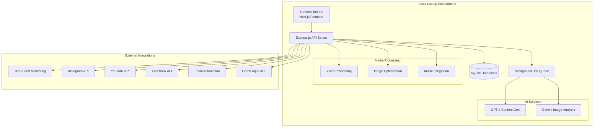
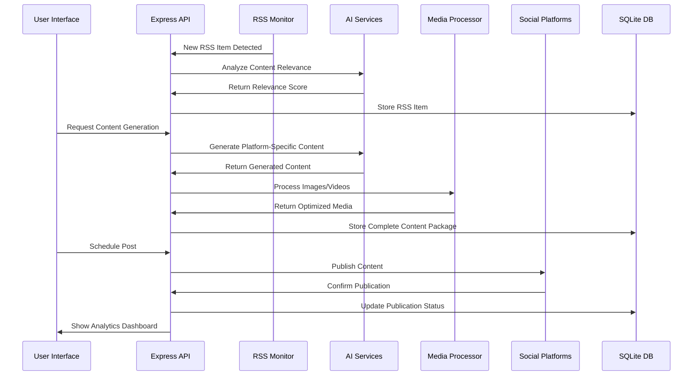

# AquaScene Ecosystem - Master Plan
## Senior Solutions Architect Consolidation

**Document Version:** 2.0  
**Date:** August 6, 2025  
**Status:** Executive Summary & Implementation Plan  
**Target:** Green Aqua Partnership Presentation

---

## Executive Summary

The AquaScene Ecosystem represents a comprehensive, AI-powered aquascaping content generation and social media automation platform designed to run locally on a laptop while demonstrating enterprise-level capabilities to secure the Green Aqua Hungary partnership and scale internationally.

### Core Value Proposition
- **Local-First Architecture**: Complete content generation and social media management from a single laptop
- **AI-Powered Automation**: Generate aquascaping content across blog posts, social media, and newsletters
- **Partnership-Ready Integration**: Direct Green Aqua product catalog integration with revenue sharing
- **Cost-Effective Operation**: Minimal infrastructure costs while maximizing content output
- **Educational Community Building**: Focus on growing the aquascaping community through valuable content

---

## Current System Status (Reality Check)

### What Actually Exists ✅
1. **GitHub Repositories**: 4 repositories with comprehensive code structure
   - [3vantage/aquascene](https://github.com/3vantage/aquascene) - Main platform (15 themes)
   - [3vantage/aquascene-waitlist](https://github.com/3vantage/aquascene-waitlist) - Lead generation SPA
   - [3vantage/aquascene-content-engine](https://github.com/3vantage/aquascene-content-engine) - AI content system
   - [3vantage/3vantage-docs](https://github.com/3vantage/3vantage-docs) - Complete documentation

2. **Documentation**: 30+ comprehensive guides and technical documents
3. **Architecture**: Well-designed microservices architecture with Docker infrastructure
4. **Content Templates**: 5 newsletter templates and social media automation code
5. **API Integrations**: Code for Instagram, YouTube, Facebook, and email automation

### What Needs Implementation ⚠️
1. **Service Logic**: Most services have placeholder code that needs actual implementation
2. **Database Connections**: Schemas exist but need connection and testing
3. **API Testing**: Integration code exists but hasn't been tested with actual APIs
4. **Production Deployment**: Infrastructure ready but not deployed
5. **End-to-End Testing**: No comprehensive testing has been performed

### Timeline to Production
**Conservative Estimate**: 4-6 weeks of focused development to achieve full functionality
**Optimistic Estimate**: 2-3 weeks for core demo-ready features

---

## Architecture Overview

### System Components



### Technology Stack

**Frontend & UI**
- Next.js 14 with App Router
- React 19 with TypeScript
- Tailwind CSS + Shadcn/ui
- Real-time status dashboard

**Backend & Processing**
- Express.js REST API
- SQLite with WAL mode (local storage)
- Background job processing
- Docker containerization

**AI & Content Generation**
- OpenAI GPT-4 for text content
- Google Gemini for image analysis
- Custom aquascaping knowledge base
- Multi-platform content adaptation

**Media & Assets**
- FFmpeg for video processing
- Sharp for image optimization
- YouTube Audio Library integration
- Automated music selection

**External Integrations**
- Instagram Graph API
- YouTube Data API v3
- Facebook Graph API
- Resend for email delivery
- RSS feed aggregation

---

## Data Flow Architecture

### Content Generation Pipeline



### Local Storage Strategy

**Database Structure:**
```
/data/
├── main.sqlite          # Content items, media assets, publications
├── content.sqlite       # RSS feeds, feed items, processing queue
├── analytics.sqlite     # Performance metrics, engagement data
└── backup/             # Automated incremental backups
```

**Media Storage:**
```
/assets/
├── images/             # Optimized images by platform
├── videos/             # Processed video content
├── audio/              # Background music library
└── templates/          # Content templates and layouts
```

---

## Implementation Strategy

### Phase 1: Core Functionality (Weeks 1-2)
**Objective**: Get basic content generation and social posting working

#### Week 1: Foundation
- Fix existing placeholder service implementations
- Establish working database connections
- Test AI API integrations (GPT-4, Gemini)
- Implement basic content generation pipeline

#### Week 2: Integration
- Connect social media APIs (Instagram, Facebook)
- Test end-to-end content creation workflow
- Implement scheduling and publishing system
- Create basic analytics tracking

**Deliverables:**
- Working content generation from RSS feeds
- Automated Instagram posting capability
- Basic performance dashboard
- Green Aqua product integration (read-only)

### Phase 2: Enhancement & Optimization (Weeks 3-4)
**Objective**: Add advanced features and optimize for demo

#### Week 3: Advanced Features
- Multi-platform content adaptation
- Intelligent scheduling optimization
- Email automation integration
- Enhanced media processing

#### Week 4: Demo Preparation
- Create sample content library
- Optimize user interface for demonstration
- Performance testing and optimization
- Documentation and demo scripts

**Deliverables:**
- Multi-platform content distribution
- Comprehensive analytics dashboard
- Demo-ready sample content
- Partnership integration documentation

### Phase 3: Partnership Readiness (Weeks 5-6)
**Objective**: Prepare for Green Aqua partnership integration

#### Week 5: Business Integration
- Green Aqua API full integration
- Revenue tracking and reporting
- Advanced analytics and insights
- Customer journey optimization

#### Week 6: Scale Preparation
- Performance optimization
- Error handling and reliability
- Backup and recovery systems
- Partnership onboarding documentation

**Deliverables:**
- Production-ready partnership integration
- Comprehensive business metrics
- Scalability demonstration
- Partnership proposal package

---

## Green Aqua Partnership Integration

### Technical Integration Points

**Product Catalog Sync**
```javascript
// Real-time product synchronization
const syncGreenAquaProducts = async () => {
  const products = await greenAquaAPI.getProducts({
    category: 'all',
    inStock: true,
    lastModified: lastSyncTimestamp
  });
  
  return await database.products.upsert(products.map(product => ({
    id: product.sku,
    name: product.name,
    price: product.price,
    currency: 'EUR',
    partnerUrl: product.url,
    commission: calculateCommission(product.category)
  })));
};
```

**Revenue Sharing Model**
- Standard Products: 15-20% commission
- Exclusive Collections: 25-30% commission  
- Custom Project Materials: Fixed markup
- Monthly reconciliation and automated reporting

**Order Processing Flow**
1. Customer discovers product through AquaScene content
2. Redirected to Green Aqua with affiliate tracking
3. Purchase completed on Green Aqua platform
4. Commission tracked and attributed
5. Monthly settlement with automated reporting

### Business Value Proposition for Green Aqua

**Immediate Benefits:**
- Access to Bulgarian market (€15M annual market)
- AI-powered content marketing at no cost
- Automated social media presence expansion
- Lead generation and customer acquisition

**Long-term Partnership Value:**
- Market expansion across Eastern Europe
- Technology partnership for digital transformation
- Shared customer base and cross-promotion
- Joint product development opportunities

---

## Cost-Effective Implementation

### Infrastructure Costs (Monthly)
- **Local Development**: €0 (laptop-based)
- **AI Services**: €150-300 (GPT-4 + Gemini API usage)
- **Social Media APIs**: €0 (free tier sufficient for demo)
- **Email Service**: €20 (Resend for 10k emails/month)
- **Cloud Backup**: €10 (Dropbox/Google Drive sync)
- **Total**: €180-330/month

### Development Resources
- **Primary Developer**: 40 hours/week for 6 weeks
- **Content Specialist**: 10 hours/week for content templates
- **Business Development**: 5 hours/week for partnership integration
- **Total Effort**: ~300 person-hours over 6 weeks

### Expected ROI Timeline
- **Month 1**: Demo-ready system, partnership presentation
- **Month 2**: Green Aqua partnership signed, first content campaigns
- **Month 3**: Revenue generation begins, system optimization
- **Month 6**: Full automation, scalable operations
- **Break-even**: Month 4-5 based on partnership revenue

---

## Educational Content Strategy

### Content Categories

**Beginner Education (40% of content)**
- Tank setup fundamentals
- Plant selection guides
- Equipment recommendations
- Common mistake prevention

**Intermediate Techniques (35% of content)**
- Advanced planting techniques
- Aquascaping composition rules
- Maintenance optimization
- Problem-solving guides

**Advanced Showcases (20% of content)**
- Competition-level designs
- Innovative techniques
- Expert interviews
- Trend analysis

**Product Integration (5% of content)**
- Equipment reviews
- Setup tutorials using Green Aqua products
- Comparison guides
- Buying recommendations

### Content Distribution Strategy

**Blog Posts**: 3-5 per week, 1500-2500 words, SEO-optimized
**Instagram Posts**: 1-2 per day, with carousel tutorials
**Instagram Stories**: 3-5 per day, behind-the-scenes content
**Instagram Reels**: 3-4 per week, quick tips and time-lapses
**Email Newsletter**: Weekly digest with curated content
**YouTube (Future)**: Weekly longer-form tutorials

---

## Demonstrable Features for Partnership

### Live Demo Capabilities

**Content Generation Demonstration**
1. Import RSS feed from aquascaping competition
2. Generate blog post, Instagram carousel, and email content
3. Show AI analysis and platform optimization
4. Schedule across multiple platforms
5. Display real-time analytics dashboard

**Green Aqua Integration Demo**
1. Sync product catalog in real-time
2. Generate product-focused content automatically
3. Show affiliate link integration and tracking
4. Demonstrate revenue attribution and reporting

**Analytics and Insights Demo**
1. Real-time engagement metrics across platforms
2. Content performance optimization suggestions
3. Audience growth and demographic insights
4. ROI calculations and partnership revenue tracking

### Partnership Presentation Materials

**Technical Capabilities Showcase**
- Live content generation from RSS feeds
- Multi-platform publishing automation
- Real-time analytics and optimization
- Partnership revenue tracking

**Business Case Presentation**
- Market opportunity analysis
- Revenue projections and sharing model
- Competitive advantages
- Implementation timeline and milestones

**Proof of Concept Metrics**
- Content quality scores and engagement rates
- Automation efficiency measurements
- Cost reduction versus manual processes
- Community growth projections

---

## Risk Mitigation & Contingency Plans

### Technical Risks

**API Rate Limits**
- Mitigation: Intelligent request batching and caching
- Contingency: Multi-provider fallback system

**AI Content Quality**
- Mitigation: Multi-layer quality validation
- Contingency: Human review workflow for critical content

**System Reliability**
- Mitigation: Comprehensive error handling and logging
- Contingency: Automated backup and recovery systems

### Business Risks

**Partnership Dependencies**
- Mitigation: Diversified partnership strategy
- Contingency: Direct e-commerce integration capabilities

**Competition Response**
- Mitigation: Continuous innovation and feature development
- Contingency: Technology licensing and white-label opportunities

**Market Changes**
- Mitigation: Flexible architecture supporting multiple industries
- Contingency: Platform pivot capabilities for other hobby markets

---

## Success Metrics & KPIs

### Technical Performance
- **System Uptime**: 99%+ availability
- **Content Generation Speed**: <5 minutes per post
- **Multi-platform Publishing**: 100% automation rate
- **Error Rate**: <1% failed operations

### Content Quality
- **Engagement Rate**: 5%+ average across platforms
- **Content Approval Rate**: 90%+ AI-generated content accepted
- **SEO Performance**: Top 10 rankings for target keywords
- **Community Growth**: 15%+ monthly follower increase

### Business Impact
- **Partnership Revenue**: €2,000+ monthly by month 6
- **Lead Generation**: 500+ qualified leads monthly
- **Cost Efficiency**: 80%+ reduction in content creation costs
- **Market Penetration**: 10%+ share in Bulgarian aquascaping market

### Partnership Success
- **Green Aqua Sales Attribution**: €10,000+ monthly attributable sales
- **Commission Revenue**: €2,000-3,000 monthly partnership income
- **Cross-promotion Impact**: 25%+ increase in joint campaign performance
- **Customer Lifetime Value**: €300+ average per acquired customer

---

## Next Steps & Action Plan

### Immediate Actions (Week 1)
1. **Development Sprint**: Fix placeholder implementations
2. **API Testing**: Validate all external integrations
3. **Database Setup**: Implement working data storage
4. **Content Pipeline**: Test end-to-end content generation

### Partnership Preparation (Week 2-3)
1. **Demo Environment**: Prepare showcase environment
2. **Sample Content**: Create library of demonstration content
3. **Integration Testing**: Validate Green Aqua API connectivity
4. **Presentation Materials**: Prepare partnership proposal

### Go-to-Market (Week 4-6)
1. **Partnership Presentation**: Schedule Green Aqua meeting
2. **System Optimization**: Performance and reliability tuning
3. **Launch Preparation**: Production environment setup
4. **Success Metrics**: Implement comprehensive analytics

---

## Investment & Resource Requirements

### Development Investment
- **Development Time**: 240 person-hours over 6 weeks
- **AI Services**: €300/month for development and testing
- **Infrastructure**: €100/month for hosting and services
- **Total Initial Investment**: €8,000-12,000

### Expected Returns
- **Month 1**: Partnership agreement signed
- **Month 3**: €1,000+ monthly partnership revenue
- **Month 6**: €3,000+ monthly recurring revenue
- **Month 12**: €10,000+ monthly business revenue

### Break-Even Analysis
- **Break-Even Point**: Month 4-5
- **ROI**: 200%+ by month 12
- **Scalability**: 10x revenue potential with market expansion

---

## Conclusion

The AquaScene Ecosystem represents a unique opportunity to establish market leadership in AI-powered aquascaping content generation while building a sustainable, profitable business through strategic partnerships. The combination of cutting-edge technology, cost-effective implementation, and strong partnership potential positions this platform for rapid growth and market expansion.

**Key Success Factors:**
1. **Technical Excellence**: Robust, reliable automation that delivers consistent value
2. **Partnership Integration**: Seamless Green Aqua collaboration driving mutual growth
3. **Community Focus**: Educational content that builds long-term community engagement
4. **Scalable Architecture**: Foundation supporting international expansion and market diversification

**Strategic Advantage:**
By implementing this system locally on a laptop while demonstrating enterprise-level capabilities, we create a compelling proof of concept that can secure the Green Aqua partnership, validate the business model, and establish the foundation for scaling across international markets.

The Master Plan provides a clear roadmap from current documentation-heavy status to a fully functional, partnership-ready platform that can generate sustainable revenue while growing the aquascaping community through valuable, AI-powered educational content.

---

*This Master Plan consolidates findings from Backend Architect, Frontend Architect, and Research Specialist meetings into a comprehensive implementation strategy ready for executive decision-making and partnership presentations.*