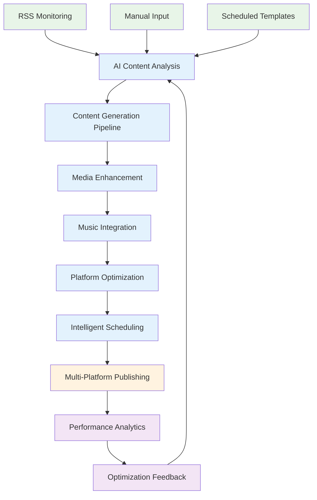

# Aquascape Content Ecosystem - Master Architecture Document

## Executive Summary

The Aquascape Content Ecosystem is a comprehensive, local-first platform designed to automate the creation, curation, and distribution of aquascaping content across multiple digital channels. Built around a partnership with Green Aqua Hungary, this system provides end-to-end automation from RSS feed monitoring to social media publishing, with intelligent content optimization and audience engagement analysis.

## Architecture Overview

### Core Design Principles

1. **Local-First Operation**: Primary processing and storage occurs locally on the user's laptop
2. **Cloud Backup & Sync**: Selective cloud synchronization for critical data and configurations  
3. **AI-Powered Automation**: Intelligent content generation and optimization using GPT-4 and Gemini
4. **Platform Agnostic**: Support for multiple social media platforms with platform-specific optimization
5. **Educational Focus**: Content pipeline optimized for aquascaping education and community building

### Technology Stack

```
Frontend Layer:
├── Next.js 14 with App Router (Content Tool UI)
├── React 19 with TypeScript
├── Tailwind CSS for styling
└── Shadcn/ui component library

Backend Services:
├── Express.js API server
├── Node.js runtime with ES modules
├── SQLite databases with WAL mode
└── Background job processing

AI & Processing:
├── OpenAI GPT-4 for text generation
├── Google Gemini for image analysis
├── FFmpeg for video/audio processing
└── Sharp for image optimization

External Integrations:
├── Instagram Graph API
├── YouTube Data API v3
├── Facebook Graph API
├── Freesound API for music
├── RSS feed parsing
└── Resend for email delivery
```

## System Architecture

### 1. Repository Structure

The ecosystem consists of several focused repositories:

```
3vantage-ecosystem/
├── 3vantage-docs/              # 📚 Central documentation hub
├── aquascape-content-tool/     # 🎨 Local newsletter generator (4 templates)
├── aquascene-backend/          # ⚡ Express API with PostgreSQL/SQLite
├── aquascene/                  # 🌊 Main platform (15 dynamic themes)
├── aquascene-waitlist/         # 📝 Partnership-ready waitlist SPA
├── aquascene-content-engine/   # 🤖 AI content generation pipeline
├── aquascene-shared-ui/        # 🧩 Shared component library
└── aquascene-workspace/        # 🔧 Development tooling
```

### 2. Core Components

#### A. RSS Feed Aggregation System
- **Purpose**: Monitor aquascaping competitions, innovations, and industry news
- **Sources**: AGA, IAPLC, Green Aqua, Aquarium Co-Op, planted tank communities
- **Processing**: AI-powered relevance scoring, content extraction, duplicate detection
- **Output**: Curated feed items ready for content generation

#### B. Content Generation Pipeline
- **Input**: RSS items, manual requests, scheduled templates
- **Processing**: AI analysis, research phase, multi-platform content creation
- **Enhancement**: Media selection, music integration, SEO optimization
- **Output**: Platform-optimized content ready for publication

#### C. Social Media Publishing Infrastructure
- **Platforms**: Instagram Reels, YouTube Shorts, Facebook, LinkedIn
- **Features**: Automated posting, engagement tracking, performance analytics
- **Optimization**: Platform-specific content adaptation, optimal timing

#### D. Local Storage Architecture
- **Databases**: SQLite with WAL mode for performance
- **File Management**: Hierarchical storage with media processing pipeline
- **Backup System**: Automated incremental and full backups
- **Cloud Sync**: Selective synchronization with multiple providers

#### E. Stock Music Integration
- **Sources**: YouTube Audio Library, Freesound, local music library
- **Processing**: Mood analysis, duration matching, license compliance
- **Output**: Copyright-safe music tracks matched to video content

### 3. Data Flow Architecture



## Technical Implementation

### 1. Database Schema Design

The system uses multiple SQLite databases for optimal performance:

#### Main Database (main.sqlite)
```sql
-- Core content items with full metadata
CREATE TABLE content_items (
    id TEXT PRIMARY KEY,
    type VARCHAR(50) NOT NULL,
    title TEXT NOT NULL,
    description TEXT,
    content TEXT,
    metadata JSON,
    tags TEXT,
    status VARCHAR(20) DEFAULT 'draft',
    language VARCHAR(10) DEFAULT 'en',
    created_at DATETIME DEFAULT CURRENT_TIMESTAMP,
    updated_at DATETIME DEFAULT CURRENT_TIMESTAMP
);

-- Media assets with comprehensive tracking
CREATE TABLE media_assets (
    id TEXT PRIMARY KEY,
    filename TEXT NOT NULL,
    file_path TEXT NOT NULL,
    file_size INTEGER,
    mime_type VARCHAR(100),
    dimensions JSON,
    duration INTEGER,
    checksum TEXT,
    metadata JSON,
    usage_count INTEGER DEFAULT 0,
    created_at DATETIME DEFAULT CURRENT_TIMESTAMP
);

-- Social media publication tracking
CREATE TABLE publications (
    id TEXT PRIMARY KEY,
    content_id TEXT REFERENCES content_items(id),
    platform VARCHAR(50),
    platform_id TEXT,
    status VARCHAR(20),
    scheduled_for DATETIME,
    published_at DATETIME,
    metrics JSON,
    created_at DATETIME DEFAULT CURRENT_TIMESTAMP
);
```

#### RSS Database (content.sqlite)
```sql
-- RSS feed sources and configurations
CREATE TABLE rss_feeds (
    id TEXT PRIMARY KEY,
    name VARCHAR(255) NOT NULL,
    url TEXT NOT NULL UNIQUE,
    category VARCHAR(100) NOT NULL,
    poll_interval INTERVAL DEFAULT '1 hour',
    is_active BOOLEAN DEFAULT true,
    last_polled DATETIME,
    total_items INTEGER DEFAULT 0
);

-- Processed RSS items with AI analysis
CREATE TABLE feed_items (
    id TEXT PRIMARY KEY,
    feed_id TEXT REFERENCES rss_feeds(id),
    title TEXT NOT NULL,
    description TEXT,
    link TEXT,
    published_at DATETIME,
    relevance_score DECIMAL(3,2),
    key_information JSON,
    translations JSON DEFAULT '{}',
    processing_status VARCHAR(50) DEFAULT 'pending'
);
```

### 2. API Design

The system exposes RESTful APIs for all major operations:

#### Content Management
```javascript
// Content generation
POST /api/content/generate
{
  "source": "rss_item_id" | "manual",
  "contentType": "newsletter" | "social_post" | "video",
  "platforms": ["instagram", "youtube", "facebook"],
  "template": "showcase" | "tutorial" | "timelapse",
  "priority": 1-10
}

// Content scheduling
POST /api/content/schedule
{
  "contentId": "uuid",
  "platforms": ["instagram", "facebook"],
  "scheduledFor": "2024-01-15T19:00:00Z",
  "options": { "autoOptimizeTime": true }
}
```

#### RSS Management
```javascript
// Feed management
GET /api/rss/feeds
POST /api/rss/feeds
PUT /api/rss/feeds/:id
DELETE /api/rss/feeds/:id

// Content curation
GET /api/rss/curated?audience=aquascapers&limit=10
GET /api/rss/analytics?days=30
```

#### Social Media APIs
```javascript
// Publishing
POST /api/social/publish
{
  "contentId": "uuid",
  "platform": "instagram",
  "publishTime": "now" | "scheduled",
  "options": { "locationId": "123456" }
}

// Analytics
GET /api/social/analytics/:platform?period=7d
GET /api/social/performance/content/:contentId
```

### 3. AI Integration Architecture

#### Content Generation Pipeline
```javascript
class AIContentGenerator {
  async generateContent(config) {
    // 1. Context analysis
    const context = await this.analyzeContext(config.source);
    
    // 2. Research phase
    const research = await this.researchTopic(context);
    
    // 3. Content generation with platform adaptation
    const content = await this.generatePlatformContent({
      context,
      research,
      platform: config.platform,
      template: config.template
    });
    
    // 4. Quality enhancement
    return await this.enhanceContent(content);
  }
}
```

#### Music Selection Algorithm
```javascript
class SmartMusicSelector {
  async selectMusic(videoContent) {
    // Analyze video characteristics
    const analysis = await this.analyzeVideo(videoContent);
    
    // Search multiple music sources
    const candidates = await this.searchMusic({
      mood: analysis.mood,
      duration: analysis.duration,
      energy: analysis.energy
    });
    
    // Score and rank options
    const ranked = await this.rankByCompatibility(candidates, analysis);
    
    // Verify license and return best match
    return await this.validateAndProcess(ranked[0]);
  }
}
```

## Deployment Architecture

### 1. Local Development Environment

```bash
# Required dependencies
Node.js >= 18.0.0
Python >= 3.9 (for AI services)
FFmpeg (for video processing)
SQLite >= 3.35.0

# Storage requirements
Minimum: 10GB free space
Recommended: 50GB+ for media storage
```

### 2. Production Deployment

The system supports multiple deployment scenarios:

#### Single-User Desktop Application
- Electron wrapper for cross-platform desktop app
- Local SQLite databases
- Built-in backup and sync capabilities
- Offline-first operation with periodic cloud sync

#### Multi-User Server Deployment
- Docker containerization
- PostgreSQL for multi-user support
- Redis for job queuing
- Cloud storage integration (AWS S3, GCS)

#### Hybrid Cloud Deployment
- Local processing with cloud backup
- Edge caching for media assets
- Scalable background job processing
- Multi-region content delivery

## Security Architecture

### 1. Data Protection
- **Local Data Encryption**: AES-256 encryption for sensitive files
- **API Key Management**: Encrypted credential storage with key rotation
- **Secure Transmission**: TLS 1.3 for all external communications
- **Access Control**: Role-based permissions for multi-user scenarios

### 2. Platform Security
- **OAuth 2.0**: Secure authentication with social media platforms
- **Rate Limiting**: Intelligent rate limiting to prevent API abuse
- **Input Validation**: Comprehensive validation of all user inputs
- **Content Scanning**: Automated scanning for inappropriate content

## Performance Optimization

### 1. Database Performance
```sql
-- Optimized indexes for common queries
CREATE INDEX idx_content_status_created ON content_items(status, created_at);
CREATE INDEX idx_feed_items_relevance ON feed_items(relevance_score DESC, published_at DESC);
CREATE INDEX idx_publications_platform_status ON publications(platform, status, scheduled_for);
```

### 2. Media Processing Optimization
- **Progressive Enhancement**: Process media assets in background
- **Lazy Loading**: Load media assets only when needed
- **Caching Strategy**: Multi-level caching for processed assets
- **Compression**: Automatic image and video compression

### 3. AI Service Optimization
- **Response Caching**: Cache AI responses for similar requests
- **Batch Processing**: Process multiple requests together
- **Fallback Strategies**: Local processing fallbacks for AI services
- **Rate Limit Management**: Intelligent quota management across services

## Monitoring and Analytics

### 1. System Health Monitoring
```javascript
// Health check endpoints
GET /health
{
  "status": "healthy",
  "version": "1.0.0",
  "databases": {
    "main": "connected",
    "content": "connected"
  },
  "services": {
    "rss_poller": "running",
    "content_generator": "idle",
    "social_publisher": "running"
  }
}
```

### 2. Performance Metrics
- **Content Generation**: Success rate, generation time, quality scores
- **Publishing**: Success rate, engagement metrics, optimal timing analysis
- **RSS Monitoring**: Feed health, processing success rate, relevance accuracy
- **User Engagement**: Content performance, platform effectiveness, audience growth

## Scalability Considerations

### 1. Horizontal Scaling
- **Microservices Architecture**: Separate services for different functions
- **Message Queues**: Redis/RabbitMQ for background job processing
- **Load Balancing**: Distribute requests across multiple instances
- **Database Sharding**: Partition data across multiple databases

### 2. Vertical Scaling
- **Resource Optimization**: Efficient memory and CPU usage
- **Database Optimization**: Query optimization and indexing strategies
- **Caching Layers**: Multiple caching levels for improved performance
- **Background Processing**: Asynchronous processing for heavy tasks

## Future Enhancements

### Phase 2: Advanced AI Features
- **Computer Vision**: Advanced aquascape analysis and species identification
- **Voice Narration**: AI-generated voice narration for video content
- **Trend Prediction**: Predictive analytics for content trends
- **Personalization**: User-specific content recommendations

### Phase 3: Community Features
- **User-Generated Content**: Community content submission and curation
- **Social Features**: Comments, likes, shares within the platform
- **Expert Network**: Integration with aquascaping experts and influencers
- **Marketplace Integration**: Direct integration with equipment suppliers

### Phase 4: Mobile Applications
- **React Native Apps**: iOS and Android companion apps
- **Offline Synchronization**: Full offline capability with sync
- **Push Notifications**: Real-time engagement notifications
- **AR Features**: Augmented reality aquascaping tools

## Business Integration

### 1. Green Aqua Partnership
- **Product Integration**: Direct product catalog synchronization
- **Revenue Sharing**: Automated commission tracking and reporting
- **Brand Consistency**: Unified visual identity and messaging
- **Customer Journey**: Seamless experience from content to purchase

### 2. Market Expansion Strategy
- **Localization**: Multi-language support for global markets
- **Regional Partnerships**: Local aquascaping store partnerships
- **Educational Programs**: Integration with aquascaping courses
- **Event Integration**: Support for competitions and exhibitions

## Risk Management

### 1. Technical Risks
- **AI Service Dependencies**: Fallback strategies for AI service outages
- **Platform API Changes**: Flexible API adapters with version management
- **Data Loss Prevention**: Comprehensive backup and recovery procedures
- **Performance Degradation**: Monitoring and automatic scaling

### 2. Business Risks
- **Content Quality**: Multi-level quality assurance processes
- **Copyright Compliance**: Automated license checking and attribution
- **Platform Policy Changes**: Adaptive strategies for social media policy updates
- **Competition Response**: Rapid feature development and deployment capabilities

## Conclusion

The Aquascape Content Ecosystem represents a comprehensive solution for automated aquascaping content creation and distribution. By combining local-first architecture with cloud capabilities, AI-powered content generation, and intelligent social media optimization, the system provides a scalable foundation for growing the aquascaping community while supporting business objectives.

The modular architecture ensures maintainability and extensibility, while the focus on automation reduces manual overhead and enables consistent, high-quality content production. The system's integration with Green Aqua and other industry partners positions it as a central hub for aquascaping education and commerce.

With its robust technical foundation, comprehensive feature set, and clear expansion path, the Aquascape Content Ecosystem is well-positioned to become the leading platform for aquascaping content creation and community engagement.