# Comprehensive Data Flow Diagrams - Aquascape Content Ecosystem

## Overview

This document provides detailed data flow diagrams for the entire aquascape content ecosystem, showing how data moves between components and the relationships between different services.

## 1. High-Level System Architecture


## 2. RSS Feed Processing Data Flow


## 3. Content Generation Pipeline Data Flow


## 4. Social Media Publishing Data Flow


## 5. Music Integration Data Flow


## 6. Local Storage Architecture Data Flow

```mermaid
graph TB
    APP[Application Layer] --> MANAGER[Storage Manager]
    
    MANAGER --> MAIN_DB[(main.sqlite<br/>Content & Metadata)]
    MANAGER --> CONTENT_DB[(content.sqlite<br/>Generated Content)]
    MANAGER --> CACHE_DB[(cache.sqlite<br/>Temporary Data)]
    MANAGER --> ANALYTICS_DB[(analytics.sqlite<br/>Performance Data)]
    
    MANAGER --> FILE_MANAGER[File Manager]
    
    FILE_MANAGER --> IMAGES[/media/images/<br/>- raw/<br/>- processed/<br/>- thumbnails/]
    FILE_MANAGER --> VIDEOS[/media/videos/<br/>- source/<br/>- processed/<br/>- preview/]
    FILE_MANAGER --> AUDIO[/media/audio/<br/>- music/<br/>- effects/<br/>- generated/]
    
    MANAGER --> BACKUP_MGR[Backup Manager]
    BACKUP_MGR --> DAILY[/backups/daily/]
    BACKUP_MGR --> WEEKLY[/backups/weekly/]
    BACKUP_MGR --> EXPORT[/backups/exports/]
    
    MANAGER --> SYNC_MGR[Cloud Sync Manager]
    SYNC_MGR --> DROPBOX[Dropbox Sync]
    SYNC_MGR --> GDRIVE[Google Drive Sync]
    SYNC_MGR --> ICLOUD[iCloud Sync]
    
    %% Configuration Management
    MANAGER --> CONFIG_MGR[Config Manager]
    CONFIG_MGR --> APP_CONFIG[/config/app.json]
    CONFIG_MGR --> INTEGRATION_CONFIG[/config/integrations.json]
    CONFIG_MGR --> FEED_CONFIG[/config/feeds.json]
    CONFIG_MGR --> TEMPLATE_CONFIG[/config/templates.json]
    
    %% Data Flow Arrows
    MAIN_DB -.-> BACKUP_MGR
    CONTENT_DB -.-> BACKUP_MGR
    IMAGES -.-> BACKUP_MGR
    VIDEOS -.-> BACKUP_MGR
    AUDIO -.-> BACKUP_MGR
    
    MAIN_DB -.-> SYNC_MGR
    CONFIG_MGR -.-> SYNC_MGR
    
    classDef database fill:#e8f5e8
    classDef storage fill:#e3f2fd
    classDef backup fill:#fff3e0
    classDef sync fill:#f3e5f5
    classDef config fill:#fce4ec
    
    class MAIN_DB,CONTENT_DB,CACHE_DB,ANALYTICS_DB database
    class IMAGES,VIDEOS,AUDIO,FILE_MANAGER storage
    class BACKUP_MGR,DAILY,WEEKLY,EXPORT backup
    class SYNC_MGR,DROPBOX,GDRIVE,ICLOUD sync
    class CONFIG_MGR,APP_CONFIG,INTEGRATION_CONFIG,FEED_CONFIG,TEMPLATE_CONFIG config
```

## 7. Content Scheduling Timeline

```mermaid
gantt
    title Content Generation & Publishing Timeline
    dateFormat  HH:mm
    axisFormat %H:%M
    
    section RSS Monitoring
    Feed Polling (Hourly)    :rss1, 06:00, 1h
    Feed Polling (Hourly)    :rss2, 07:00, 1h
    Feed Polling (Hourly)    :rss3, 08:00, 1h
    Feed Polling (Hourly)    :rss4, 09:00, 1h
    
    section Content Generation
    AI Analysis              :gen1, 09:15, 15m
    Content Creation         :gen2, 09:30, 20m
    Media Selection          :gen3, 09:50, 10m
    Quality Check            :gen4, 10:00, 5m
    
    section Publishing Optimization
    Audience Analysis        :opt1, 10:05, 10m
    Time Slot Selection      :opt2, 10:15, 5m
    Platform Adaptation      :opt3, 10:20, 15m
    
    section Distribution
    Instagram Post           :pub1, 12:00, 2m
    Facebook Post            :pub2, 15:00, 2m
    YouTube Upload           :pub3, 19:00, 5m
    Newsletter Queue         :pub4, 20:00, 1m
    
    section Monitoring
    Engagement Tracking      :mon1, 12:00, 8h
    Performance Analysis     :mon2, 20:00, 30m
    Optimization Updates     :mon3, 20:30, 15m
```



## 8. Error Handling and Recovery Flow


## 9. Analytics and Feedback Loop


## 10. System Integration Overview


These data flow diagrams illustrate:

1. **Complete system architecture** with all major components
2. **Sequential processing flows** for RSS ingestion and content generation
3. **Multi-platform publishing workflows** with platform-specific adaptations
4. **Local-first storage architecture** with backup and sync capabilities
5. **Error handling and recovery mechanisms** for robust operation
6. **Analytics feedback loops** for continuous optimization
7. **Service integration patterns** showing how all components work together

The diagrams demonstrate how data flows through the entire ecosystem, from RSS feed ingestion to final social media publication, with comprehensive error handling, analytics, and optimization feedback loops.