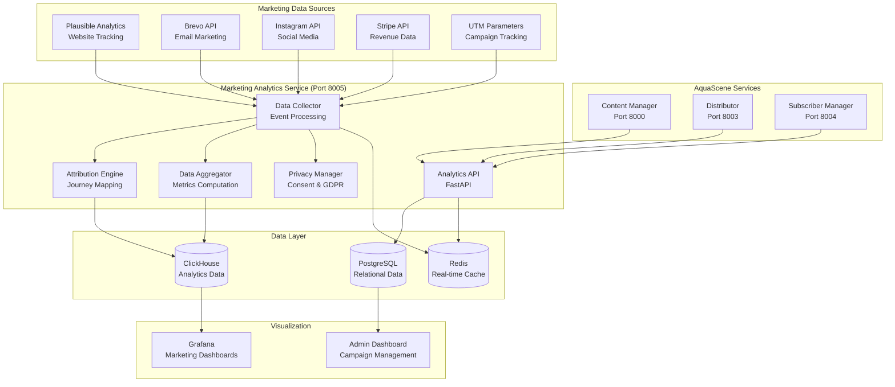
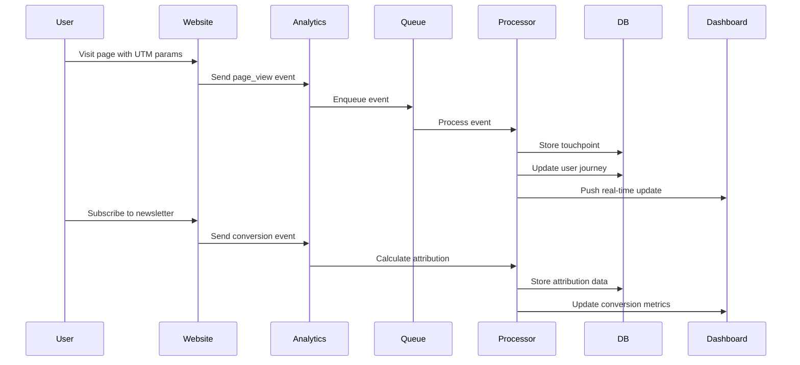

# Marketing Analytics Architecture for AquaScene Ecosystem

**Version:** 1.0  
**Date:** August 6, 2025  
**Author:** Claude Code  
**Status:** Design Document

## Executive Summary

This document outlines a comprehensive marketing analytics architecture for the AquaScene ecosystem that provides unified tracking, attribution modeling, and actionable insights across all marketing channels. The solution integrates with existing services while maintaining user privacy compliance and cost-effectiveness.

### Key Objectives

- **Unified Analytics**: Single source of truth for all marketing metrics
- **Attribution Modeling**: Track complete user journeys from social → email → website → conversion
- **Privacy Compliance**: GDPR-compliant tracking with user consent management
- **Real-time Insights**: Immediate visibility into campaign performance
- **Cost Optimization**: Efficient resource utilization and budget allocation
- **Scalable Architecture**: Support growth from startup to enterprise scale

## Current State Analysis

### Existing Infrastructure Assessment

Based on the current AquaScene content engine implementation, we have:

```yaml
Existing Services:
  - content-manager: Port 8000 (API Gateway)
  - ai-processor: Port 8001 (Content Generation)
  - distributor: Port 8003 (Multi-channel Distribution)
  - subscriber-manager: Port 8004 (User Management)
  - web-scraper: Port 8002 (Content Acquisition)

Infrastructure:
  - PostgreSQL: Primary database
  - Redis: Caching and message queuing
  - Grafana: Visualization dashboards
  - Prometheus: Metrics collection
  - MinIO: Object storage

Marketing Channels:
  - Instagram Business API (existing)
  - Email via Brevo/SendGrid (existing)
  - Website analytics (needs integration)
  - Revenue tracking (needs implementation)
```

### Gaps Identified

1. **Unified Analytics**: No centralized marketing data warehouse
2. **Cross-channel Attribution**: Limited user journey tracking
3. **Website Analytics**: No integration with Plausible Analytics
4. **Revenue Tracking**: No conversion/sales attribution
5. **Real-time Dashboards**: Marketing-specific insights missing
6. **Campaign Management**: No unified campaign tracking

## Marketing Analytics Service Architecture

### Service Overview

```yaml
Service Name: marketing-analytics-service
Port: 8005
Container: content-engine-analytics
Technology Stack:
  Runtime: Python 3.11
  Framework: FastAPI 0.104+
  Database: PostgreSQL + ClickHouse (analytics)
  Cache: Redis 7
  Message Queue: Redis Streams
  External APIs: Plausible, Brevo, Stripe
```

### Architecture Diagram



## Database Schema Design

### PostgreSQL Schema (Operational Data)

```sql
-- Marketing Analytics Core Tables
CREATE SCHEMA marketing_analytics;

-- Campaigns Management
CREATE TABLE marketing_analytics.campaigns (
    id UUID PRIMARY KEY DEFAULT gen_random_uuid(),
    name VARCHAR(255) NOT NULL,
    type VARCHAR(50) NOT NULL, -- 'email', 'social', 'content', 'paid'
    status VARCHAR(20) DEFAULT 'active',
    start_date TIMESTAMP NOT NULL,
    end_date TIMESTAMP,
    budget_allocated DECIMAL(10,2),
    budget_spent DECIMAL(10,2) DEFAULT 0,
    utm_source VARCHAR(100),
    utm_medium VARCHAR(100),
    utm_campaign VARCHAR(100),
    target_audience JSONB,
    goals JSONB,
    metadata JSONB,
    created_at TIMESTAMP DEFAULT NOW(),
    updated_at TIMESTAMP DEFAULT NOW()
);

-- Marketing Channels
CREATE TABLE marketing_analytics.channels (
    id SERIAL PRIMARY KEY,
    name VARCHAR(100) UNIQUE NOT NULL,
    type VARCHAR(50) NOT NULL, -- 'organic', 'paid', 'email', 'social', 'direct'
    cost_per_acquisition DECIMAL(8,2),
    attribution_window_days INTEGER DEFAULT 30,
    is_active BOOLEAN DEFAULT TRUE,
    configuration JSONB,
    created_at TIMESTAMP DEFAULT NOW()
);

-- User Journey Tracking
CREATE TABLE marketing_analytics.user_journeys (
    id UUID PRIMARY KEY DEFAULT gen_random_uuid(),
    user_id UUID, -- Links to subscriber_manager
    session_id VARCHAR(255),
    journey_start TIMESTAMP NOT NULL,
    journey_end TIMESTAMP,
    first_touch_channel_id INTEGER REFERENCES marketing_analytics.channels(id),
    last_touch_channel_id INTEGER REFERENCES marketing_analytics.channels(id),
    conversion_event VARCHAR(100),
    conversion_value DECIMAL(10,2),
    total_touchpoints INTEGER DEFAULT 0,
    journey_duration_minutes INTEGER,
    attribution_data JSONB,
    created_at TIMESTAMP DEFAULT NOW()
);

-- Touchpoints (Individual interactions)
CREATE TABLE marketing_analytics.touchpoints (
    id UUID PRIMARY KEY DEFAULT gen_random_uuid(),
    journey_id UUID REFERENCES marketing_analytics.user_journeys(id) ON DELETE CASCADE,
    channel_id INTEGER REFERENCES marketing_analytics.channels(id),
    campaign_id UUID REFERENCES marketing_analytics.campaigns(id),
    touchpoint_type VARCHAR(100) NOT NULL, -- 'page_view', 'email_open', 'social_click', etc.
    timestamp TIMESTAMP NOT NULL,
    source_url TEXT,
    utm_parameters JSONB,
    device_info JSONB,
    location_info JSONB,
    custom_properties JSONB,
    created_at TIMESTAMP DEFAULT NOW()
);

-- Revenue Attribution
CREATE TABLE marketing_analytics.revenue_attribution (
    id UUID PRIMARY KEY DEFAULT gen_random_uuid(),
    journey_id UUID REFERENCES marketing_analytics.user_journeys(id),
    transaction_id VARCHAR(255),
    revenue_amount DECIMAL(10,2) NOT NULL,
    attribution_model VARCHAR(50) NOT NULL, -- 'first_touch', 'last_touch', 'linear', 'time_decay'
    attributed_channels JSONB, -- Channel ID to attribution percentage mapping
    transaction_date TIMESTAMP NOT NULL,
    product_category VARCHAR(100),
    commission_rate DECIMAL(5,4),
    created_at TIMESTAMP DEFAULT NOW()
);

-- Privacy & Consent Management
CREATE TABLE marketing_analytics.user_consent (
    id UUID PRIMARY KEY DEFAULT gen_random_uuid(),
    user_identifier VARCHAR(255) NOT NULL, -- Email, cookie ID, etc.
    consent_type VARCHAR(50) NOT NULL, -- 'analytics', 'marketing', 'personalization'
    consent_granted BOOLEAN NOT NULL,
    consent_date TIMESTAMP NOT NULL,
    expiry_date TIMESTAMP,
    ip_address INET,
    user_agent TEXT,
    consent_method VARCHAR(100), -- 'cookie_banner', 'email_preference', 'gdpr_form'
    revoked_at TIMESTAMP,
    created_at TIMESTAMP DEFAULT NOW()
);

-- Performance Metrics Cache
CREATE TABLE marketing_analytics.metric_snapshots (
    id UUID PRIMARY KEY DEFAULT gen_random_uuid(),
    metric_type VARCHAR(100) NOT NULL,
    metric_name VARCHAR(255) NOT NULL,
    metric_value DECIMAL(12,4),
    dimensions JSONB,
    period_start TIMESTAMP NOT NULL,
    period_end TIMESTAMP NOT NULL,
    calculated_at TIMESTAMP DEFAULT NOW(),
    
    UNIQUE(metric_type, metric_name, dimensions, period_start, period_end)
);

-- Create indexes for performance
CREATE INDEX idx_user_journeys_user_id ON marketing_analytics.user_journeys(user_id);
CREATE INDEX idx_user_journeys_date ON marketing_analytics.user_journeys(journey_start);
CREATE INDEX idx_touchpoints_journey_id ON marketing_analytics.touchpoints(journey_id);
CREATE INDEX idx_touchpoints_timestamp ON marketing_analytics.touchpoints(timestamp);
CREATE INDEX idx_revenue_attribution_date ON marketing_analytics.revenue_attribution(transaction_date);
CREATE INDEX idx_campaigns_date_status ON marketing_analytics.campaigns(start_date, status);
```

### ClickHouse Schema (Analytics Data Warehouse)

```sql
-- ClickHouse for high-performance analytics queries
CREATE DATABASE marketing_analytics_dw;

-- Event tracking table (high-volume inserts, analytical queries)
CREATE TABLE marketing_analytics_dw.events (
    timestamp DateTime64(3),
    event_id String,
    user_id Nullable(String),
    session_id String,
    event_type String,
    channel String,
    campaign_id Nullable(String),
    source String,
    medium String,
    content Nullable(String),
    term Nullable(String),
    page_url Nullable(String),
    referrer_url Nullable(String),
    device_type String,
    browser String,
    os String,
    country String,
    city Nullable(String),
    user_agent String,
    ip_address Nullable(String),
    custom_properties String, -- JSON string
    revenue Nullable(Decimal(10,2))
) ENGINE = MergeTree()
ORDER BY (timestamp, channel, event_type)
PARTITION BY toYYYYMM(timestamp);

-- Aggregated daily metrics
CREATE TABLE marketing_analytics_dw.daily_metrics (
    date Date,
    channel String,
    campaign_id Nullable(String),
    unique_users UInt32,
    total_sessions UInt32,
    page_views UInt32,
    conversions UInt32,
    revenue Decimal(12,2),
    cost Decimal(12,2),
    cpa Decimal(8,2), -- Cost per acquisition
    roas Decimal(8,4) -- Return on ad spend
) ENGINE = SummingMergeTree()
ORDER BY (date, channel, campaign_id);
```

## API Endpoints Design

### Core Analytics API

```yaml
Base URL: /api/v1/analytics

# Event Tracking
POST /events
  Description: Track marketing events and touchpoints
  Body:
    event_type: string (required)
    user_id: string (optional)
    session_id: string (required)
    timestamp: string (ISO format)
    properties: object
    utm_parameters: object
  Response: 201 Created

# Campaign Management
GET /campaigns
  Description: List marketing campaigns with filtering
  Query Params:
    status: string (active, paused, ended)
    type: string (email, social, content, paid)
    date_from: string
    date_to: string
  Response: Array of campaign objects

POST /campaigns
  Description: Create new marketing campaign
  Body: Campaign object with name, type, budget, etc.
  Response: 201 Created with campaign ID

PUT /campaigns/{campaign_id}
  Description: Update campaign details
  Body: Partial campaign object
  Response: 200 OK

# Attribution & Journey Analysis
GET /journeys/{user_id}
  Description: Get complete user journey for specific user
  Response: Journey object with touchpoints

GET /attribution/revenue
  Description: Revenue attribution analysis
  Query Params:
    model: string (first_touch, last_touch, linear, time_decay)
    date_from: string
    date_to: string
    channel: string (optional)
  Response: Attribution breakdown

# Metrics & Reporting
GET /metrics/overview
  Description: High-level marketing performance metrics
  Query Params:
    period: string (today, week, month, quarter, year)
    compare_to: string (previous_period, previous_year)
  Response: 
    total_revenue: number
    total_conversions: number
    cost_per_acquisition: number
    return_on_ad_spend: number
    top_channels: array

GET /metrics/channel-performance
  Description: Performance breakdown by marketing channel
  Response: Channel performance data with trends

GET /metrics/funnel
  Description: Marketing funnel analysis
  Response: Funnel stages with conversion rates

# Real-time Dashboard Data
GET /dashboard/realtime
  Description: Real-time marketing metrics
  Response: Live visitor count, active campaigns, recent conversions

# Privacy & Consent
POST /consent/record
  Description: Record user consent preferences
  Body:
    user_identifier: string
    consent_types: array
    consent_granted: boolean
    metadata: object

GET /privacy/export/{user_id}
  Description: Export user's marketing data (GDPR compliance)
  Response: Complete data export

DELETE /privacy/delete/{user_id}
  Description: Delete user's marketing data (GDPR right to be forgotten)
  Response: 204 No Content
```

## Integration Points

### 1. Plausible Analytics Integration

```python
class PlausibleConnector:
    def __init__(self, site_id: str, api_key: str):
        self.site_id = site_id
        self.api_key = api_key
        self.base_url = "https://plausible.io/api/v1"
    
    async def fetch_website_stats(self, 
                                 period: str = "30d",
                                 metrics: List[str] = None) -> Dict:
        """Fetch website analytics data from Plausible"""
        if metrics is None:
            metrics = ["visitors", "pageviews", "bounce_rate", "visit_duration"]
        
        url = f"{self.base_url}/stats/aggregate"
        params = {
            "site_id": self.site_id,
            "period": period,
            "metrics": ",".join(metrics)
        }
        
        headers = {"Authorization": f"Bearer {self.api_key}"}
        
        async with httpx.AsyncClient() as client:
            response = await client.get(url, params=params, headers=headers)
            return response.json()
    
    async def fetch_top_sources(self, period: str = "30d") -> List[Dict]:
        """Fetch top traffic sources"""
        url = f"{self.base_url}/stats/breakdown"
        params = {
            "site_id": self.site_id,
            "period": period,
            "property": "source",
            "limit": 20
        }
        
        headers = {"Authorization": f"Bearer {self.api_key}"}
        
        async with httpx.AsyncClient() as client:
            response = await client.get(url, params=params, headers=headers)
            return response.json()["results"]
    
    async def fetch_goal_conversions(self, goal: str, period: str = "30d") -> Dict:
        """Fetch conversion data for specific goals"""
        url = f"{self.base_url}/stats/breakdown"
        params = {
            "site_id": self.site_id,
            "period": period,
            "property": f"goal:{goal}"
        }
        
        headers = {"Authorization": f"Bearer {self.api_key}"}
        
        async with httpx.AsyncClient() as client:
            response = await client.get(url, params=params, headers=headers)
            return response.json()
```

### 2. Brevo Email Analytics Integration

```python
class BrevoConnector:
    def __init__(self, api_key: str):
        self.api_key = api_key
        self.base_url = "https://api.brevo.com/v3"
    
    async def fetch_campaign_stats(self, campaign_id: int) -> Dict:
        """Fetch email campaign performance metrics"""
        url = f"{self.base_url}/emailCampaigns/{campaign_id}/statistics"
        headers = {"api-key": self.api_key}
        
        async with httpx.AsyncClient() as client:
            response = await client.get(url, headers=headers)
            return response.json()
    
    async def fetch_list_growth(self, list_id: int, period_days: int = 30) -> Dict:
        """Fetch subscriber list growth metrics"""
        end_date = datetime.utcnow()
        start_date = end_date - timedelta(days=period_days)
        
        url = f"{self.base_url}/contacts/lists/{list_id}/statistics"
        params = {
            "startDate": start_date.strftime("%Y-%m-%d"),
            "endDate": end_date.strftime("%Y-%m-%d")
        }
        headers = {"api-key": self.api_key}
        
        async with httpx.AsyncClient() as client:
            response = await client.get(url, params=params, headers=headers)
            return response.json()
    
    async def fetch_automation_stats(self) -> List[Dict]:
        """Fetch email automation performance"""
        url = f"{self.base_url}/automation/statistics"
        headers = {"api-key": self.api_key}
        
        async with httpx.AsyncClient() as client:
            response = await client.get(url, headers=headers)
            return response.json()
```

### 3. Instagram Integration (Enhanced)

```python
class InstagramAnalyticsConnector:
    def __init__(self, access_token: str, business_account_id: str):
        self.access_token = access_token
        self.business_account_id = business_account_id
        self.base_url = "https://graph.facebook.com/v18.0"
    
    async def fetch_account_insights(self, period: str = "day", days: int = 30) -> Dict:
        """Fetch Instagram business account insights"""
        since = (datetime.utcnow() - timedelta(days=days)).strftime("%Y-%m-%d")
        until = datetime.utcnow().strftime("%Y-%m-%d")
        
        url = f"{self.base_url}/{self.business_account_id}/insights"
        params = {
            "metric": "impressions,reach,profile_views,website_clicks",
            "period": period,
            "since": since,
            "until": until,
            "access_token": self.access_token
        }
        
        async with httpx.AsyncClient() as client:
            response = await client.get(url, params=params)
            return response.json()
    
    async def fetch_story_insights(self, story_id: str) -> Dict:
        """Fetch Instagram Story performance metrics"""
        url = f"{self.base_url}/{story_id}/insights"
        params = {
            "metric": "impressions,reach,replies,taps_forward,taps_back,exits",
            "access_token": self.access_token
        }
        
        async with httpx.AsyncClient() as client:
            response = await client.get(url, params=params)
            return response.json()
    
    async def fetch_hashtag_performance(self, hashtag: str) -> Dict:
        """Fetch hashtag performance insights"""
        url = f"{self.base_url}/ig_hashtag_search"
        params = {
            "user_id": self.business_account_id,
            "q": hashtag,
            "access_token": self.access_token
        }
        
        async with httpx.AsyncClient() as client:
            response = await client.get(url, params=params)
            return response.json()
```

## Attribution Modeling Engine

### Multi-Touch Attribution Implementation

```python
from enum import Enum
from typing import List, Dict, Optional
from dataclasses import dataclass
from datetime import datetime, timedelta

class AttributionModel(Enum):
    FIRST_TOUCH = "first_touch"
    LAST_TOUCH = "last_touch"
    LINEAR = "linear"
    TIME_DECAY = "time_decay"
    POSITION_BASED = "position_based"
    DATA_DRIVEN = "data_driven"

@dataclass
class TouchpointAttribution:
    channel: str
    campaign_id: Optional[str]
    touchpoint_id: str
    timestamp: datetime
    attribution_weight: float
    revenue_attributed: float

class AttributionEngine:
    def __init__(self, db_connection):
        self.db = db_connection
        self.attribution_window_days = 30
    
    async def calculate_attribution(self, 
                                  journey_id: str,
                                  conversion_value: float,
                                  model: AttributionModel) -> List[TouchpointAttribution]:
        """Calculate attribution for a user journey"""
        
        # Get all touchpoints for the journey
        touchpoints = await self.get_journey_touchpoints(journey_id)
        
        if not touchpoints:
            return []
        
        if model == AttributionModel.FIRST_TOUCH:
            return self._first_touch_attribution(touchpoints, conversion_value)
        elif model == AttributionModel.LAST_TOUCH:
            return self._last_touch_attribution(touchpoints, conversion_value)
        elif model == AttributionModel.LINEAR:
            return self._linear_attribution(touchpoints, conversion_value)
        elif model == AttributionModel.TIME_DECAY:
            return self._time_decay_attribution(touchpoints, conversion_value)
        elif model == AttributionModel.POSITION_BASED:
            return self._position_based_attribution(touchpoints, conversion_value)
        else:
            raise ValueError(f"Unsupported attribution model: {model}")
    
    def _first_touch_attribution(self, touchpoints: List, conversion_value: float) -> List[TouchpointAttribution]:
        """First-touch attribution model"""
        first_touchpoint = touchpoints[0]
        
        return [TouchpointAttribution(
            channel=first_touchpoint['channel'],
            campaign_id=first_touchpoint['campaign_id'],
            touchpoint_id=first_touchpoint['id'],
            timestamp=first_touchpoint['timestamp'],
            attribution_weight=1.0,
            revenue_attributed=conversion_value
        )]
    
    def _last_touch_attribution(self, touchpoints: List, conversion_value: float) -> List[TouchpointAttribution]:
        """Last-touch attribution model"""
        last_touchpoint = touchpoints[-1]
        
        return [TouchpointAttribution(
            channel=last_touchpoint['channel'],
            campaign_id=last_touchpoint['campaign_id'],
            touchpoint_id=last_touchpoint['id'],
            timestamp=last_touchpoint['timestamp'],
            attribution_weight=1.0,
            revenue_attributed=conversion_value
        )]
    
    def _linear_attribution(self, touchpoints: List, conversion_value: float) -> List[TouchpointAttribution]:
        """Linear attribution model - equal credit to all touchpoints"""
        weight_per_touchpoint = 1.0 / len(touchpoints)
        revenue_per_touchpoint = conversion_value / len(touchpoints)
        
        attributions = []
        for touchpoint in touchpoints:
            attributions.append(TouchpointAttribution(
                channel=touchpoint['channel'],
                campaign_id=touchpoint['campaign_id'],
                touchpoint_id=touchpoint['id'],
                timestamp=touchpoint['timestamp'],
                attribution_weight=weight_per_touchpoint,
                revenue_attributed=revenue_per_touchpoint
            ))
        
        return attributions
    
    def _time_decay_attribution(self, touchpoints: List, conversion_value: float, half_life_days: int = 7) -> List[TouchpointAttribution]:
        """Time-decay attribution model - more recent touchpoints get more credit"""
        conversion_time = touchpoints[-1]['timestamp']  # Assuming last touchpoint is conversion
        
        # Calculate decay weights
        weights = []
        for touchpoint in touchpoints:
            time_diff = (conversion_time - touchpoint['timestamp']).days
            # Exponential decay: weight = 2^(-time_diff / half_life)
            weight = 2 ** (-time_diff / half_life_days)
            weights.append(weight)
        
        # Normalize weights
        total_weight = sum(weights)
        normalized_weights = [w / total_weight for w in weights]
        
        # Create attributions
        attributions = []
        for i, touchpoint in enumerate(touchpoints):
            attributions.append(TouchpointAttribution(
                channel=touchpoint['channel'],
                campaign_id=touchpoint['campaign_id'],
                touchpoint_id=touchpoint['id'],
                timestamp=touchpoint['timestamp'],
                attribution_weight=normalized_weights[i],
                revenue_attributed=conversion_value * normalized_weights[i]
            ))
        
        return attributions
    
    def _position_based_attribution(self, touchpoints: List, conversion_value: float) -> List[TouchpointAttribution]:
        """Position-based attribution: 40% first, 40% last, 20% middle"""
        if len(touchpoints) == 1:
            return self._first_touch_attribution(touchpoints, conversion_value)
        elif len(touchpoints) == 2:
            # 50% each for first and last
            attributions = []
            for i, touchpoint in enumerate(touchpoints):
                attributions.append(TouchpointAttribution(
                    channel=touchpoint['channel'],
                    campaign_id=touchpoint['campaign_id'],
                    touchpoint_id=touchpoint['id'],
                    timestamp=touchpoint['timestamp'],
                    attribution_weight=0.5,
                    revenue_attributed=conversion_value * 0.5
                ))
            return attributions
        else:
            # 40% first, 40% last, 20% distributed among middle
            middle_touchpoints = len(touchpoints) - 2
            middle_weight_each = 0.2 / middle_touchpoints if middle_touchpoints > 0 else 0
            
            attributions = []
            for i, touchpoint in enumerate(touchpoints):
                if i == 0:  # First touchpoint
                    weight = 0.4
                elif i == len(touchpoints) - 1:  # Last touchpoint
                    weight = 0.4
                else:  # Middle touchpoints
                    weight = middle_weight_each
                
                attributions.append(TouchpointAttribution(
                    channel=touchpoint['channel'],
                    campaign_id=touchpoint['campaign_id'],
                    touchpoint_id=touchpoint['id'],
                    timestamp=touchpoint['timestamp'],
                    attribution_weight=weight,
                    revenue_attributed=conversion_value * weight
                ))
            
            return attributions
    
    async def get_journey_touchpoints(self, journey_id: str) -> List[Dict]:
        """Fetch all touchpoints for a user journey"""
        query = """
            SELECT 
                t.id,
                t.timestamp,
                c.name as channel,
                t.campaign_id,
                t.touchpoint_type,
                t.utm_parameters
            FROM marketing_analytics.touchpoints t
            JOIN marketing_analytics.channels c ON t.channel_id = c.id
            WHERE t.journey_id = %s
            ORDER BY t.timestamp ASC
        """
        
        async with self.db.acquire() as connection:
            rows = await connection.fetch(query, journey_id)
            return [dict(row) for row in rows]
```

## Data Flow Architecture

### Real-time Event Processing



### Batch Processing Pipeline

```python
class AnalyticsBatchProcessor:
    def __init__(self, clickhouse_client, postgres_client):
        self.clickhouse = clickhouse_client
        self.postgres = postgres_client
        self.logger = logging.getLogger(__name__)
    
    async def process_daily_aggregations(self, target_date: datetime):
        """Process daily metric aggregations"""
        try:
            # Extract events from ClickHouse
            events = await self._extract_daily_events(target_date)
            
            # Calculate channel performance
            channel_metrics = self._calculate_channel_metrics(events)
            
            # Calculate campaign performance
            campaign_metrics = self._calculate_campaign_metrics(events)
            
            # Store aggregated metrics
            await self._store_aggregated_metrics(channel_metrics, campaign_metrics, target_date)
            
            self.logger.info(f"Successfully processed daily aggregations for {target_date.date()}")
            
        except Exception as e:
            self.logger.error(f"Failed to process daily aggregations: {e}")
            raise
    
    async def _extract_daily_events(self, target_date: datetime) -> List[Dict]:
        """Extract events for specific date from ClickHouse"""
        query = """
            SELECT 
                channel,
                campaign_id,
                event_type,
                count(*) as event_count,
                uniq(user_id) as unique_users,
                uniq(session_id) as unique_sessions,
                sum(revenue) as total_revenue
            FROM marketing_analytics_dw.events
            WHERE toDate(timestamp) = %s
            GROUP BY channel, campaign_id, event_type
        """
        
        result = await self.clickhouse.execute(query, [target_date.date()])
        return result
    
    def _calculate_channel_metrics(self, events: List[Dict]) -> Dict:
        """Calculate channel-level performance metrics"""
        channel_data = {}
        
        for event in events:
            channel = event['channel']
            if channel not in channel_data:
                channel_data[channel] = {
                    'unique_users': 0,
                    'unique_sessions': 0,
                    'conversions': 0,
                    'revenue': 0,
                    'page_views': 0
                }
            
            channel_data[channel]['unique_users'] += event['unique_users']
            channel_data[channel]['unique_sessions'] += event['unique_sessions']
            channel_data[channel]['revenue'] += event['total_revenue'] or 0
            
            if event['event_type'] == 'conversion':
                channel_data[channel]['conversions'] += event['event_count']
            elif event['event_type'] == 'page_view':
                channel_data[channel]['page_views'] += event['event_count']
        
        return channel_data
    
    async def generate_attribution_reports(self, start_date: datetime, end_date: datetime):
        """Generate attribution reports for specified date range"""
        
        # Get all conversions in the period
        conversions = await self._get_conversions(start_date, end_date)
        
        attribution_results = []
        
        for conversion in conversions:
            # Calculate attribution for each model
            for model in AttributionModel:
                attribution = await self.attribution_engine.calculate_attribution(
                    conversion['journey_id'],
                    conversion['revenue'],
                    model
                )
                
                for attr in attribution:
                    attribution_results.append({
                        'conversion_id': conversion['id'],
                        'model': model.value,
                        'channel': attr.channel,
                        'campaign_id': attr.campaign_id,
                        'attribution_weight': attr.attribution_weight,
                        'revenue_attributed': attr.revenue_attributed,
                        'conversion_date': conversion['date']
                    })
        
        # Store attribution results
        await self._store_attribution_results(attribution_results)
        
        return len(attribution_results)
```

## Privacy-Compliant Tracking

### GDPR Compliance Implementation

```python
class PrivacyManager:
    def __init__(self, db_connection):
        self.db = db_connection
        self.consent_expiry_days = 365  # 1 year consent validity
    
    async def record_user_consent(self, 
                                 user_identifier: str,
                                 consent_types: List[str],
                                 ip_address: str,
                                 user_agent: str,
                                 consent_method: str) -> Dict:
        """Record user's privacy consent preferences"""
        
        consent_records = []
        
        for consent_type in consent_types:
            consent_record = {
                'id': str(uuid.uuid4()),
                'user_identifier': user_identifier,
                'consent_type': consent_type,
                'consent_granted': True,
                'consent_date': datetime.utcnow(),
                'expiry_date': datetime.utcnow() + timedelta(days=self.consent_expiry_days),
                'ip_address': ip_address,
                'user_agent': user_agent,
                'consent_method': consent_method
            }
            consent_records.append(consent_record)
        
        # Store consent records
        query = """
            INSERT INTO marketing_analytics.user_consent 
            (id, user_identifier, consent_type, consent_granted, consent_date, 
             expiry_date, ip_address, user_agent, consent_method)
            VALUES ($1, $2, $3, $4, $5, $6, $7, $8, $9)
        """
        
        async with self.db.acquire() as connection:
            for record in consent_records:
                await connection.execute(query, *record.values())
        
        return {'consent_ids': [r['id'] for r in consent_records]}
    
    async def check_user_consent(self, user_identifier: str, consent_type: str) -> bool:
        """Check if user has valid consent for specific tracking type"""
        
        query = """
            SELECT consent_granted, expiry_date
            FROM marketing_analytics.user_consent
            WHERE user_identifier = $1 
                AND consent_type = $2 
                AND revoked_at IS NULL
            ORDER BY consent_date DESC
            LIMIT 1
        """
        
        async with self.db.acquire() as connection:
            row = await connection.fetchrow(query, user_identifier, consent_type)
            
            if not row:
                return False  # No consent record found
            
            if not row['consent_granted']:
                return False  # Consent was denied
            
            if datetime.utcnow() > row['expiry_date']:
                return False  # Consent has expired
            
            return True
    
    async def export_user_data(self, user_identifier: str) -> Dict:
        """Export all marketing data for a user (GDPR Article 20)"""
        
        user_data = {
            'user_identifier': user_identifier,
            'export_date': datetime.utcnow().isoformat(),
            'data': {}
        }
        
        # Export consent records
        consent_query = """
            SELECT * FROM marketing_analytics.user_consent
            WHERE user_identifier = $1
        """
        
        # Export journey data
        journey_query = """
            SELECT uj.*, array_agg(
                json_build_object(
                    'timestamp', t.timestamp,
                    'channel', c.name,
                    'touchpoint_type', t.touchpoint_type,
                    'source_url', t.source_url,
                    'utm_parameters', t.utm_parameters
                ) ORDER BY t.timestamp
            ) as touchpoints
            FROM marketing_analytics.user_journeys uj
            LEFT JOIN marketing_analytics.touchpoints t ON uj.id = t.journey_id
            LEFT JOIN marketing_analytics.channels c ON t.channel_id = c.id
            WHERE uj.user_id = $1
            GROUP BY uj.id
        """
        
        async with self.db.acquire() as connection:
            # Export consent data
            consent_rows = await connection.fetch(consent_query, user_identifier)
            user_data['data']['consent_records'] = [dict(row) for row in consent_rows]
            
            # Export journey data
            journey_rows = await connection.fetch(journey_query, user_identifier)
            user_data['data']['user_journeys'] = [dict(row) for row in journey_rows]
        
        return user_data
    
    async def delete_user_data(self, user_identifier: str) -> Dict:
        """Delete all user data (GDPR Article 17 - Right to be forgotten)"""
        
        deletion_summary = {
            'user_identifier': user_identifier,
            'deletion_date': datetime.utcnow().isoformat(),
            'deleted_records': {}
        }
        
        async with self.db.acquire() as connection:
            async with connection.transaction():
                # Delete touchpoints first (foreign key constraint)
                touchpoints_deleted = await connection.execute("""
                    DELETE FROM marketing_analytics.touchpoints 
                    WHERE journey_id IN (
                        SELECT id FROM marketing_analytics.user_journeys 
                        WHERE user_id = $1
                    )
                """, user_identifier)
                
                # Delete user journeys
                journeys_deleted = await connection.execute("""
                    DELETE FROM marketing_analytics.user_journeys 
                    WHERE user_id = $1
                """, user_identifier)
                
                # Delete consent records
                consent_deleted = await connection.execute("""
                    DELETE FROM marketing_analytics.user_consent 
                    WHERE user_identifier = $1
                """, user_identifier)
                
                # Delete revenue attribution
                attribution_deleted = await connection.execute("""
                    DELETE FROM marketing_analytics.revenue_attribution 
                    WHERE journey_id IN (
                        SELECT id FROM marketing_analytics.user_journeys 
                        WHERE user_id = $1
                    )
                """, user_identifier)
        
        deletion_summary['deleted_records'] = {
            'touchpoints': touchpoints_deleted,
            'user_journeys': journeys_deleted,
            'consent_records': consent_deleted,
            'revenue_attribution': attribution_deleted
        }
        
        return deletion_summary
```

## Unified Grafana Dashboard Design

### Marketing Performance Dashboard

```yaml
Dashboard: "Marketing Analytics Overview"
Refresh: 30s
Time Range: Last 30 days

Panels:
  Row 1 - Key Performance Indicators:
    - Total Revenue (current vs previous period)
    - Conversion Rate (%)
    - Cost Per Acquisition ($)
    - Return on Ad Spend (ROAS)
    
  Row 2 - Channel Performance:
    - Revenue by Channel (pie chart)
    - Channel Conversion Rates (bar chart)
    - Channel Cost Efficiency (scatter plot)
    
  Row 3 - Attribution Analysis:
    - First-touch vs Last-touch Attribution (comparison)
    - Multi-touch Attribution Breakdown (sankey diagram)
    - Attribution Model Comparison (table)
    
  Row 4 - User Journey Analysis:
    - Average Journey Length (days)
    - Touchpoints Before Conversion (histogram)
    - Journey Drop-off Analysis (funnel)
    
  Row 5 - Campaign Performance:
    - Active Campaigns Performance (table)
    - Campaign ROI Trend (time series)
    - Budget Utilization (gauge)
    
  Row 6 - Real-time Metrics:
    - Live Visitors (single stat)
    - Today's Conversions (single stat)
    - Active Campaigns (list)
```

### Grafana Panel Configuration Examples

```json
{
  "dashboard": {
    "id": null,
    "title": "Marketing Analytics Overview",
    "refresh": "30s",
    "time": {
      "from": "now-30d",
      "to": "now"
    },
    "panels": [
      {
        "id": 1,
        "title": "Total Revenue",
        "type": "stat",
        "targets": [
          {
            "expr": "sum(marketing_revenue_total)",
            "legendFormat": "Current Period"
          },
          {
            "expr": "sum(marketing_revenue_total offset 30d)",
            "legendFormat": "Previous Period"
          }
        ],
        "fieldConfig": {
          "defaults": {
            "color": {
              "mode": "value"
            },
            "mappings": [],
            "thresholds": {
              "steps": [
                {
                  "color": "red",
                  "value": null
                },
                {
                  "color": "yellow",
                  "value": 10000
                },
                {
                  "color": "green",
                  "value": 50000
                }
              ]
            },
            "unit": "currencyUSD"
          }
        }
      },
      {
        "id": 2,
        "title": "Channel Performance",
        "type": "piechart",
        "targets": [
          {
            "expr": "sum by (channel) (marketing_revenue_by_channel)"
          }
        ],
        "options": {
          "legend": {
            "displayMode": "list",
            "placement": "right"
          }
        }
      },
      {
        "id": 3,
        "title": "Attribution Model Comparison",
        "type": "table",
        "targets": [
          {
            "format": "table",
            "expr": "marketing_attribution_by_model"
          }
        ],
        "transformations": [
          {
            "id": "organize",
            "options": {
              "excludeByName": {},
              "indexByName": {},
              "renameByName": {
                "channel": "Channel",
                "first_touch_revenue": "First Touch ($)",
                "last_touch_revenue": "Last Touch ($)",
                "linear_revenue": "Linear ($)",
                "time_decay_revenue": "Time Decay ($)"
              }
            }
          }
        ]
      }
    ]
  }
}
```

## Implementation Timeline

### Phase 1: Foundation (Weeks 1-4)

**Week 1-2: Infrastructure Setup**
- [ ] Deploy marketing-analytics-service container
- [ ] Set up ClickHouse for analytics data warehouse
- [ ] Configure PostgreSQL schema for operational data
- [ ] Implement basic API endpoints for event tracking

**Week 3-4: Core Data Collection**
- [ ] Implement Plausible Analytics integration
- [ ] Set up Brevo email marketing data ingestion
- [ ] Enhance Instagram analytics data collection
- [ ] Build event processing pipeline with Redis Streams

### Phase 2: Attribution & Privacy (Weeks 5-8)

**Week 5-6: Attribution Engine**
- [ ] Implement multi-touch attribution models
- [ ] Build user journey tracking system
- [ ] Create touchpoint correlation algorithms
- [ ] Develop attribution reporting APIs

**Week 7-8: Privacy Compliance**
- [ ] Implement GDPR-compliant consent management
- [ ] Build user data export functionality
- [ ] Create data deletion workflows
- [ ] Add privacy-aware event tracking

### Phase 3: Analytics & Dashboards (Weeks 9-12)

**Week 9-10: Advanced Analytics**
- [ ] Build batch processing pipeline for daily aggregations
- [ ] Implement predictive analytics for campaign optimization
- [ ] Create automated insight generation
- [ ] Develop A/B testing framework for campaigns

**Week 11-12: Visualization & Reporting**
- [ ] Configure Grafana marketing dashboards
- [ ] Build automated report generation
- [ ] Create campaign performance alerts
- [ ] Implement real-time monitoring

### Phase 4: Optimization & Scale (Weeks 13-16)

**Week 13-14: Performance Optimization**
- [ ] Optimize ClickHouse query performance
- [ ] Implement data partitioning strategies
- [ ] Add caching layers for frequently accessed data
- [ ] Performance test under load

**Week 15-16: Revenue Integration**
- [ ] Integrate with Stripe for revenue tracking
- [ ] Build affiliate commission tracking
- [ ] Implement subscription metrics
- [ ] Create customer lifetime value calculations

## Cost-Effective Implementation Strategy

### Resource Optimization

```yaml
Development Environment:
  ClickHouse: Single node setup (2GB RAM)
  Additional Service: Python FastAPI (512MB RAM)
  Storage: Extend existing PostgreSQL (no additional cost)
  Monitoring: Use existing Grafana instance

Production Scaling:
  ClickHouse Cluster: Start with single node, scale horizontally
  Load Balancing: Use existing Nginx setup
  Caching: Leverage existing Redis infrastructure
  Storage: Implement data retention policies (90-day raw data)

Cost Estimates:
  Development: $0 additional (uses existing infrastructure)
  Production (small): $50-100/month (ClickHouse hosting)
  Production (scale): $200-500/month (multi-node ClickHouse cluster)
```

### Data Retention Strategy

```python
class DataRetentionManager:
    def __init__(self, clickhouse_client):
        self.clickhouse = clickhouse_client
    
    async def implement_retention_policy(self):
        """Implement cost-effective data retention"""
        
        # Raw event data: 90 days
        await self.clickhouse.execute("""
            ALTER TABLE marketing_analytics_dw.events
            MODIFY TTL timestamp + INTERVAL 90 DAY
        """)
        
        # Daily aggregated data: 2 years
        await self.clickhouse.execute("""
            ALTER TABLE marketing_analytics_dw.daily_metrics
            MODIFY TTL date + INTERVAL 2 YEAR
        """)
        
        # Archive old PostgreSQL data
        await self.archive_old_operational_data()
    
    async def archive_old_operational_data(self):
        """Archive old operational data to reduce storage costs"""
        
        # Move old journeys to archive table
        archive_date = datetime.utcnow() - timedelta(days=365)
        
        query = """
            WITH archived_journeys AS (
                DELETE FROM marketing_analytics.user_journeys
                WHERE journey_start < $1
                RETURNING *
            )
            INSERT INTO marketing_analytics.user_journeys_archive
            SELECT * FROM archived_journeys
        """
        
        await self.postgres.execute(query, archive_date)
```

## Performance Considerations

### Query Optimization

1. **ClickHouse Optimization**
   - Use appropriate partition keys (date-based)
   - Implement proper ordering keys for query patterns
   - Use materialized views for frequently accessed aggregations

2. **PostgreSQL Optimization**
   - Add composite indexes on frequently queried columns
   - Use partial indexes for status-based queries
   - Implement connection pooling

3. **Caching Strategy**
   - Cache dashboard data in Redis (5-minute TTL)
   - Use application-level caching for attribution calculations
   - Implement CDN for static dashboard assets

### Scalability Planning

```yaml
Traffic Estimates:
  Events per day: 10K - 100K (startup to growth)
  API requests per second: 10 - 100
  Dashboard users: 5 - 50 concurrent

Scaling Thresholds:
  Single ClickHouse node: Up to 1M events/day
  ClickHouse cluster: 1M+ events/day
  Application scaling: Auto-scale based on CPU/memory
  Database scaling: Read replicas at 1000+ concurrent users
```

## Success Metrics & KPIs

### Technical KPIs

```yaml
Performance Metrics:
  - API response time: <200ms (95th percentile)
  - Dashboard load time: <3 seconds
  - Event processing latency: <5 seconds
  - Data accuracy: >99.5%
  - Uptime: >99.9%

Data Quality Metrics:
  - Attribution accuracy: >95%
  - Data completeness: >99%
  - Privacy compliance: 100%
  - Cost per processed event: <$0.001
```

### Business Impact KPIs

```yaml
Marketing Effectiveness:
  - Marketing ROI visibility: 100% of campaigns tracked
  - Attribution accuracy improvement: >50% vs last-touch
  - Campaign optimization speed: 50% faster decisions
  - Customer acquisition cost reduction: 20-30%
  - Revenue attribution confidence: >90%

User Experience:
  - Dashboard adoption rate: >80% of marketing team
  - Decision-making speed: 50% faster campaign adjustments
  - Data export requests: <1 per month per user (good UX)
  - Training time: <2 hours for new users
```

## Risk Mitigation

### Data Privacy Risks

```yaml
Risk: GDPR Non-compliance
Mitigation:
  - Built-in consent management
  - Automated data deletion workflows
  - Regular privacy audits
  - Legal team review of data handling

Risk: Data Breaches
Mitigation:
  - End-to-end encryption for PII
  - Role-based access control
  - Audit logging for all data access
  - Regular security assessments
```

### Technical Risks

```yaml
Risk: Data Loss
Mitigation:
  - Automated backups every 6 hours
  - Cross-region replication for critical data
  - Point-in-time recovery capability
  - Disaster recovery testing

Risk: Performance Degradation
Mitigation:
  - Automated performance monitoring
  - Query optimization alerts
  - Horizontal scaling capabilities
  - Fallback to cached data
```

### Business Risks

```yaml
Risk: Attribution Inaccuracy
Mitigation:
  - Multiple attribution models for comparison
  - Statistical significance testing
  - Regular model validation
  - Manual verification sampling

Risk: Cost Overruns
Mitigation:
  - Usage-based alerting
  - Automated data retention policies
  - Resource optimization monitoring
  - Monthly cost reviews
```

## Conclusion

This marketing analytics architecture provides AquaScene with a comprehensive, privacy-compliant, and cost-effective solution for understanding marketing performance across all channels. The implementation leverages existing infrastructure while adding specialized analytics capabilities that will drive better marketing decisions and improved ROI.

The phased approach allows for gradual implementation and validation of each component, ensuring business value is delivered incrementally while maintaining system reliability and user privacy.

**Next Steps:**
1. Review and approve the technical architecture
2. Prioritize implementation phases based on business needs
3. Set up development environment and begin Phase 1
4. Establish success metrics and monitoring procedures

---

**Document Prepared By:** Claude Code  
**Review Required:** Technical Lead, Marketing Team, Legal/Privacy Team  
**Implementation Start:** Upon approval  
**Expected Completion:** 16 weeks from start date