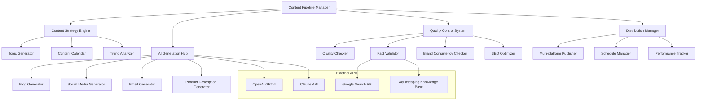

# AI Content Generation Pipeline Documentation

## Overview

The AquaScene AI Content Generation Pipeline is a sophisticated system that leverages artificial intelligence to create high-quality, engaging content specifically tailored for the aquascaping community. It combines advanced language models, custom-trained prompts, quality control mechanisms, and automated distribution to maintain consistent, valuable content across all platforms.

## System Architecture

### Core Components



### Technology Stack
- **Primary AI**: OpenAI GPT-4 for content generation
- **Secondary AI**: Anthropic Claude for quality review
- **Knowledge Base**: Custom aquascaping database with 10,000+ articles
- **Fact Checking**: Google Search API integration
- **SEO Tools**: Custom SEO analysis and optimization
- **Content Storage**: PostgreSQL with full-text search
- **Media Processing**: Cloudinary for image optimization
- **Scheduling**: Node-cron with Redis queue management

## Content Strategy Engine

### Intelligent Topic Generation

#### Topic Discovery System
```typescript
// src/lib/ai-content/topic-generator.ts
export class TopicGenerator {
  private openai: OpenAI;
  private trendAnalyzer: TrendAnalyzer;
  private knowledgeBase: KnowledgeBase;
  private seasonalityEngine: SeasonalityEngine;

  constructor() {
    this.openai = new OpenAI({ apiKey: process.env.OPENAI_API_KEY });
    this.trendAnalyzer = new TrendAnalyzer();
    this.knowledgeBase = new KnowledgeBase();
    this.seasonalityEngine = new SeasonalityEngine();
  }

  async generateTopicIdeas(
    contentType: ContentType,
    targetAudience: AudienceLevel,
    timeframe: number = 30
  ): Promise<TopicIdea[]> {
    // Analyze current trends in aquascaping
    const trends = await this.trendAnalyzer.getCurrentTrends();
    
    // Get seasonal considerations
    const seasonal = await this.seasonalityEngine.getSeasonalTopics();
    
    // Analyze knowledge gaps
    const gaps = await this.knowledgeBase.identifyContentGaps();
    
    // Generate comprehensive topic ideas
    const topicPrompt = this.buildTopicPrompt(contentType, targetAudience, trends, seasonal, gaps);
    
    const response = await this.openai.chat.completions.create({
      model: 'gpt-4',
      messages: [{ role: 'user', content: topicPrompt }],
      temperature: 0.8,
      max_tokens: 2000
    });

    const rawTopics = this.parseTopicResponse(response.choices[0].message.content!);
    
    // Enrich topics with metadata
    const enrichedTopics = await Promise.all(
      rawTopics.map(topic => this.enrichTopicIdea(topic, contentType, targetAudience))
    );

    // Score and prioritize topics
    return this.prioritizeTopics(enrichedTopics, timeframe);
  }

  private buildTopicPrompt(
    contentType: ContentType,
    audience: AudienceLevel,
    trends: Trend[],
    seasonal: SeasonalTopic[],
    gaps: ContentGap[]
  ): string {
    return `
      Generate ${contentType} topic ideas for aquascaping content targeting ${audience} level enthusiasts.
      
      Current Context:
      - Trending topics: ${trends.map(t => t.name).join(', ')}
      - Seasonal considerations: ${seasonal.map(s => s.theme).join(', ')}
      - Content gaps to fill: ${gaps.map(g => g.area).join(', ')}
      
      Requirements for ${contentType}:
      ${this.getContentTypeRequirements(contentType)}
      
      Audience Level: ${audience}
      ${this.getAudienceRequirements(audience)}
      
      Generate 15 diverse topic ideas. For each topic, provide:
      1. Title (engaging and SEO-friendly)
      2. Brief description (2-3 sentences)
      3. Key points to cover (3-5 bullet points)
      4. Difficulty level (beginner/intermediate/advanced)
      5. Estimated content length
      6. Keywords to target
      7. Seasonal relevance (if any)
      8. Unique angle or hook
      
      Focus on:
      - Practical, actionable content
      - Unique perspectives not commonly covered
      - Problem-solving approaches
      - Step-by-step guidance
      - Equipment recommendations when relevant
      - Beginner-friendly explanations of complex topics
      - Advanced techniques for experienced aquascapers
      
      Format as JSON array with clear structure.
    `;
  }

  async enrichTopicIdea(
    topic: RawTopicIdea,
    contentType: ContentType,
    audience: AudienceLevel
  ): Promise<TopicIdea> {
    // Analyze search volume and competition
    const seoData = await this.analyzeSEOPotential(topic.title, topic.keywords);
    
    // Check content uniqueness
    const uniquenessScore = await this.assessUniqueness(topic.description);
    
    // Estimate engagement potential
    const engagementScore = await this.predictEngagement(topic, contentType, audience);
    
    // Calculate production effort
    const productionEffort = this.estimateProductionEffort(topic, contentType);

    return {
      ...topic,
      seoData,
      uniquenessScore,
      engagementScore,
      productionEffort,
      priority: this.calculatePriority(seoData, uniquenessScore, engagementScore, productionEffort),
      generatedAt: new Date()
    };
  }

  private prioritizeTopics(topics: TopicIdea[], timeframe: number): TopicIdea[] {
    // Sort by priority score
    const prioritized = topics.sort((a, b) => b.priority - a.priority);
    
    // Balance topic types and difficulty levels
    const balanced = this.balanceTopicMix(prioritized);
    
    // Consider seasonal timing
    const seasonallyAdjusted = this.adjustForSeasonality(balanced, timeframe);
    
    return seasonallyAdjusted.slice(0, Math.min(timeframe, 50));
  }
}
```

#### Content Calendar Management
```typescript
// src/lib/ai-content/content-calendar.ts
export class ContentCalendar {
  private database: Database;
  private topicGenerator: TopicGenerator;
  private schedulingEngine: SchedulingEngine;

  async generateMonthlyCalendar(
    month: number,
    year: number,
    preferences: CalendarPreferences
  ): Promise<ContentCalendar> {
    const calendar: ContentCalendar = {
      month,
      year,
      entries: [],
      themes: [],
      metrics: {
        totalPieces: 0,
        contentTypes: {},
        difficultyDistribution: {},
        estimatedReach: 0
      }
    };

    // Generate monthly themes
    calendar.themes = await this.generateMonthlyThemes(month, year);
    
    // Create daily content schedule
    const daysInMonth = new Date(year, month, 0).getDate();
    
    for (let day = 1; day <= daysInMonth; day++) {
      const date = new Date(year, month - 1, day);
      const dayEntry = await this.planDayContent(date, preferences, calendar.themes);
      
      if (dayEntry.content.length > 0) {
        calendar.entries.push(dayEntry);
        calendar.metrics.totalPieces += dayEntry.content.length;
      }
    }

    // Calculate distribution metrics
    calendar.metrics = this.calculateCalendarMetrics(calendar);

    return calendar;
  }

  private async planDayContent(
    date: Date,
    preferences: CalendarPreferences,
    themes: MonthlyTheme[]
  ): Promise<CalendarEntry> {
    const dayOfWeek = date.getDay();
    const isWeekend = dayOfWeek === 0 || dayOfWeek === 6;
    
    const entry: CalendarEntry = {
      date,
      content: [],
      theme: this.selectDayTheme(date, themes),
      priority: this.calculateDayPriority(date, isWeekend)
    };

    // Blog content (2-3 times per week)
    if (this.shouldScheduleBlog(dayOfWeek, preferences.blogFrequency)) {
      const blogTopic = await this.topicGenerator.generateTopicIdeas(
        'blog',
        preferences.targetAudience,
        1
      );
      
      if (blogTopic.length > 0) {
        entry.content.push({
          type: 'blog',
          topic: blogTopic[0],
          scheduledTime: this.getOptimalBlogTime(date),
          estimatedEffort: blogTopic[0].productionEffort,
          priority: 'high'
        });
      }
    }

    // Social media content (daily)
    const socialTopics = await this.generateSocialContent(date, entry.theme, preferences);
    entry.content.push(...socialTopics);

    // Email content (weekly)
    if (this.shouldScheduleEmail(date, preferences.emailFrequency)) {
      const emailTopic = await this.generateEmailTopic(date, entry.theme);
      if (emailTopic) {
        entry.content.push(emailTopic);
      }
    }

    return entry;
  }

  private async generateMonthlyThemes(month: number, year: number): Promise<MonthlyTheme[]> {
    const seasonalContext = this.getSeasonalContext(month);
    const aquascapingEvents = await this.getAquascapingEvents(month, year);
    
    const themes: MonthlyTheme[] = [
      {
        name: `${seasonalContext.name} Aquascaping`,
        description: seasonalContext.description,
        weeks: [1, 2],
        focus: seasonalContext.focus,
        keyTopics: seasonalContext.topics
      }
    ];

    // Add event-based themes
    aquascapingEvents.forEach(event => {
      themes.push({
        name: event.name,
        description: event.description,
        weeks: event.weeks,
        focus: event.focus,
        keyTopics: event.topics
      });
    });

    return themes;
  }
}
```

## AI Generation Hub

### Multi-Modal Content Generator

#### Blog Content Generator
```typescript
// src/lib/ai-content/blog-generator.ts
export class BlogContentGenerator {
  private openai: OpenAI;
  private knowledgeBase: KnowledgeBase;
  private seoOptimizer: SEOOptimizer;
  private qualityChecker: QualityChecker;

  constructor() {
    this.openai = new OpenAI({ apiKey: process.env.OPENAI_API_KEY });
    this.knowledgeBase = new KnowledgeBase();
    this.seoOptimizer = new SEOOptimizer();
    this.qualityChecker = new QualityChecker();
  }

  async generateBlogPost(topic: TopicIdea): Promise<GeneratedBlogPost> {
    // Research phase - gather relevant information
    const research = await this.conductResearch(topic);
    
    // Generate outline
    const outline = await this.generateOutline(topic, research);
    
    // Generate content sections
    const sections = await this.generateSections(outline, research);
    
    // Compile full article
    const article = await this.compileArticle(topic, outline, sections);
    
    // Optimize for SEO
    const optimized = await this.seoOptimizer.optimize(article, topic.keywords);
    
    // Quality check
    const qualityReport = await this.qualityChecker.assess(optimized);
    
    return {
      ...optimized,
      topic,
      outline,
      research: research.summary,
      qualityReport,
      generatedAt: new Date(),
      status: qualityReport.passed ? 'ready' : 'needs_review'
    };
  }

  private async conductResearch(topic: TopicIdea): Promise<ResearchData> {
    const researchPrompt = `
      Conduct comprehensive research for an aquascaping blog post about: "${topic.title}"
      
      Research Requirements:
      - Scientific accuracy for plant and fish information
      - Current best practices in aquascaping
      - Equipment specifications and recommendations
      - Common problems and solutions
      - Recent developments in the field
      - Expert opinions and techniques
      
      Target Audience: ${topic.difficulty} level aquascapers
      
      Provide research findings in the following structure:
      1. Key facts and statistics
      2. Expert techniques and methods
      3. Equipment and product information
      4. Common mistakes to avoid
      5. Advanced tips and tricks
      6. Related topics and concepts
      7. Current trends and innovations
      
      Ensure all information is accurate and up-to-date.
    `;

    const response = await this.openai.chat.completions.create({
      model: 'gpt-4',
      messages: [{ role: 'user', content: researchPrompt }],
      temperature: 0.3,
      max_tokens: 1500
    });

    const researchContent = response.choices[0].message.content!;
    
    // Cross-reference with knowledge base
    const knowledgeBaseData = await this.knowledgeBase.search(topic.keywords);
    
    // Fact-check critical information
    const factChecked = await this.factCheck(researchContent);

    return {
      content: researchContent,
      knowledgeBase: knowledgeBaseData,
      factChecked,
      summary: this.summarizeResearch(researchContent),
      sources: await this.generateSources(topic),
      confidence: factChecked.overallConfidence
    };
  }

  private async generateOutline(topic: TopicIdea, research: ResearchData): Promise<BlogOutline> {
    const outlinePrompt = `
      Create a detailed outline for an aquascaping blog post:
      
      Title: "${topic.title}"
      Description: ${topic.description}
      Target Audience: ${topic.difficulty} level
      Estimated Length: ${topic.estimatedLength} words
      
      Research Summary:
      ${research.summary}
      
      Create an engaging outline with:
      1. Compelling introduction that hooks the reader
      2. 4-6 main sections with clear headings
      3. Practical tips and actionable advice
      4. Step-by-step instructions where applicable
      5. Equipment recommendations with explanations
      6. Troubleshooting section for common issues
      7. Conclusion with key takeaways and next steps
      
      Each section should:
      - Have a clear, SEO-friendly heading
      - Include 2-4 subsections
      - Specify what information to cover
      - Indicate where to include images or diagrams
      - Note any equipment or product mentions
      
      Make the outline educational but engaging, suitable for ${topic.difficulty} level readers.
    `;

    const response = await this.openai.chat.completions.create({
      model: 'gpt-4',
      messages: [{ role: 'user', content: outlinePrompt }],
      temperature: 0.4,
      max_tokens: 1000
    });

    return this.parseOutline(response.choices[0].message.content!);
  }

  private async generateSections(outline: BlogOutline, research: ResearchData): Promise<BlogSection[]> {
    const sections: BlogSection[] = [];

    for (const outlineSection of outline.sections) {
      const sectionPrompt = `
        Write a comprehensive section for an aquascaping blog post:
        
        Section: ${outlineSection.heading}
        Subsections: ${outlineSection.subsections.join(', ')}
        Content Focus: ${outlineSection.focus}
        Target Length: ${outlineSection.targetWords} words
        
        Research Context:
        ${research.summary}
        
        Writing Guidelines:
        - Use clear, engaging language
        - Include specific examples and recommendations
        - Provide actionable advice
        - Use technical terms appropriately for the audience
        - Include practical tips and insights
        - Mention specific products/equipment when relevant
        - Use transition sentences for smooth flow
        - Include calls-to-action where appropriate
        
        Format:
        - Use proper markdown formatting
        - Include subheadings (###)
        - Use bullet points for lists
        - Bold important terms
        - Italicize scientific names
        - Include placeholder tags for images: [IMAGE: description]
      `;

      const response = await this.openai.chat.completions.create({
        model: 'gpt-4',
        messages: [{ role: 'user', content: sectionPrompt }],
        temperature: 0.6,
        max_tokens: 800
      });

      sections.push({
        heading: outlineSection.heading,
        content: response.choices[0].message.content!,
        wordCount: this.countWords(response.choices[0].message.content!),
        subsections: outlineSection.subsections,
        images: this.extractImagePlaceholders(response.choices[0].message.content!)
      });
    }

    return sections;
  }

  private async compileArticle(
    topic: TopicIdea,
    outline: BlogOutline,
    sections: BlogSection[]
  ): Promise<BlogArticle> {
    // Create introduction
    const introduction = await this.generateIntroduction(topic, outline);
    
    // Create conclusion
    const conclusion = await this.generateConclusion(topic, sections);
    
    // Compile full article
    const fullContent = [
      introduction,
      ...sections.map(s => s.content),
      conclusion
    ].join('\n\n');

    // Generate metadata
    const metadata = await this.generateMetadata(topic, fullContent);

    return {
      title: topic.title,
      content: fullContent,
      introduction,
      sections,
      conclusion,
      metadata,
      wordCount: this.countWords(fullContent),
      readingTime: Math.ceil(this.countWords(fullContent) / 200),
      images: this.extractAllImages(sections),
      generatedAt: new Date()
    };
  }

  private async generateIntroduction(topic: TopicIdea, outline: BlogOutline): Promise<string> {
    const introPrompt = `
      Write an engaging introduction for an aquascaping blog post:
      
      Title: "${topic.title}"
      Description: ${topic.description}
      Target Audience: ${topic.difficulty} level aquascapers
      
      Main Points to Cover:
      ${outline.sections.map(s => `- ${s.heading}`).join('\n')}
      
      Create an introduction that:
      - Hooks the reader immediately
      - Clearly states what they'll learn
      - Addresses their pain points or interests
      - Sets the tone for the article
      - Is 150-200 words long
      - Includes a compelling opening statement
      - Previews the key benefits they'll gain
      
      Use engaging, conversational tone while maintaining authority.
    `;

    const response = await this.openai.chat.completions.create({
      model: 'gpt-4',
      messages: [{ role: 'user', content: introPrompt }],
      temperature: 0.7,
      max_tokens: 300
    });

    return response.choices[0].message.content!;
  }
}
```

#### Social Media Content Generator
```typescript
// src/lib/ai-content/social-generator.ts
export class SocialMediaGenerator {
  private openai: OpenAI;
  private platformOptimizer: PlatformOptimizer;
  private hashtagManager: HashtagManager;
  private engagementAnalyzer: EngagementAnalyzer;

  constructor() {
    this.openai = new OpenAI({ apiKey: process.env.OPENAI_API_KEY });
    this.platformOptimizer = new PlatformOptimizer();
    this.hashtagManager = new HashtagManager();
    this.engagementAnalyzer = new EngagementAnalyzer();
  }

  async generateSocialContent(
    topic: string,
    platform: SocialPlatform,
    contentType: SocialContentType,
    context?: ContentContext
  ): Promise<SocialContent> {
    // Generate base content
    const baseContent = await this.generateBaseContent(topic, contentType, context);
    
    // Optimize for specific platform
    const optimized = await this.platformOptimizer.optimize(baseContent, platform);
    
    // Generate hashtags
    const hashtags = await this.hashtagManager.generate(topic, platform);
    
    // Add engagement elements
    const withEngagement = await this.addEngagementElements(optimized, platform);
    
    return {
      platform,
      type: contentType,
      content: withEngagement,
      hashtags,
      scheduledTime: await this.getOptimalPostTime(platform),
      engagement: {
        callToAction: this.extractCallToAction(withEngagement),
        interactiveElements: this.extractInteractiveElements(withEngagement)
      },
      metadata: {
        topic,
        generatedAt: new Date(),
        estimatedReach: await this.estimateReach(platform, hashtags.length),
        confidence: await this.assessContentQuality(withEngagement, platform)
      }
    };
  }

  private async generateBaseContent(
    topic: string,
    contentType: SocialContentType,
    context?: ContentContext
  ): Promise<string> {
    const contentPrompts = {
      caption: this.buildCaptionPrompt(topic, context),
      story: this.buildStoryPrompt(topic, context),
      reel: this.buildReelPrompt(topic, context),
      carousel: this.buildCarouselPrompt(topic, context)
    };

    const prompt = contentPrompts[contentType];
    
    const response = await this.openai.chat.completions.create({
      model: 'gpt-4',
      messages: [{ role: 'user', content: prompt }],
      temperature: 0.8,
      max_tokens: this.getMaxTokensForType(contentType)
    });

    return response.choices[0].message.content!;
  }

  private buildCaptionPrompt(topic: string, context?: ContentContext): string {
    return `
      Create an engaging Instagram caption for an aquascaping post about: ${topic}
      
      Context:
      ${context ? `- Post context: ${context.description}` : ''}
      ${context ? `- Target audience: ${context.audience}` : ''}
      ${context ? `- Brand voice: ${context.brandVoice}` : ''}
      
      Requirements:
      - 125-150 words (optimal Instagram length)
      - Hook the reader in the first sentence
      - Provide valuable aquascaping insight or tip
      - Include a compelling call-to-action
      - Use emojis strategically (2-4 maximum)
      - Ask an engaging question to encourage comments
      - Maintain educational but approachable tone
      - Reference specific plants, techniques, or equipment when relevant
      - Include personal insight or experience
      - End with community engagement question
      
      Structure:
      1. Strong opening hook
      2. Main educational content
      3. Practical tip or insight
      4. Call-to-action
      5. Engagement question
      
      Don't include hashtags (they'll be added separately).
      Focus on value and community building.
    `;
  }

  private buildStoryPrompt(topic: string, context?: ContentContext): string {
    return `
      Create Instagram Story content about: ${topic}
      
      Generate 3-5 story slides with different formats:
      
      Slide Types to Include:
      - Tip/Educational slide
      - Behind-the-scenes content
      - Interactive poll or question
      - Product recommendation (if relevant)
      - Call-to-action slide
      
      For each slide, provide:
      1. Content text (keep under 50 words per slide)
      2. Visual description
      3. Interactive element (if applicable)
      4. Duration (15 seconds recommended)
      
      Guidelines:
      - Use casual, conversational tone
      - Include actionable tips
      - Make it visually engaging
      - Encourage interaction
      - Keep text readable on mobile
      - Use story-specific language and urgency
      
      Context: ${context?.description || 'General aquascaping content'}
    `;
  }

  async generateContentVariations(
    baseContent: SocialContent,
    variationCount: number = 3
  ): Promise<SocialContent[]> {
    const variations: SocialContent[] = [baseContent];

    for (let i = 0; i < variationCount; i++) {
      const variationPrompt = `
        Create a variation of this aquascaping social media post:
        
        Original: "${baseContent.content}"
        Platform: ${baseContent.platform}
        Topic: ${baseContent.metadata.topic}
        
        Create a different version that:
        - Maintains the same key message
        - Uses different wording and structure
        - Offers a fresh perspective on the same topic
        - Keeps similar length and engagement elements
        - Includes different but relevant details
        - Uses varied emoji placement
        - Changes the call-to-action approach
        
        Make it feel like naturally different content, not just rewording.
      `;

      const response = await this.openai.chat.completions.create({
        model: 'gpt-4',
        messages: [{ role: 'user', content: variationPrompt }],
        temperature: 0.9,
        max_tokens: 300
      });

      const variation: SocialContent = {
        ...baseContent,
        content: response.choices[0].message.content!,
        hashtags: await this.hashtagManager.generateVariation(baseContent.hashtags),
        metadata: {
          ...baseContent.metadata,
          variationOf: baseContent.metadata.topic,
          variationNumber: i + 1
        }
      };

      variations.push(variation);
    }

    return variations;
  }
}
```

### Quality Control System

#### Comprehensive Quality Assessment
```typescript
// src/lib/ai-content/quality-control.ts
export class QualityControlSystem {
  private factChecker: FactChecker;
  private brandChecker: BrandConsistencyChecker;
  private seoAnalyzer: SEOAnalyzer;
  private readabilityAnalyzer: ReadabilityAnalyzer;
  private plagiarismChecker: PlagiarismChecker;

  constructor() {
    this.factChecker = new FactChecker();
    this.brandChecker = new BrandConsistencyChecker();
    this.seoAnalyzer = new SEOAnalyzer();
    this.readabilityAnalyzer = new ReadabilityAnalyzer();
    this.plagiarismChecker = new PlagiarismChecker();
  }

  async assessContent(content: GeneratedContent): Promise<QualityReport> {
    const report: QualityReport = {
      contentId: content.id,
      assessedAt: new Date(),
      overallScore: 0,
      passed: false,
      sections: {},
      recommendations: [],
      criticalIssues: [],
      warnings: []
    };

    // Run parallel quality checks
    const [
      factCheckResult,
      brandResult,
      seoResult,
      readabilityResult,
      plagiarismResult,
      contentStructureResult
    ] = await Promise.all([
      this.factChecker.check(content),
      this.brandChecker.verify(content),
      this.seoAnalyzer.analyze(content),
      this.readabilityAnalyzer.analyze(content),
      this.plagiarismChecker.check(content),
      this.analyzeContentStructure(content)
    ]);

    // Compile results
    report.sections = {
      factAccuracy: factCheckResult,
      brandConsistency: brandResult,
      seoOptimization: seoResult,
      readability: readabilityResult,
      originality: plagiarismResult,
      structure: contentStructureResult
    };

    // Calculate overall score
    report.overallScore = this.calculateOverallScore(report.sections);
    
    // Determine if content passes
    report.passed = this.determinePassStatus(report.sections);
    
    // Generate recommendations
    report.recommendations = this.generateRecommendations(report.sections);
    
    // Identify critical issues
    report.criticalIssues = this.identifyCriticalIssues(report.sections);

    return report;
  }

  private async analyzeContentStructure(content: GeneratedContent): Promise<StructureAnalysis> {
    const analysis: StructureAnalysis = {
      score: 0,
      issues: [],
      strengths: [],
      headingStructure: this.analyzeHeadings(content.text),
      paragraphLength: this.analyzeParagraphs(content.text),
      listUsage: this.analyzeLists(content.text),
      imageDistribution: this.analyzeImages(content.text),
      callToActionPresence: this.analyzeCallToActions(content.text)
    };

    // Evaluate heading hierarchy
    if (analysis.headingStructure.hasProperHierarchy) {
      analysis.strengths.push('Proper heading hierarchy maintained');
      analysis.score += 20;
    } else {
      analysis.issues.push('Improve heading structure and hierarchy');
    }

    // Check paragraph length
    if (analysis.paragraphLength.averageLength <= 150) {
      analysis.strengths.push('Good paragraph length for readability');
      analysis.score += 15;
    } else {
      analysis.issues.push('Break up long paragraphs for better readability');
    }

    // Evaluate list usage
    if (analysis.listUsage.count > 0) {
      analysis.strengths.push('Good use of lists for scannable content');
      analysis.score += 10;
    }

    // Check call-to-action
    if (analysis.callToActionPresence.count > 0) {
      analysis.strengths.push('Includes clear call-to-action');
      analysis.score += 15;
    } else {
      analysis.issues.push('Add clear call-to-action for engagement');
    }

    return analysis;
  }

  async improveContent(
    content: GeneratedContent,
    qualityReport: QualityReport
  ): Promise<ImprovedContent> {
    const improvements: ContentImprovement[] = [];

    // Address critical issues first
    for (const issue of qualityReport.criticalIssues) {
      const improvement = await this.addressCriticalIssue(content, issue);
      improvements.push(improvement);
    }

    // Apply recommendations
    for (const recommendation of qualityReport.recommendations) {
      if (recommendation.priority === 'high') {
        const improvement = await this.applyRecommendation(content, recommendation);
        improvements.push(improvement);
      }
    }

    // Generate improved version
    const improvedContent = await this.generateImprovedVersion(content, improvements);
    
    // Re-assess improved content
    const newQualityReport = await this.assessContent(improvedContent);

    return {
      original: content,
      improved: improvedContent,
      improvements,
      originalScore: qualityReport.overallScore,
      improvedScore: newQualityReport.overallScore,
      improvementLog: this.generateImprovementLog(improvements)
    };
  }

  private async addressCriticalIssue(
    content: GeneratedContent,
    issue: CriticalIssue
  ): Promise<ContentImprovement> {
    const improvementPrompt = `
      Fix this critical issue in aquascaping content:
      
      Issue: ${issue.description}
      Severity: ${issue.severity}
      Location: ${issue.location}
      
      Original content excerpt:
      "${content.text.substring(issue.startIndex, issue.endIndex)}"
      
      Provide a corrected version that:
      - Addresses the specific issue
      - Maintains the original meaning and tone
      - Ensures factual accuracy
      - Preserves the content flow
      - Uses appropriate aquascaping terminology
      
      Return only the corrected text section.
    `;

    const response = await this.openai.chat.completions.create({
      model: 'gpt-4',
      messages: [{ role: 'user', content: improvementPrompt }],
      temperature: 0.3,
      max_tokens: 500
    });

    return {
      type: 'critical_fix',
      issue: issue.description,
      originalText: content.text.substring(issue.startIndex, issue.endIndex),
      improvedText: response.choices[0].message.content!,
      startIndex: issue.startIndex,
      endIndex: issue.endIndex,
      impact: 'high'
    };
  }
}
```

#### AI-Powered Fact Checking
```typescript
// src/lib/ai-content/fact-checker.ts
export class FactChecker {
  private openai: OpenAI;
  private knowledgeBase: AquascapingKnowledgeBase;
  private searchApi: GoogleSearchAPI;
  private expertSources: ExpertSource[];

  constructor() {
    this.openai = new OpenAI({ apiKey: process.env.OPENAI_API_KEY });
    this.knowledgeBase = new AquascapingKnowledgeBase();
    this.searchApi = new GoogleSearchAPI();
    this.expertSources = this.loadExpertSources();
  }

  async checkFacts(content: string): Promise<FactCheckResult> {
    // Extract factual claims
    const claims = await this.extractClaims(content);
    
    // Verify each claim
    const verificationResults = await Promise.all(
      claims.map(claim => this.verifyClaim(claim))
    );

    // Calculate overall confidence
    const overallConfidence = this.calculateConfidence(verificationResults);

    return {
      claims: claims.length,
      verified: verificationResults.filter(r => r.verified).length,
      flagged: verificationResults.filter(r => r.flagged).length,
      confidence: overallConfidence,
      results: verificationResults,
      recommendations: this.generateFactCheckRecommendations(verificationResults)
    };
  }

  private async extractClaims(content: string): Promise<FactualClaim[]> {
    const extractionPrompt = `
      Extract factual claims from this aquascaping content that need verification:
      
      Content: "${content}"
      
      Identify claims about:
      - Plant care requirements (lighting, CO2, nutrients)
      - Fish compatibility and care
      - Equipment specifications and performance
      - Chemical parameters and their effects
      - Biological processes in aquariums
      - Product effectiveness and safety
      - Scientific facts about aquatic life
      - Technical procedures and their outcomes
      
      For each claim, provide:
      1. The exact claim text
      2. Category (plant-care, fish-care, equipment, chemistry, biology, etc.)
      3. Specificity level (general, specific, technical)
      4. Verifiability (easily verifiable, requires expert knowledge, opinion-based)
      
      Return as JSON array of claims.
    `;

    const response = await this.openai.chat.completions.create({
      model: 'gpt-4',
      messages: [{ role: 'user', content: extractionPrompt }],
      temperature: 0.2,
      max_tokens: 1000
    });

    return JSON.parse(response.choices[0].message.content!);
  }

  private async verifyClaim(claim: FactualClaim): Promise<ClaimVerification> {
    const verification: ClaimVerification = {
      claim: claim.text,
      category: claim.category,
      verified: false,
      flagged: false,
      confidence: 0,
      sources: [],
      reasoning: ''
    };

    // Check against knowledge base
    const knowledgeBaseResult = await this.knowledgeBase.verify(claim);
    
    // Search for authoritative sources
    const searchResults = await this.searchApi.verifyFact(claim.text, claim.category);
    
    // Cross-reference with expert sources
    const expertVerification = await this.checkExpertSources(claim);

    // AI-powered verification
    const aiVerification = await this.aiVerifyClaim(claim, searchResults);

    // Combine verification results
    verification.verified = this.determineVerificationStatus([
      knowledgeBaseResult,
      searchResults,
      expertVerification,
      aiVerification
    ]);

    verification.confidence = this.calculateClaimConfidence([
      knowledgeBaseResult,
      searchResults,
      expertVerification,
      aiVerification
    ]);

    verification.sources = this.combineSources([
      knowledgeBaseResult.sources,
      searchResults.sources,
      expertVerification.sources
    ]);

    verification.reasoning = this.generateReasoning(verification);

    return verification;
  }

  private async aiVerifyClaim(
    claim: FactualClaim, 
    searchResults: SearchResult[]
  ): Promise<AIVerificationResult> {
    const verificationPrompt = `
      Verify this aquascaping claim using the provided search results:
      
      Claim: "${claim.text}"
      Category: ${claim.category}
      
      Search Results:
      ${searchResults.map(r => `- Source: ${r.source}\n  Content: ${r.snippet}`).join('\n\n')}
      
      Instructions:
      - Analyze the claim for accuracy based on search results
      - Consider the credibility of sources
      - Look for consensus or disagreement among sources
      - Identify any outdated or incorrect information
      - Consider context and nuance
      
      Respond with:
      1. Verification status (VERIFIED, PARTIALLY_VERIFIED, UNVERIFIED, CONTRADICTED)
      2. Confidence level (0-100)
      3. Reasoning for the assessment
      4. Any corrections or clarifications needed
      5. Quality of available evidence
      
      Be especially careful with:
      - Chemical dosing recommendations
      - Species compatibility claims
      - Equipment performance specifications
      - Health and safety information
    `;

    const response = await this.openai.chat.completions.create({
      model: 'gpt-4',
      messages: [{ role: 'user', content: verificationPrompt }],
      temperature: 0.1,
      max_tokens: 800
    });

    return this.parseAIVerificationResponse(response.choices[0].message.content!);
  }
}
```

## Content Distribution System

### Multi-Platform Publishing

#### Automated Distribution Manager
```typescript
// src/lib/ai-content/distribution-manager.ts
export class ContentDistributionManager {
  private publishers: Map<string, ContentPublisher> = new Map();
  private scheduler: DistributionScheduler;
  private analytics: DistributionAnalytics;
  private optimizer: DistributionOptimizer;

  constructor() {
    this.initializePublishers();
    this.scheduler = new DistributionScheduler();
    this.analytics = new DistributionAnalytics();
    this.optimizer = new DistributionOptimizer();
    this.setupDistributionTasks();
  }

  private initializePublishers() {
    this.publishers.set('blog', new BlogPublisher());
    this.publishers.set('instagram', new InstagramPublisher());
    this.publishers.set('email', new EmailPublisher());
    this.publishers.set('youtube', new YouTubePublisher());
    this.publishers.set('tiktok', new TikTokPublisher());
  }

  async distributeContent(
    content: GeneratedContent,
    distributionPlan: DistributionPlan
  ): Promise<DistributionResult> {
    const results: PlatformResult[] = [];
    
    // Process each platform in the distribution plan
    for (const platformConfig of distributionPlan.platforms) {
      try {
        const result = await this.distributeToplatform(content, platformConfig);
        results.push(result);
        
        // Add delay between platforms to avoid rate limits
        if (platformConfig.delay) {
          await this.delay(platformConfig.delay);
        }
        
      } catch (error) {
        console.error(`❌ Distribution failed for ${platformConfig.platform}:`, error);
        results.push({
          platform: platformConfig.platform,
          success: false,
          error: error.message,
          timestamp: new Date()
        });
      }
    }

    // Track distribution performance
    await this.analytics.trackDistribution(content.id, results);

    return {
      contentId: content.id,
      distributedAt: new Date(),
      platforms: results,
      successCount: results.filter(r => r.success).length,
      failureCount: results.filter(r => !r.success).length,
      totalReach: results.reduce((sum, r) => sum + (r.estimatedReach || 0), 0)
    };
  }

  private async distributeToplatform(
    content: GeneratedContent,
    config: PlatformConfig
  ): Promise<PlatformResult> {
    const publisher = this.publishers.get(config.platform);
    if (!publisher) {
      throw new Error(`No publisher found for platform: ${config.platform}`);
    }

    // Adapt content for platform
    const adaptedContent = await this.adaptContentForPlatform(content, config);
    
    // Optimize timing
    const optimalTime = await this.optimizer.getOptimalPublishTime(config.platform);
    
    // Schedule or publish immediately
    if (config.scheduleTime || optimalTime > new Date()) {
      return await this.scheduleContent(adaptedContent, config, optimalTime);
    } else {
      return await publisher.publish(adaptedContent, config);
    }
  }

  async generateDistributionPlan(
    content: GeneratedContent,
    strategy: DistributionStrategy
  ): Promise<DistributionPlan> {
    const plan: DistributionPlan = {
      contentId: content.id,
      strategy: strategy.name,
      platforms: [],
      totalEstimatedReach: 0,
      scheduledStart: new Date(),
      estimatedCompletion: new Date()
    };

    // Determine platforms based on content type and strategy
    const suitablePlatforms = await this.identifySuitablePlatforms(content, strategy);
    
    for (const platform of suitablePlatforms) {
      const platformConfig = await this.generatePlatformConfig(content, platform, strategy);
      plan.platforms.push(platformConfig);
      plan.totalEstimatedReach += platformConfig.estimatedReach;
    }

    // Optimize publishing schedule
    plan.platforms = await this.optimizePublishingSchedule(plan.platforms);
    
    // Set completion time
    const lastScheduledTime = Math.max(...plan.platforms.map(p => p.scheduleTime?.getTime() || 0));
    plan.estimatedCompletion = new Date(lastScheduledTime);

    return plan;
  }

  private async adaptContentForPlatform(
    content: GeneratedContent,
    config: PlatformConfig
  ): Promise<AdaptedContent> {
    const adaptationPrompt = `
      Adapt this aquascaping content for ${config.platform}:
      
      Original Content:
      Title: ${content.title}
      Content: ${content.text.substring(0, 1000)}...
      
      Platform Requirements:
      - Character limit: ${config.characterLimit || 'none'}
      - Supports images: ${config.supportsImages}
      - Supports videos: ${config.supportsVideos}
      - Hashtag strategy: ${config.hashtagStrategy}
      - Tone: ${config.tone}
      - Audience: ${config.targetAudience}
      
      Adaptation Guidelines:
      - Maintain key message and value
      - Optimize for platform's unique features
      - Adjust tone and formatting appropriately
      - Include platform-specific engagement elements
      - Ensure compliance with platform guidelines
      - Preserve brand voice and expertise
      
      Return the adapted content with proper formatting for ${config.platform}.
    `;

    const response = await this.openai.chat.completions.create({
      model: 'gpt-4',
      messages: [{ role: 'user', content: adaptationPrompt }],
      temperature: 0.6,
      max_tokens: 1000
    });

    return {
      platform: config.platform,
      title: this.extractTitle(response.choices[0].message.content!),
      content: response.choices[0].message.content!,
      hashtags: await this.generatePlatformHashtags(content.topic, config.platform),
      images: await this.selectPlatformImages(content.images, config),
      scheduling: {
        optimalTime: await this.optimizer.getOptimalPublishTime(config.platform),
        timezone: config.timezone || 'UTC'
      }
    };
  }
}
```

## Analytics and Optimization

### Performance Tracking System

#### Content Performance Analytics
```typescript
// src/lib/ai-content/content-analytics.ts
export class ContentPerformanceAnalytics {
  private database: Database;
  private aiAnalyzer: AIPerformanceAnalyzer;
  private trendAnalyzer: ContentTrendAnalyzer;

  async generatePerformanceReport(timeframe: Timeframe): Promise<PerformanceReport> {
    const report: PerformanceReport = {
      timeframe,
      generatedAt: new Date(),
      summary: {},
      contentAnalysis: {},
      platformPerformance: {},
      audienceInsights: {},
      recommendations: [],
      trends: {}
    };

    // Collect performance data
    const [
      contentMetrics,
      platformMetrics,
      audienceData,
      engagementData,
      conversionData
    ] = await Promise.all([
      this.getContentMetrics(timeframe),
      this.getPlatformMetrics(timeframe),
      this.getAudienceInsights(timeframe),
      this.getEngagementMetrics(timeframe),
      this.getConversionMetrics(timeframe)
    ]);

    // Analyze performance patterns
    report.contentAnalysis = await this.analyzeContentPerformance(contentMetrics);
    report.platformPerformance = await this.analyzePlatformPerformance(platformMetrics);
    report.audienceInsights = await this.analyzeAudienceData(audienceData);

    // Generate AI-powered insights
    const aiInsights = await this.aiAnalyzer.generateInsights({
      content: contentMetrics,
      platforms: platformMetrics,
      audience: audienceData,
      engagement: engagementData,
      conversions: conversionData
    });

    report.recommendations = aiInsights.recommendations;
    report.trends = await this.trendAnalyzer.identifyTrends(timeframe);

    return report;
  }

  private async analyzeContentPerformance(metrics: ContentMetric[]): Promise<ContentAnalysis> {
    const analysis: ContentAnalysis = {
      topPerformers: [],
      underperformers: [],
      contentTypeAnalysis: {},
      topicAnalysis: {},
      lengthAnalysis: {},
      timeAnalysis: {}
    };

    // Identify top and bottom performers
    const sorted = metrics.sort((a, b) => b.engagementScore - a.engagementScore);
    analysis.topPerformers = sorted.slice(0, 10);
    analysis.underperformers = sorted.slice(-10);

    // Analyze by content type
    const typeGroups = this.groupBy(metrics, 'contentType');
    for (const [type, typeMetrics] of Object.entries(typeGroups)) {
      analysis.contentTypeAnalysis[type] = {
        count: typeMetrics.length,
        averageEngagement: this.average(typeMetrics.map(m => m.engagementScore)),
        averageReach: this.average(typeMetrics.map(m => m.reach)),
        conversionRate: this.average(typeMetrics.map(m => m.conversionRate))
      };
    }

    // Analyze by topic
    const topicGroups = this.groupBy(metrics, 'topic');
    for (const [topic, topicMetrics] of Object.entries(topicGroups)) {
      analysis.topicAnalysis[topic] = {
        count: topicMetrics.length,
        averageEngagement: this.average(topicMetrics.map(m => m.engagementScore)),
        trending: this.isTrendingTopic(topic, topicMetrics)
      };
    }

    return analysis;
  }

  async optimizeContentStrategy(
    currentStrategy: ContentStrategy,
    performanceData: PerformanceReport
  ): Promise<OptimizedStrategy> {
    const optimizationPrompt = `
      Analyze this aquascaping content strategy and performance data to recommend optimizations:
      
      Current Strategy:
      - Content types: ${currentStrategy.contentTypes.join(', ')}
      - Publishing frequency: ${currentStrategy.frequency}
      - Target topics: ${currentStrategy.topics.join(', ')}
      - Platform focus: ${currentStrategy.platforms.join(', ')}
      
      Performance Summary:
      - Top performing content type: ${performanceData.contentAnalysis.topPerformers[0]?.contentType}
      - Best performing topic: ${Object.keys(performanceData.contentAnalysis.topicAnalysis)[0]}
      - Average engagement rate: ${performanceData.summary.averageEngagement}%
      - Conversion rate: ${performanceData.summary.conversionRate}%
      
      Platform Performance:
      ${Object.entries(performanceData.platformPerformance).map(([platform, data]) => 
        `- ${platform}: ${data.engagement}% engagement, ${data.reach} reach`
      ).join('\n')}
      
      Based on this data, provide strategic recommendations for:
      1. Content type optimization
      2. Topic selection and trending opportunities
      3. Publishing schedule optimization
      4. Platform allocation strategy
      5. Audience targeting refinements
      6. Content format improvements
      7. Engagement tactics
      8. Conversion optimization
      
      Provide specific, actionable recommendations with expected impact.
    `;

    const response = await this.openai.chat.completions.create({
      model: 'gpt-4',
      messages: [{ role: 'user', content: optimizationPrompt }],
      temperature: 0.4,
      max_tokens: 1500
    });

    return this.parseOptimizationRecommendations(response.choices[0].message.content!);
  }
}
```

This comprehensive AI content generation pipeline documentation provides complete coverage of the automated content creation system designed specifically for the aquascaping industry. The system combines advanced AI capabilities with domain expertise to produce high-quality, engaging content across multiple platforms while maintaining consistency and authenticity.