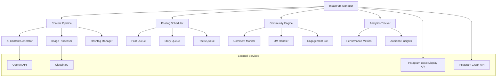

# Instagram Automation System Documentation

## Overview

The AquaScene Instagram automation system is a comprehensive social media management platform designed specifically for the aquascaping community. It combines AI-powered content generation, automated posting, story management, community engagement, and analytics tracking to create a cohesive social media presence that drives brand awareness and community growth.

## System Architecture

### Core Components



### Technology Stack
- **Instagram APIs**: Basic Display API and Graph API for comprehensive access
- **Content Generation**: OpenAI GPT-4 with aquascaping-specific prompts
- **Image Processing**: Cloudinary for optimization and transformation
- **Scheduling**: Node-cron with Redis queue management
- **Database**: PostgreSQL with Prisma for content and analytics storage
- **Authentication**: OAuth 2.0 flow with Instagram
- **Media Storage**: Cloud-based storage with CDN distribution

## Content Generation Pipeline

### AI-Powered Content Creation

#### Caption Generator
```typescript
// src/lib/instagram/content-generator.ts
export class InstagramContentGenerator {
  private openai: OpenAI;
  private hashtagManager: HashtagManager;
  private imageAnalyzer: ImageAnalyzer;

  constructor() {
    this.openai = new OpenAI({ apiKey: process.env.OPENAI_API_KEY });
    this.hashtagManager = new HashtagManager();
    this.imageAnalyzer = new ImageAnalyzer();
  }

  async generatePost(imageUrl: string, context?: PostContext): Promise<InstagramPost> {
    // Analyze image to understand content
    const imageAnalysis = await this.imageAnalyzer.analyze(imageUrl);
    
    // Generate caption based on image and context
    const caption = await this.generateCaption(imageAnalysis, context);
    
    // Generate relevant hashtags
    const hashtags = await this.hashtagManager.generateHashtags(imageAnalysis, caption);
    
    // Create optimized image variants
    const optimizedImages = await this.createImageVariants(imageUrl);

    return {
      id: generateId(),
      caption: caption,
      hashtags: hashtags,
      images: optimizedImages,
      scheduledTime: context?.scheduledTime || this.getOptimalPostTime(),
      type: this.determinePostType(imageAnalysis),
      metadata: {
        ...imageAnalysis,
        generatedAt: new Date(),
        context: context
      }
    };
  }

  private async generateCaption(
    imageAnalysis: ImageAnalysis, 
    context?: PostContext
  ): Promise<string> {
    const prompt = `
      Create an engaging Instagram caption for an aquascaping post.
      
      Image Analysis:
      - Main subjects: ${imageAnalysis.subjects.join(', ')}
      - Colors: ${imageAnalysis.colors.join(', ')}
      - Style: ${imageAnalysis.style}
      - Mood: ${imageAnalysis.mood}
      - Technical elements: ${imageAnalysis.technical.join(', ')}
      
      Context:
      - Post type: ${context?.type || 'showcase'}
      - Target audience: ${context?.audience || 'aquascaping enthusiasts'}
      - Goal: ${context?.goal || 'engagement and education'}
      - Tone: ${context?.tone || 'inspirational and educational'}
      
      Requirements:
      - 150-300 characters (Instagram optimal length)
      - Include practical aquascaping tip or insight
      - Encourage engagement with a question
      - Use emojis sparingly but effectively
      - Mention specific plants, techniques, or equipment when relevant
      - Include call-to-action for community interaction
      - Avoid hashtags in caption (will be added separately)
      
      Style Guidelines:
      - Educational but accessible
      - Enthusiastic but not overly promotional
      - Include personal insights or experiences
      - Use technical terms appropriately for audience level
      - Create emotional connection with the aquascape
    `;

    const response = await this.openai.chat.completions.create({
      model: 'gpt-4',
      messages: [{ role: 'user', content: prompt }],
      temperature: 0.8,
      max_tokens: 300
    });

    return response.choices[0].message.content || '';
  }

  async generateStoryContent(topic: string): Promise<StoryContent[]> {
    const storyTypes = ['tip', 'behind-scenes', 'poll', 'question', 'showcase'];
    const stories: StoryContent[] = [];

    for (const type of storyTypes) {
      const content = await this.generateStoryByType(type, topic);
      if (content) stories.push(content);
    }

    return stories;
  }

  private async generateStoryByType(type: string, topic: string): Promise<StoryContent | null> {
    const prompts = {
      tip: `Create a quick aquascaping tip about ${topic} for Instagram Stories. Keep it under 50 words and actionable.`,
      poll: `Create an engaging poll question about ${topic} for aquascaping enthusiasts. Provide two interesting options.`,
      question: `Create a thought-provoking question about ${topic} to encourage audience interaction.`,
      showcase: `Write a brief, exciting description for showcasing ${topic} in aquascaping.`
    };

    const prompt = prompts[type as keyof typeof prompts];
    if (!prompt) return null;

    const response = await this.openai.chat.completions.create({
      model: 'gpt-4',
      messages: [{ role: 'user', content: prompt }],
      temperature: 0.9,
      max_tokens: 150
    });

    return {
      type: type as StoryType,
      content: response.choices[0].message.content || '',
      duration: 15, // seconds
      interactive: type === 'poll' || type === 'question'
    };
  }
}
```

#### Hashtag Strategy Manager
```typescript
// src/lib/instagram/hashtag-manager.ts
export class HashtagManager {
  private popularTags: Map<string, HashtagData> = new Map();
  private trendingTags: Set<string> = new Set();
  private communityTags: Set<string> = new Set();

  constructor() {
    this.initializeHashtagDatabase();
  }

  private initializeHashtagDatabase() {
    // Core aquascaping hashtags with performance data
    const coreHashtags = [
      { tag: 'aquascaping', category: 'primary', competition: 'high', reach: 'high' },
      { tag: 'plantedtank', category: 'primary', competition: 'medium', reach: 'high' },
      { tag: 'aquarium', category: 'general', competition: 'very-high', reach: 'very-high' },
      { tag: 'freshwateraquarium', category: 'specific', competition: 'medium', reach: 'medium' },
      { tag: 'aquascape', category: 'primary', competition: 'high', reach: 'high' },
      { tag: 'natureaquarium', category: 'style', competition: 'low', reach: 'medium' },
      { tag: 'iwagumi', category: 'style', competition: 'low', reach: 'low' },
      { tag: 'dutchaquarium', category: 'style', competition: 'very-low', reach: 'low' },
      { tag: 'aquascaper', category: 'community', competition: 'medium', reach: 'medium' },
      { tag: 'plantedaquarium', category: 'specific', competition: 'medium', reach: 'medium' }
    ];

    // Plant-specific hashtags
    const plantHashtags = [
      'aquaticplants', 'cryptocoryne', 'anubias', 'java', 'moss', 'carpetplants',
      'stemplants', 'foregroundplants', 'backgroundplants', 'aquariumplants'
    ];

    // Equipment hashtags
    const equipmentHashtags = [
      'co2system', 'ledlighting', 'canisterfilter', 'aquasoil', 'driftwood',
      'dragonstone', 'ada', 'chihiros', 'fluval', 'eheim'
    ];

    // Technique hashtags
    const techniqueHashtags = [
      'hardscape', 'layout', 'trimming', 'planting', 'cycling', 'maintenance',
      'waterchange', 'fertilization', 'pruning', 'scaping'
    ];

    // Store all hashtags with metadata
    [...coreHashtags].forEach(hashtagData => {
      this.popularTags.set(hashtagData.tag, hashtagData);
    });
  }

  async generateHashtags(
    imageAnalysis: ImageAnalysis, 
    caption: string
  ): Promise<HashtagSet> {
    const hashtags: HashtagSet = {
      primary: [],
      secondary: [],
      niche: [],
      trending: [],
      community: []
    };

    // Analyze image content for relevant hashtags
    const contentTags = await this.getContentBasedHashtags(imageAnalysis);
    
    // Analyze caption for context
    const captionTags = await this.getCaptionBasedHashtags(caption);
    
    // Get trending hashtags
    const trending = await this.getTrendingHashtags();

    // Distribute hashtags across categories
    hashtags.primary = this.selectPrimaryHashtags(contentTags, captionTags);
    hashtags.secondary = this.selectSecondaryHashtags(contentTags, captionTags);
    hashtags.niche = this.selectNicheHashtags(imageAnalysis);
    hashtags.trending = trending.slice(0, 3);
    hashtags.community = this.getCommunityHashtags();

    // Ensure optimal mix and count (max 30 total)
    return this.optimizeHashtagMix(hashtags);
  }

  private async getContentBasedHashtags(analysis: ImageAnalysis): Promise<string[]> {
    const tags: string[] = [];

    // Style-based hashtags
    if (analysis.style) {
      const styleMap: Record<string, string[]> = {
        'nature': ['natureaquarium', 'naturestyle', 'takashiamano'],
        'iwagumi': ['iwagumi', 'iwagumistyle', 'minimalist'],
        'dutch': ['dutchstyle', 'dutchaquarium', 'stemheavy'],
        'jungle': ['junglestyle', 'wildaquarium', 'lush']
      };
      
      tags.push(...(styleMap[analysis.style] || []));
    }

    // Color-based hashtags
    if (analysis.colors.includes('green')) tags.push('greenaquarium');
    if (analysis.colors.includes('red')) tags.push('redplants');
    if (analysis.colors.includes('blue')) tags.push('blueaquascape');

    // Subject-based hashtags
    analysis.subjects.forEach(subject => {
      const subjectMap: Record<string, string[]> = {
        'driftwood': ['driftwood', 'hardscape', 'naturaldecor'],
        'stones': ['dragonstone', 'seiryu', 'hardscape'],
        'plants': ['aquaticplants', 'plantedtank', 'greenthumb'],
        'fish': ['tropicalfish', 'freshwaterfish', 'aquariumfish']
      };
      
      tags.push(...(subjectMap[subject] || []));
    });

    return tags;
  }

  async trackHashtagPerformance(post: InstagramPost, metrics: PostMetrics): Promise<void> {
    for (const hashtag of post.hashtags.all) {
      await this.database.hashtagPerformance.upsert({
        where: { hashtag },
        update: {
          totalUses: { increment: 1 },
          totalReach: { increment: metrics.reach },
          totalEngagement: { increment: metrics.engagement },
          avgEngagementRate: {
            set: await this.calculateAvgEngagement(hashtag)
          }
        },
        create: {
          hashtag,
          totalUses: 1,
          totalReach: metrics.reach,
          totalEngagement: metrics.engagement,
          avgEngagementRate: metrics.engagementRate
        }
      });
    }
  }
}
```

### Image Processing and Optimization

#### Automated Image Enhancement
```typescript
// src/lib/instagram/image-processor.ts
export class ImageProcessor {
  private cloudinary: CloudinaryApi;

  constructor() {
    this.cloudinary = new CloudinaryApi({
      cloud_name: process.env.CLOUDINARY_CLOUD_NAME,
      api_key: process.env.CLOUDINARY_API_KEY,
      api_secret: process.env.CLOUDINARY_API_SECRET
    });
  }

  async processForInstagram(imageUrl: string): Promise<ProcessedImages> {
    const baseTransformations = [
      'q_auto:best', // Automatic quality optimization
      'f_auto',      // Automatic format selection
      'c_fill',      // Fill the frame
      'g_auto'       // Automatic gravity/focus
    ];

    return {
      feed: await this.createFeedImage(imageUrl, baseTransformations),
      story: await this.createStoryImage(imageUrl, baseTransformations),
      carousel: await this.createCarouselImages(imageUrl, baseTransformations),
      reel: await this.createReelThumbnail(imageUrl, baseTransformations)
    };
  }

  private async createFeedImage(
    imageUrl: string, 
    baseTransforms: string[]
  ): Promise<ProcessedImage> {
    // Instagram feed optimal: 1080x1080 (1:1 ratio)
    const transformations = [
      ...baseTransforms,
      'w_1080,h_1080',
      'ar_1:1',
      'c_fill,g_auto'
    ];

    const processed = await this.cloudinary.image(imageUrl)
      .transformation(transformations.join(','))
      .toURL();

    return {
      url: processed,
      width: 1080,
      height: 1080,
      format: 'auto',
      quality: 'auto:best'
    };
  }

  private async createStoryImage(
    imageUrl: string, 
    baseTransforms: string[]
  ): Promise<ProcessedImage> {
    // Instagram story optimal: 1080x1920 (9:16 ratio)
    const transformations = [
      ...baseTransforms,
      'w_1080,h_1920',
      'ar_9:16',
      'c_fill,g_auto'
    ];

    const processed = await this.cloudinary.image(imageUrl)
      .transformation(transformations.join(','))
      .toURL();

    return {
      url: processed,
      width: 1080,
      height: 1920,
      format: 'auto',
      quality: 'auto:best'
    };
  }

  async enhanceAquascapeImage(imageUrl: string): Promise<string> {
    // Aquascaping-specific enhancements
    const enhancements = [
      'e_vibrance:20',        // Enhance plant colors
      'e_saturation:10',      // Boost color saturation
      'e_contrast:15',        // Improve contrast
      'e_sharpen:100',        // Sharpen details
      'e_auto_color:80',      // Auto color correction
      'e_auto_brightness:20'  // Brightness adjustment
    ];

    return await this.cloudinary.image(imageUrl)
      .transformation(enhancements.join(','))
      .toURL();
  }

  async createCarouselImages(
    imageUrls: string[]
  ): Promise<ProcessedImage[]> {
    const carouselImages: ProcessedImage[] = [];

    for (const [index, imageUrl] of imageUrls.entries()) {
      const processed = await this.processForInstagram(imageUrl);
      
      // Add slide number overlay for clarity
      const withOverlay = await this.cloudinary.image(processed.feed.url)
        .overlay(
          this.cloudinary.text(`${index + 1}/${imageUrls.length}`, {
            fontFamily: 'Arial',
            fontSize: 40,
            fontWeight: 'bold',
            color: 'white'
          }).position('bottom_right').offset('x_20,y_20')
        )
        .toURL();

      carouselImages.push({
        ...processed.feed,
        url: withOverlay,
        slideNumber: index + 1
      });
    }

    return carouselImages;
  }
}
```

## Posting and Scheduling System

### Automated Post Scheduling

#### Intelligent Scheduling Engine
```typescript
// src/lib/instagram/scheduler.ts
export class InstagramScheduler {
  private queue: PostQueue;
  private analytics: AnalyticsEngine;
  private instagramApi: InstagramAPI;

  constructor() {
    this.queue = new PostQueue();
    this.analytics = new AnalyticsEngine();
    this.instagramApi = new InstagramAPI();
    this.setupScheduledTasks();
  }

  private setupScheduledTasks() {
    // Check for scheduled posts every 5 minutes
    cron.schedule('*/5 * * * *', async () => {
      await this.processScheduledPosts();
    });

    // Analyze optimal posting times daily
    cron.schedule('0 6 * * *', async () => {
      await this.updateOptimalPostingTimes();
    });

    // Generate weekly content suggestions
    cron.schedule('0 9 * * 1', async () => {
      await this.generateWeeklyContentPlan();
    });
  }

  async schedulePost(post: InstagramPost, options?: ScheduleOptions): Promise<ScheduledPost> {
    // Determine optimal posting time if not specified
    if (!post.scheduledTime) {
      post.scheduledTime = await this.getOptimalPostTime(options);
    }

    // Validate content before scheduling
    const validation = await this.validatePost(post);
    if (!validation.valid) {
      throw new Error(`Post validation failed: ${validation.errors.join(', ')}`);
    }

    // Add to queue
    const scheduledPost = await this.queue.add({
      ...post,
      status: 'scheduled',
      attempts: 0,
      maxAttempts: 3
    });

    console.log(`📅 Post scheduled for ${post.scheduledTime}: ${post.caption.substring(0, 50)}...`);
    
    return scheduledPost;
  }

  private async processScheduledPosts(): Promise<void> {
    const duePosts = await this.queue.getDuePosts();
    
    for (const post of duePosts) {
      try {
        await this.publishPost(post);
        await this.queue.markAsCompleted(post.id);
        console.log(`✅ Successfully published post: ${post.id}`);
      } catch (error) {
        console.error(`❌ Failed to publish post ${post.id}:`, error);
        await this.handlePostFailure(post, error);
      }
    }
  }

  private async publishPost(post: ScheduledPost): Promise<PublishedPost> {
    // Upload media first
    const mediaIds = await this.uploadMedia(post.images);
    
    // Create the post
    const result = await this.instagramApi.createPost({
      media_ids: mediaIds,
      caption: this.buildFullCaption(post),
      location_id: post.location?.id
    });

    // Track publication
    await this.analytics.trackPublication({
      postId: result.id,
      scheduledTime: post.scheduledTime,
      actualTime: new Date(),
      contentType: post.type,
      hashtags: post.hashtags.all
    });

    return {
      ...post,
      instagramId: result.id,
      publishedAt: new Date(),
      status: 'published'
    };
  }

  async getOptimalPostTime(options?: ScheduleOptions): Promise<Date> {
    const audienceData = await this.analytics.getAudienceInsights();
    const historicalPerformance = await this.analytics.getPostingTimeAnalysis();
    
    // Consider multiple factors
    const factors = {
      audienceTimezone: audienceData.primaryTimezone,
      highEngagementHours: historicalPerformance.bestHours,
      dayOfWeek: historicalPerformance.bestDays,
      contentType: options?.contentType || 'photo',
      urgency: options?.urgency || 'normal'
    };

    // Calculate optimal time
    const optimalTime = this.calculateOptimalTime(factors);
    
    // Ensure it's in the future and within business hours
    return this.adjustToBusinessHours(optimalTime);
  }

  private buildFullCaption(post: ScheduledPost): string {
    const parts = [
      post.caption,
      '', // Empty line
      post.hashtags.primary.map(tag => `#${tag}`).join(' '),
      post.hashtags.secondary.map(tag => `#${tag}`).join(' '),
      post.hashtags.niche.map(tag => `#${tag}`).join(' ')
    ];

    return parts.filter(part => part.length > 0).join('\n');
  }
}
```

#### Story Automation System
```typescript
// src/lib/instagram/story-automation.ts
export class StoryAutomation {
  private storyQueue: StoryQueue;
  private contentGenerator: StoryContentGenerator;

  constructor() {
    this.storyQueue = new StoryQueue();
    this.contentGenerator = new StoryContentGenerator();
    this.setupStoryScheduling();
  }

  private setupStoryScheduling() {
    // Post stories throughout the day
    const storyTimes = ['09:00', '13:00', '17:00', '20:00'];
    
    storyTimes.forEach(time => {
      cron.schedule(`0 ${time.split(':')[1]} ${time.split(':')[0]} * * *`, async () => {
        await this.postScheduledStory();
      });
    });
  }

  async createDailyStorySequence(): Promise<StorySequence> {
    const themes = [
      'tip-of-the-day',
      'behind-the-scenes',
      'community-highlight',
      'product-spotlight',
      'question-time'
    ];

    const stories: Story[] = [];

    for (const theme of themes) {
      const story = await this.contentGenerator.generateStory(theme);
      if (story) {
        stories.push(story);
      }
    }

    return {
      id: generateId(),
      stories,
      totalDuration: stories.reduce((acc, story) => acc + story.duration, 0),
      scheduledTime: this.getNextStoryTime()
    };
  }

  async postScheduledStory(): Promise<void> {
    const story = await this.storyQueue.getNext();
    if (!story) return;

    try {
      // Create interactive elements if needed
      if (story.interactive) {
        story.stickers = await this.createInteractiveStickers(story);
      }

      // Upload story
      const result = await this.instagramApi.createStory({
        media_url: story.media.url,
        media_type: story.media.type,
        stickers: story.stickers
      });

      console.log(`📖 Story posted successfully: ${result.id}`);
      
      // Track story performance
      await this.analytics.trackStory(story, result);

    } catch (error) {
      console.error('❌ Story posting failed:', error);
      await this.handleStoryFailure(story, error);
    }
  }

  private async createInteractiveStickers(story: Story): Promise<Sticker[]> {
    const stickers: Sticker[] = [];

    if (story.type === 'poll') {
      stickers.push({
        type: 'poll',
        question: story.pollQuestion,
        options: story.pollOptions,
        position: { x: 0.5, y: 0.7 }
      });
    }

    if (story.type === 'question') {
      stickers.push({
        type: 'question',
        question: story.questionText,
        backgroundColor: '#2D5A3D', // Aquascaping green
        position: { x: 0.5, y: 0.8 }
      });
    }

    // Add location sticker if relevant
    if (story.location) {
      stickers.push({
        type: 'location',
        locationId: story.location.id,
        position: { x: 0.2, y: 0.1 }
      });
    }

    return stickers;
  }
}
```

## Community Engagement System

### Automated Interaction Management

#### Comment Management System
```typescript
// src/lib/instagram/comment-manager.ts
export class CommentManager {
  private aiModerator: AIModerator;
  private responseGenerator: ResponseGenerator;
  private engagementTracker: EngagementTracker;

  constructor() {
    this.aiModerator = new AIModerator();
    this.responseGenerator = new ResponseGenerator();
    this.engagementTracker = new EngagementTracker();
    this.setupCommentMonitoring();
  }

  private setupCommentMonitoring() {
    // Check for new comments every 10 minutes
    cron.schedule('*/10 * * * *', async () => {
      await this.processNewComments();
    });

    // Daily engagement summary
    cron.schedule('0 20 * * *', async () => {
      await this.generateEngagementReport();
    });
  }

  async processNewComments(): Promise<void> {
    const recentPosts = await this.getRecentPosts(24); // Last 24 hours
    
    for (const post of recentPosts) {
      const newComments = await this.instagramApi.getNewComments(post.id);
      
      for (const comment of newComments) {
        await this.handleComment(comment, post);
      }
    }
  }

  private async handleComment(comment: Comment, post: Post): Promise<void> {
    // Moderate comment for spam/inappropriate content
    const moderation = await this.aiModerator.moderateComment(comment);
    
    if (moderation.shouldHide) {
      await this.instagramApi.hideComment(comment.id);
      console.log(`🚫 Hidden inappropriate comment: ${comment.id}`);
      return;
    }

    if (moderation.shouldReply) {
      // Generate contextual response
      const response = await this.responseGenerator.generateResponse(comment, post);
      
      if (response) {
        await this.instagramApi.replyToComment(comment.id, response);
        console.log(`💬 Replied to comment: ${comment.text.substring(0, 30)}...`);
      }
    }

    // Like meaningful comments
    if (moderation.shouldLike) {
      await this.instagramApi.likeComment(comment.id);
    }

    // Track engagement
    await this.engagementTracker.recordCommentInteraction(comment, moderation.action);
  }

  async generateEngagementResponse(
    comment: Comment, 
    post: Post
  ): Promise<string | null> {
    // Analyze comment sentiment and intent
    const analysis = await this.analyzeComment(comment);
    
    if (analysis.isQuestion) {
      return await this.generateAnswerResponse(comment, post, analysis);
    }
    
    if (analysis.isCompliment) {
      return await this.generateThankYouResponse(comment, analysis);
    }
    
    if (analysis.isRequest) {
      return await this.generateHelpfulResponse(comment, post, analysis);
    }

    // Generic engagement response
    if (analysis.sentiment === 'positive') {
      return this.getGenericPositiveResponse();
    }

    return null;
  }

  private async generateAnswerResponse(
    comment: Comment, 
    post: Post, 
    analysis: CommentAnalysis
  ): Promise<string> {
    const prompt = `
      Generate a helpful response to this aquascaping question:
      
      Question: "${comment.text}"
      Post context: ${post.caption}
      Question type: ${analysis.questionType}
      
      Requirements:
      - Be helpful and informative
      - Keep response under 150 characters
      - Use friendly, approachable tone
      - Include practical advice if applicable
      - End with engagement question or emoji
      - Don't use hashtags in replies
      
      Examples of good responses:
      - "Great question! For that setup, I'd recommend CO2 injection and high-light plants. What's your experience level? 🌿"
      - "The secret is gradual trimming and consistent fertilization. Have you tried liquid fertilizers? 💚"
    `;

    const response = await this.openai.chat.completions.create({
      model: 'gpt-4',
      messages: [{ role: 'user', content: prompt }],
      temperature: 0.7,
      max_tokens: 100
    });

    return response.choices[0].message.content || '';
  }
}
```

#### Direct Message Automation
```typescript
// src/lib/instagram/dm-handler.ts
export class DMHandler {
  private responseBot: ResponseBot;
  private leadQualifier: LeadQualifier;
  private conversationTracker: ConversationTracker;

  constructor() {
    this.responseBot = new ResponseBot();
    this.leadQualifier = new LeadQualifier();
    this.conversationTracker = new ConversationTracker();
    this.setupDMMonitoring();
  }

  private setupDMMonitoring() {
    // Check for new DMs every 5 minutes
    cron.schedule('*/5 * * * *', async () => {
      await this.processNewDMs();
    });
  }

  async processNewDMs(): Promise<void> {
    const newMessages = await this.instagramApi.getNewDirectMessages();
    
    for (const message of newMessages) {
      await this.handleDirectMessage(message);
    }
  }

  private async handleDirectMessage(message: DirectMessage): Promise<void> {
    const conversation = await this.conversationTracker.getConversation(message.threadId);
    
    // Analyze message intent
    const intent = await this.analyzeMessageIntent(message.text, conversation);
    
    switch (intent.type) {
      case 'inquiry':
        await this.handleInquiry(message, intent);
        break;
        
      case 'support':
        await this.handleSupport(message, intent);
        break;
        
      case 'collaboration':
        await this.handleCollaboration(message, intent);
        break;
        
      case 'general':
        await this.handleGeneral(message, intent);
        break;
        
      default:
        await this.handleUnknown(message);
    }

    // Update conversation tracking
    await this.conversationTracker.updateConversation(message);
  }

  private async handleInquiry(message: DirectMessage, intent: MessageIntent): Promise<void> {
    // Qualify as potential lead
    const leadScore = await this.leadQualifier.scoreMessage(message, intent);
    
    if (leadScore > 0.7) {
      // High-value inquiry - notify admin and send detailed response
      await this.notifyAdmin('high_value_inquiry', message);
      
      const response = await this.generateDetailedResponse(message, intent);
      await this.sendDM(message.threadId, response);
      
      // Add to CRM/follow-up system
      await this.addToFollowUpQueue(message, leadScore);
    } else {
      // Standard inquiry response
      const response = await this.generateStandardResponse(message, intent);
      await this.sendDM(message.threadId, response);
    }
  }

  async generateAutoResponse(message: DirectMessage): Promise<string> {
    const prompt = `
      Generate a professional auto-response for this Instagram DM about aquascaping:
      
      Message: "${message.text}"
      Sender: @${message.sender.username}
      
      Requirements:
      - Professional but friendly tone
      - Acknowledge specific question/request
      - Provide helpful information if possible
      - Include next steps or call-to-action
      - Keep under 200 characters
      - Include relevant emojis
      
      Context:
      - We're AquaScene, aquascaping platform
      - We offer design services, products, and education
      - Partnership with Green Aqua Hungary
      - Focus on building community
    `;

    const response = await this.openai.chat.completions.create({
      model: 'gpt-4',
      messages: [{ role: 'user', content: prompt }],
      temperature: 0.6,
      max_tokens: 150
    });

    return response.choices[0].message.content || '';
  }
}
```

## Analytics and Performance Tracking

### Comprehensive Instagram Analytics

#### Performance Analytics Engine
```typescript
// src/lib/instagram/analytics.ts
export class InstagramAnalytics {
  private metricsCollector: MetricsCollector;
  private reportGenerator: ReportGenerator;
  private insightsAnalyzer: InsightsAnalyzer;

  constructor() {
    this.metricsCollector = new MetricsCollector();
    this.reportGenerator = new ReportGenerator();
    this.insightsAnalyzer = new InsightsAnalyzer();
    this.setupAnalyticsCollection();
  }

  private setupAnalyticsCollection() {
    // Collect metrics every hour
    cron.schedule('0 * * * *', async () => {
      await this.collectHourlyMetrics();
    });

    // Generate daily reports
    cron.schedule('0 8 * * *', async () => {
      await this.generateDailyReport();
    });

    // Weekly performance analysis
    cron.schedule('0 9 * * 1', async () => {
      await this.generateWeeklyAnalysis();
    });
  }

  async getComprehensiveAnalytics(period: AnalyticsPeriod): Promise<InstagramAnalytics> {
    const [
      accountMetrics,
      postPerformance,
      storyMetrics,
      audienceInsights,
      engagementAnalysis,
      hashtagPerformance,
      competitorAnalysis
    ] = await Promise.all([
      this.getAccountMetrics(period),
      this.getPostPerformance(period),
      this.getStoryMetrics(period),
      this.getAudienceInsights(period),
      this.getEngagementAnalysis(period),
      this.getHashtagPerformance(period),
      this.getCompetitorAnalysis(period)
    ]);

    return {
      period,
      account: accountMetrics,
      posts: postPerformance,
      stories: storyMetrics,
      audience: audienceInsights,
      engagement: engagementAnalysis,
      hashtags: hashtagPerformance,
      competitors: competitorAnalysis,
      recommendations: await this.generateRecommendations(period),
      generatedAt: new Date()
    };
  }

  private async getPostPerformance(period: AnalyticsPeriod): Promise<PostPerformanceMetrics> {
    const posts = await this.getPostsInPeriod(period);
    
    const metrics: PostPerformanceMetrics = {
      totalPosts: posts.length,
      averageEngagement: 0,
      topPerformingPosts: [],
      contentTypePerformance: {},
      timeAnalysis: {},
      hashtagAnalysis: {}
    };

    // Calculate averages
    const totalEngagement = posts.reduce((sum, post) => sum + post.engagement, 0);
    metrics.averageEngagement = totalEngagement / posts.length;

    // Top performing posts
    metrics.topPerformingPosts = posts
      .sort((a, b) => b.engagementRate - a.engagementRate)
      .slice(0, 10);

    // Content type analysis
    const contentTypes = ['photo', 'carousel', 'reel'];
    for (const type of contentTypes) {
      const typePosts = posts.filter(p => p.type === type);
      if (typePosts.length > 0) {
        metrics.contentTypePerformance[type] = {
          count: typePosts.length,
          averageEngagement: typePosts.reduce((sum, p) => sum + p.engagement, 0) / typePosts.length,
          averageReach: typePosts.reduce((sum, p) => sum + p.reach, 0) / typePosts.length
        };
      }
    }

    // Time analysis
    metrics.timeAnalysis = await this.analyzePostingTimes(posts);

    return metrics;
  }

  async generateRecommendations(period: AnalyticsPeriod): Promise<Recommendation[]> {
    const analytics = await this.getComprehensiveAnalytics(period);
    const recommendations: Recommendation[] = [];

    // Content type recommendations
    const bestContentType = this.getBestPerformingContentType(analytics.posts);
    if (bestContentType) {
      recommendations.push({
        type: 'content',
        priority: 'high',
        title: `Focus on ${bestContentType.type} content`,
        description: `${bestContentType.type} posts show ${bestContentType.improvement}% better engagement`,
        action: `Increase ${bestContentType.type} content from ${bestContentType.current}% to ${bestContentType.recommended}%`
      });
    }

    // Hashtag recommendations
    const hashtagInsights = await this.analyzeHashtagEffectiveness(analytics.hashtags);
    if (hashtagInsights.underperforming.length > 0) {
      recommendations.push({
        type: 'hashtags',
        priority: 'medium',
        title: 'Optimize hashtag strategy',
        description: `${hashtagInsights.underperforming.length} hashtags showing poor performance`,
        action: `Replace underperforming hashtags with: ${hashtagInsights.suggestions.join(', ')}`
      });
    }

    // Posting time optimization
    const timeInsights = await this.analyzeOptimalPostingTimes(analytics.posts);
    if (timeInsights.canImprove) {
      recommendations.push({
        type: 'timing',
        priority: 'medium',
        title: 'Optimize posting schedule',
        description: `Posting at ${timeInsights.optimalTime} could increase engagement by ${timeInsights.potential}%`,
        action: `Shift posting schedule to ${timeInsights.optimalTime} ${timeInsights.optimalDays.join(', ')}`
      });
    }

    return recommendations;
  }

  async trackContentPerformance(post: Post, metrics: PostMetrics): Promise<void> {
    // Store detailed performance data
    await this.database.postMetrics.create({
      data: {
        postId: post.id,
        instagramId: post.instagramId,
        type: post.type,
        publishedAt: post.publishedAt,
        
        // Engagement metrics
        likes: metrics.likes,
        comments: metrics.comments,
        shares: metrics.shares,
        saves: metrics.saves,
        reach: metrics.reach,
        impressions: metrics.impressions,
        
        // Calculated metrics
        engagementRate: (metrics.likes + metrics.comments + metrics.shares + metrics.saves) / metrics.reach,
        
        // Content analysis
        captionLength: post.caption.length,
        hashtagCount: post.hashtags.all.length,
        hasLocation: !!post.location,
        
        // Timing
        hour: post.publishedAt.getHours(),
        dayOfWeek: post.publishedAt.getDay(),
        
        collectedAt: new Date()
      }
    });

    // Update hashtag performance
    await this.updateHashtagMetrics(post.hashtags.all, metrics);
    
    // Trigger performance alerts if needed
    await this.checkPerformanceAlerts(post, metrics);
  }
}
```

### Competitor Analysis System

#### Automated Competitor Monitoring
```typescript
// src/lib/instagram/competitor-analysis.ts
export class CompetitorAnalysis {
  private competitors: CompetitorProfile[] = [];
  private instagramScraper: InstagramScraper;
  private trendAnalyzer: TrendAnalyzer;

  constructor() {
    this.instagramScraper = new InstagramScraper();
    this.trendAnalyzer = new TrendAnalyzer();
    this.initializeCompetitors();
    this.setupMonitoring();
  }

  private initializeCompetitors() {
    this.competitors = [
      {
        username: 'greenaqua',
        category: 'retailer',
        priority: 'high',
        focus: ['products', 'education', 'community']
      },
      {
        username: 'aquascapinglove',
        category: 'influencer',
        priority: 'medium',
        focus: ['inspiration', 'tutorials', 'lifestyle']
      },
      {
        username: 'tropica',
        category: 'brand',
        priority: 'high',
        focus: ['products', 'education', 'innovation']
      }
      // Add more competitors as needed
    ];
  }

  private setupMonitoring() {
    // Daily competitor analysis
    cron.schedule('0 10 * * *', async () => {
      await this.analyzeCompetitors();
    });

    // Weekly trend analysis
    cron.schedule('0 9 * * 1', async () => {
      await this.analyzeTrends();
    });
  }

  async analyzeCompetitors(): Promise<CompetitorAnalysisReport> {
    const report: CompetitorAnalysisReport = {
      analyzedAt: new Date(),
      competitors: [],
      insights: [],
      opportunities: [],
      threats: []
    };

    for (const competitor of this.competitors) {
      const analysis = await this.analyzeCompetitor(competitor);
      report.competitors.push(analysis);
      
      // Extract insights
      report.insights.push(...this.extractInsights(analysis));
    }

    // Cross-competitor analysis
    report.opportunities = await this.identifyOpportunities(report.competitors);
    report.threats = await this.identifyThreats(report.competitors);

    return report;
  }

  private async analyzeCompetitor(competitor: CompetitorProfile): Promise<CompetitorAnalysis> {
    const recentPosts = await this.instagramScraper.getRecentPosts(competitor.username, 50);
    
    const analysis: CompetitorAnalysis = {
      username: competitor.username,
      category: competitor.category,
      analyzedAt: new Date(),
      
      // Growth metrics
      followerGrowth: await this.calculateFollowerGrowth(competitor.username),
      postingFrequency: this.calculatePostingFrequency(recentPosts),
      
      // Content analysis
      contentTypes: this.analyzeContentTypes(recentPosts),
      topHashtags: this.extractTopHashtags(recentPosts),
      averageEngagement: this.calculateAverageEngagement(recentPosts),
      
      // Strategy insights
      postingTimes: this.analyzePostingTimes(recentPosts),
      contentThemes: await this.identifyContentThemes(recentPosts),
      engagementStrategy: this.analyzeEngagementStrategy(recentPosts),
      
      // Performance benchmarks
      topPerformingPosts: this.getTopPerformingPosts(recentPosts),
      engagementRate: this.calculateEngagementRate(recentPosts),
      
      // Unique insights
      uniqueStrategies: await this.identifyUniqueStrategies(recentPosts),
      potentialCollaborations: await this.identifyCollaborationOpportunities(recentPosts)
    };

    return analysis;
  }

  async identifyOpportunities(competitors: CompetitorAnalysis[]): Promise<Opportunity[]> {
    const opportunities: Opportunity[] = [];

    // Gap analysis
    const contentGaps = this.findContentGaps(competitors);
    contentGaps.forEach(gap => {
      opportunities.push({
        type: 'content-gap',
        priority: 'medium',
        description: `Low competition in ${gap.topic} content`,
        action: `Create content series about ${gap.topic}`,
        potential: 'medium'
      });
    });

    // Hashtag opportunities
    const hashtagGaps = this.findHashtagOpportunities(competitors);
    hashtagGaps.forEach(hashtag => {
      opportunities.push({
        type: 'hashtag',
        priority: 'low',
        description: `Underutilized hashtag: #${hashtag.tag}`,
        action: `Incorporate #${hashtag.tag} in relevant posts`,
        potential: 'low-medium'
      });
    });

    // Timing opportunities
    const timingGaps = this.findTimingOpportunities(competitors);
    if (timingGaps.length > 0) {
      opportunities.push({
        type: 'timing',
        priority: 'high',
        description: `Low competition during ${timingGaps.join(', ')}`,
        action: `Schedule posts during these time slots`,
        potential: 'high'
      });
    }

    return opportunities;
  }
}
```

## Integration Management

### Instagram API Integration

#### Comprehensive API Management
```typescript
// src/lib/instagram/api-client.ts
export class InstagramAPIClient {
  private accessToken: string;
  private businessAccountId: string;
  private rateLimiter: RateLimiter;
  private retryManager: RetryManager;

  constructor() {
    this.accessToken = process.env.INSTAGRAM_ACCESS_TOKEN!;
    this.businessAccountId = process.env.INSTAGRAM_BUSINESS_ACCOUNT_ID!;
    this.rateLimiter = new RateLimiter({
      requests: 200,
      period: 60 * 60 * 1000 // 200 requests per hour
    });
    this.retryManager = new RetryManager({
      maxRetries: 3,
      backoffMultiplier: 2
    });
  }

  async createPost(postData: CreatePostData): Promise<InstagramAPIResponse> {
    await this.rateLimiter.waitForLimit();

    return await this.retryManager.execute(async () => {
      const response = await fetch(`https://graph.instagram.com/v18.0/${this.businessAccountId}/media`, {
        method: 'POST',
        headers: {
          'Content-Type': 'application/json',
          'Authorization': `Bearer ${this.accessToken}`
        },
        body: JSON.stringify({
          image_url: postData.imageUrl,
          caption: postData.caption,
          location_id: postData.locationId,
          access_token: this.accessToken
        })
      });

      const data = await response.json();

      if (!response.ok) {
        throw new InstagramAPIError(data.error.message, data.error.code);
      }

      // Publish the media
      const publishResponse = await this.publishMedia(data.id);
      return publishResponse;
    });
  }

  async getPostInsights(postId: string): Promise<PostInsights> {
    await this.rateLimiter.waitForLimit();

    const metrics = [
      'engagement',
      'impressions',
      'reach',
      'saved',
      'likes',
      'comments',
      'shares'
    ];

    const response = await fetch(
      `https://graph.instagram.com/v18.0/${postId}/insights?metric=${metrics.join(',')}&access_token=${this.accessToken}`
    );

    const data = await response.json();

    return {
      postId,
      metrics: this.parseInsightsData(data),
      collectedAt: new Date()
    };
  }

  async handleWebhook(webhookData: InstagramWebhook): Promise<void> {
    const { object, entry } = webhookData;

    if (object === 'instagram') {
      for (const entryItem of entry) {
        for (const change of entryItem.changes) {
          await this.processWebhookChange(change);
        }
      }
    }
  }

  private async processWebhookChange(change: WebhookChange): Promise<void> {
    switch (change.field) {
      case 'comments':
        await this.handleCommentWebhook(change.value);
        break;
        
      case 'mentions':
        await this.handleMentionWebhook(change.value);
        break;
        
      case 'story_insights':
        await this.handleStoryInsightsWebhook(change.value);
        break;
    }
  }

  async refreshAccessToken(): Promise<string> {
    const response = await fetch(
      `https://graph.instagram.com/refresh_access_token?grant_type=ig_refresh_token&access_token=${this.accessToken}`
    );

    const data = await response.json();

    if (data.access_token) {
      this.accessToken = data.access_token;
      
      // Store new token securely
      await this.storeAccessToken(data.access_token);
      
      console.log('✅ Instagram access token refreshed');
      return data.access_token;
    }

    throw new Error('Failed to refresh Instagram access token');
  }
}
```

## Troubleshooting and Maintenance

### Common Issues and Solutions

#### Instagram API Issues
```typescript
// src/lib/instagram/troubleshooting.ts
export class InstagramTroubleshooting {
  static async diagnoseAPIIssues(): Promise<DiagnosticReport> {
    const report: DiagnosticReport = {
      timestamp: new Date(),
      issues: [],
      solutions: [],
      status: 'healthy'
    };

    // Check access token validity
    try {
      await this.testAPIConnection();
      report.issues.push('✅ API connection healthy');
    } catch (error) {
      report.issues.push('❌ API connection failed');
      report.solutions.push('Check and refresh access token');
      report.status = 'critical';
    }

    // Check rate limits
    const rateLimitStatus = await this.checkRateLimits();
    if (rateLimitStatus.exceeded) {
      report.issues.push('❌ Rate limit exceeded');
      report.solutions.push('Wait for rate limit reset or implement request queuing');
      report.status = 'warning';
    }

    // Check webhook configuration
    const webhookStatus = await this.checkWebhooks();
    if (!webhookStatus.configured) {
      report.issues.push('⚠️ Webhooks not properly configured');
      report.solutions.push('Reconfigure webhook subscriptions');
    }

    return report;
  }

  static async handlePostingFailure(post: ScheduledPost, error: Error): Promise<void> {
    console.error(`❌ Post failed: ${post.id}`, error);

    // Categorize error
    const errorType = this.categorizeError(error);
    
    switch (errorType) {
      case 'rate_limit':
        // Reschedule for later
        await this.reschedulePost(post, new Date(Date.now() + 60 * 60 * 1000));
        break;
        
      case 'invalid_media':
        // Try to reprocess media
        await this.reprocessMedia(post);
        break;
        
      case 'token_expired':
        // Refresh token and retry
        await this.refreshTokenAndRetry(post);
        break;
        
      case 'content_policy':
        // Flag for manual review
        await this.flagForReview(post, 'content_policy_violation');
        break;
        
      default:
        // Generic retry with exponential backoff
        await this.retryWithBackoff(post);
    }
  }

  static getCommonSolutions(): Record<string, string[]> {
    return {
      'low_engagement': [
        'Post during optimal hours (analyze audience insights)',
        'Use trending hashtags relevant to aquascaping',
        'Increase story posting frequency',
        'Engage more with community comments',
        'Create more interactive content (polls, questions)'
      ],
      'content_creation': [
        'Use AI content generator for caption ideas',
        'Batch create content during inspiration peaks',
        'Develop content themes and schedules',
        'Repurpose high-performing content',
        'Create content templates'
      ],
      'hashtag_optimization': [
        'Analyze hashtag performance regularly',
        'Mix high and low competition hashtags',
        'Create branded hashtags for campaigns',
        'Monitor trending aquascaping hashtags',
        'Test different hashtag combinations'
      ],
      'automation_issues': [
        'Check API rate limits and quotas',
        'Verify webhook configurations',
        'Monitor queue processing',
        'Review error logs regularly',
        'Test automation workflows'
      ]
    };
  }
}
```

### Monitoring and Alerting

#### Comprehensive Monitoring System
```typescript
// src/lib/instagram/monitoring.ts
export class InstagramMonitoring {
  private alertManager: AlertManager;
  private metricsCollector: MetricsCollector;

  constructor() {
    this.alertManager = new AlertManager();
    this.metricsCollector = new MetricsCollector();
    this.setupMonitoring();
  }

  private setupMonitoring() {
    // Health checks every 5 minutes
    cron.schedule('*/5 * * * *', async () => {
      await this.performHealthCheck();
    });

    // Performance monitoring every hour
    cron.schedule('0 * * * *', async () => {
      await this.monitorPerformance();
    });
  }

  async performHealthCheck(): Promise<HealthStatus> {
    const health: HealthStatus = {
      timestamp: new Date(),
      status: 'healthy',
      checks: []
    };

    // API connectivity
    try {
      await this.instagramApi.testConnection();
      health.checks.push({ name: 'API Connection', status: 'healthy' });
    } catch (error) {
      health.checks.push({ name: 'API Connection', status: 'failed', error: error.message });
      health.status = 'unhealthy';
    }

    // Queue processing
    const queueHealth = await this.checkQueueHealth();
    health.checks.push({ name: 'Queue Processing', status: queueHealth.status });
    
    if (queueHealth.status === 'failed') {
      health.status = 'unhealthy';
    }

    // Content generation
    try {
      await this.testContentGeneration();
      health.checks.push({ name: 'Content Generation', status: 'healthy' });
    } catch (error) {
      health.checks.push({ name: 'Content Generation', status: 'failed', error: error.message });
    }

    // Alert if unhealthy
    if (health.status === 'unhealthy') {
      await this.alertManager.sendAlert('system_unhealthy', health);
    }

    return health;
  }

  async monitorPerformance(): Promise<void> {
    const metrics = await this.collectPerformanceMetrics();
    
    // Check for performance degradation
    if (metrics.engagementRate < this.getBaselineEngagement() * 0.7) {
      await this.alertManager.sendAlert('engagement_drop', {
        current: metrics.engagementRate,
        baseline: this.getBaselineEngagement(),
        decline: ((this.getBaselineEngagement() - metrics.engagementRate) / this.getBaselineEngagement()) * 100
      });
    }

    // Check posting consistency
    if (metrics.postsToday === 0 && this.shouldHavePostedToday()) {
      await this.alertManager.sendAlert('missed_posts', {
        date: new Date().toISOString().split('T')[0],
        scheduledPosts: await this.getScheduledPostsForToday()
      });
    }

    // Store metrics for trending analysis
    await this.metricsCollector.store(metrics);
  }
}
```

This comprehensive Instagram automation system documentation provides complete coverage of the social media management platform designed specifically for the aquascaping community. The system automates content creation, posting, engagement, and analytics while maintaining authentic community interaction and brand consistency.