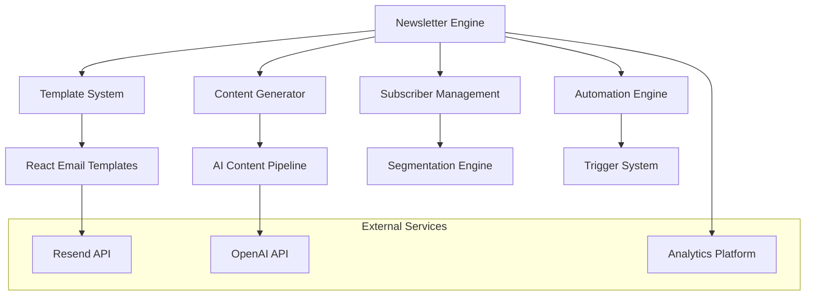

# Newsletter System Documentation

## Overview

The AquaScene newsletter system is a comprehensive email marketing automation platform specifically designed for the aquascaping community. It features AI-powered content generation, beautiful responsive templates, advanced segmentation, and detailed analytics tracking.

## System Architecture

### Core Components



### Technology Stack
- **Email Service**: Resend API for reliable delivery
- **Templates**: React Email with Tailwind CSS
- **Content Generation**: OpenAI GPT-4 with custom prompts
- **Database**: PostgreSQL with Prisma ORM
- **Scheduling**: Node-cron for automated campaigns
- **Analytics**: Custom tracking with Datadog integration
- **Image Processing**: CloudIn to optimize images for email

## Email Templates

### 1. Welcome Email (`welcome-email.tsx`)

**Purpose**: First impression email sent immediately after waitlist signup.

**Key Features**:
- Personalized greeting with user's name
- Aquascaping community introduction
- Referral code for sharing
- Next steps and expectations
- Beautiful underwater theme design

**Template Structure**:
```typescript
interface WelcomeEmailProps {
  firstName?: string;
  email?: string;
  referralCode?: string;
  waitlistPosition?: number;
}

export function WelcomeEmail({
  firstName = 'Aquascaping Enthusiast',
  email,
  referralCode = 'AQUA2024',
  waitlistPosition = 1
}: WelcomeEmailProps) {
  return (
    <Html>
      <Head />
      <Preview>Welcome to the AquaScene community! 🌿</Preview>
      <Body style={main}>
        <Container style={container}>
          {/* Header with logo */}
          <Section style={header}>
            
          </Section>
          
          {/* Main content */}
          <Section style={content}>
            <Heading style={h1}>
              Welcome, {firstName}! 🌊
            </Heading>
            
            <Text style={paragraph}>
              Thank you for joining our aquascaping community. You're now part of a passionate group of {waitlistPosition.toLocaleString()} aquascaping enthusiasts waiting for something amazing.
            </Text>
            
            {/* Referral section */}
            <Section style={referralSection}>
              <Heading style={h2}>Share & Get Rewards</Heading>
              <Text style={paragraph}>
                Your referral code: <strong>{referralCode}</strong>
              </Text>
              <Button
                pX={20}
                pY={12}
                style={button}
                href={`https://aquascene.com?ref=${referralCode}`}
              >
                Share with Friends
              </Button>
            </Section>
          </Section>
          
          {/* Footer */}
          <Section style={footer}>
            <Text style={footerText}>
              © 2024 AquaScene. All rights reserved.
            </Text>
          </Section>
        </Container>
      </Body>
    </Html>
  );
}
```

**Styling System**:
```typescript
const main = {
  backgroundColor: '#f6f9fc',
  fontFamily: 'Inter, -apple-system, BlinkMacSystemFont, sans-serif'
};

const container = {
  margin: '0 auto',
  padding: '20px 0 48px',
  maxWidth: '640px'
};

const header = {
  padding: '24px 24px 0',
  textAlign: 'center' as const
};

const content = {
  padding: '24px'
};

const button = {
  backgroundColor: '#2D5A3D',
  borderRadius: '8px',
  color: '#ffffff',
  fontSize: '16px',
  fontWeight: 'bold',
  textDecoration: 'none',
  textAlign: 'center' as const,
  display: 'block'
};
```

### 2. Weekly Digest (`weekly-digest.tsx`)

**Purpose**: Regular newsletter featuring blog highlights, tips, and community content.

**Content Sections**:
- **Hero Article**: Featured blog post with image
- **Tip of the Week**: Quick aquascaping advice
- **Community Spotlight**: User-generated content
- **Product Recommendations**: Curated equipment
- **Upcoming Events**: Workshops and webinars

**Dynamic Content Integration**:
```typescript
interface WeeklyDigestProps {
  firstName?: string;
  weekNumber?: number;
  featuredPost?: BlogPost;
  tipOfWeek?: AquascapingTip;
  communityHighlight?: CommunityPost;
  products?: Product[];
  events?: Event[];
}

interface BlogPost {
  title: string;
  excerpt: string;
  imageUrl: string;
  readTime: string;
  url: string;
  author: string;
}

interface AquascapingTip {
  title: string;
  description: string;
  difficulty: 'beginner' | 'intermediate' | 'advanced';
  tools: string[];
}
```

### 3. Partnership Announcement (`partnership-announcement.tsx`)

**Purpose**: Announces new partnerships (especially Green Aqua) with exclusive benefits.

**Key Elements**:
- Dual logo presentation
- Partner credentials and statistics
- Exclusive member benefits
- Timeline of upcoming features
- Partner testimonials

### 4. Launch Notification (`launch-notification.tsx`)

**Purpose**: Platform launch announcement with early access for waitlist members.

**Special Features**:
- Celebration design with animation-friendly CSS
- Prominent early access code display
- Platform features showcase
- Exclusive launch offers
- Getting started guide

### 5. Referral Invitation (`referral-invitation.tsx`)

**Purpose**: Dual-purpose template for invitations and referral program promotion.

**Dynamic Behavior**:
```typescript
// Template adapts based on context
if (friendFirstName) {
  // Invitation mode - personalized for the friend
  return <InvitationTemplate friend={friendFirstName} referrer={firstName} />;
} else {
  // Referral promotion mode - encouraging sharing
  return <ReferralPromotionTemplate user={firstName} progress={referralCount} />;
}
```

## Content Generation Pipeline

### AI-Powered Content Creation

#### Blog Content Generator
```typescript
// src/lib/content-generators/blog-generator.ts
export class BlogContentGenerator {
  private openai: OpenAI;
  private templates: BlogTemplate[];

  constructor() {
    this.openai = new OpenAI({ apiKey: process.env.OPENAI_API_KEY });
    this.templates = loadBlogTemplates();
  }

  async generateWeeklyContent(): Promise<WeeklyContent> {
    const topics = await this.selectTopics();
    const content = await Promise.all([
      this.generateFeaturedArticle(topics.featured),
      this.generateTipOfWeek(topics.tip),
      this.generateProductRecommendations(topics.products)
    ]);

    return {
      featuredArticle: content[0],
      tipOfWeek: content[1],
      productRecommendations: content[2],
      generatedAt: new Date()
    };
  }

  private async generateFeaturedArticle(topic: string): Promise<BlogPost> {
    const prompt = `
      Create a comprehensive aquascaping article about: ${topic}
      
      Requirements:
      - Target audience: Intermediate aquascaping enthusiasts
      - Length: 800-1200 words
      - Include practical tips and step-by-step instructions
      - Mention specific plants, fish, or equipment where relevant
      - SEO-optimized title and meta description
      - Engaging introduction that hooks the reader
      - Clear structure with subheadings
      - Conclusion with actionable next steps
      
      Style:
      - Educational but accessible tone
      - Include personal insights and experiences
      - Use vivid descriptions of aquascapes
      - Reference scientific concepts when helpful
      
      Format the response as JSON with:
      {
        "title": "SEO-optimized title",
        "metaDescription": "160-character description",
        "excerpt": "2-3 sentence summary",
        "content": "Full article in markdown",
        "tags": ["tag1", "tag2", "tag3"],
        "readTime": "estimated minutes",
        "difficulty": "beginner|intermediate|advanced"
      }
    `;

    const response = await this.openai.chat.completions.create({
      model: 'gpt-4',
      messages: [{ role: 'user', content: prompt }],
      temperature: 0.7,
      max_tokens: 2500
    });

    return JSON.parse(response.choices[0].message.content!);
  }

  private async generateTipOfWeek(category: string): Promise<AquascapingTip> {
    const prompt = `
      Create a practical aquascaping tip for the "${category}" category.
      
      Requirements:
      - Quick to implement (5-15 minutes)
      - Clear, actionable instructions
      - Explain the "why" behind the tip
      - Include any tools or materials needed
      - Suitable for home aquariums
      - Beginner-friendly but valuable for all levels
      
      Format as JSON:
      {
        "title": "Catchy tip title",
        "description": "Step-by-step instructions",
        "reasoning": "Why this works",
        "tools": ["tool1", "tool2"],
        "difficulty": "beginner|intermediate|advanced",
        "estimatedTime": "5-10 minutes",
        "category": "${category}"
      }
    `;

    const response = await this.openai.chat.completions.create({
      model: 'gpt-4',
      messages: [{ role: 'user', content: prompt }],
      temperature: 0.8,
      max_tokens: 800
    });

    return JSON.parse(response.choices[0].message.content!);
  }
}
```

#### Content Quality Control
```typescript
// src/lib/content-quality/quality-checker.ts
export class ContentQualityChecker {
  private static readonly QUALITY_CRITERIA = {
    minWordCount: 100,
    maxWordCount: 2000,
    minReadability: 60, // Flesch reading score
    requiredSections: ['introduction', 'main-content', 'conclusion'],
    bannedWords: ['cheap', 'spam', 'urgent'],
    requiredKeywords: ['aquascaping', 'aquarium', 'plants']
  };

  static async validateContent(content: GeneratedContent): Promise<QualityReport> {
    const report: QualityReport = {
      passed: true,
      score: 0,
      issues: [],
      suggestions: []
    };

    // Word count check
    const wordCount = content.text.split(' ').length;
    if (wordCount < this.QUALITY_CRITERIA.minWordCount) {
      report.issues.push(`Content too short: ${wordCount} words (minimum: ${this.QUALITY_CRITERIA.minWordCount})`);
      report.passed = false;
    }

    // Readability check
    const readabilityScore = this.calculateReadability(content.text);
    if (readabilityScore < this.QUALITY_CRITERIA.minReadability) {
      report.issues.push(`Low readability score: ${readabilityScore} (minimum: ${this.QUALITY_CRITERIA.minReadability})`);
      report.suggestions.push('Use shorter sentences and simpler words');
    }

    // Keyword density check
    const keywordDensity = this.analyzeKeywordDensity(content.text);
    if (keywordDensity.aquascaping < 0.005) { // 0.5% minimum
      report.suggestions.push('Consider including more aquascaping-specific terms');
    }

    // AI-powered quality assessment
    const aiQualityScore = await this.getAIQualityAssessment(content);
    report.score = aiQualityScore;

    return report;
  }

  private static async getAIQualityAssessment(content: GeneratedContent): Promise<number> {
    // Use a separate AI model to assess content quality
    const prompt = `
      Rate this aquascaping content on a scale of 1-100 based on:
      - Accuracy of information
      - Practical value for aquascaping enthusiasts
      - Clarity and readability
      - Engagement level
      - Technical correctness
      
      Content: ${content.text.substring(0, 1000)}...
      
      Respond with just a number (1-100).
    `;

    // Implementation would call OpenAI API
    return 85; // Placeholder
  }
}
```

### Content Scheduling System

#### Automated Newsletter Scheduling
```typescript
// src/lib/automation/newsletter-scheduler.ts
import cron from 'node-cron';
import { NewsletterEngine } from './newsletter-engine';

export class NewsletterScheduler {
  private engine: NewsletterEngine;
  private schedules: Map<string, cron.ScheduledTask> = new Map();

  constructor() {
    this.engine = new NewsletterEngine();
    this.setupDefaultSchedules();
  }

  private setupDefaultSchedules() {
    // Weekly digest - every Wednesday at 10 AM
    const weeklyTask = cron.schedule('0 10 * * 3', async () => {
      await this.sendWeeklyDigest();
    }, {
      scheduled: false,
      timezone: 'Europe/Sofia' // Bulgarian timezone
    });

    // Welcome email - triggered by webhook
    // Partnership announcements - manual trigger
    // Launch notifications - scheduled in advance

    this.schedules.set('weekly-digest', weeklyTask);
  }

  async sendWeeklyDigest() {
    console.log('🗓️ Starting weekly digest generation...');

    try {
      // Generate fresh content
      const content = await this.engine.generateWeeklyContent();
      
      // Get subscriber segments
      const segments = await this.engine.getSubscriberSegments();
      
      // Send to each segment with personalized content
      for (const segment of segments) {
        const personalizedContent = await this.engine.personalizeContent(content, segment);
        await this.engine.sendToSegment(personalizedContent, segment);
      }

      console.log('✅ Weekly digest sent successfully');
    } catch (error) {
      console.error('❌ Weekly digest failed:', error);
      await this.engine.notifyAdmins('Weekly digest failed', error);
    }
  }

  startSchedule(name: string) {
    const task = this.schedules.get(name);
    if (task) {
      task.start();
      console.log(`📅 Started schedule: ${name}`);
    }
  }

  stopSchedule(name: string) {
    const task = this.schedules.get(name);
    if (task) {
      task.stop();
      console.log(`⏹️ Stopped schedule: ${name}`);
    }
  }
}
```

## Subscriber Management

### Segmentation Engine

#### Advanced User Segmentation
```typescript
// src/lib/segmentation/segment-engine.ts
export interface SubscriberSegment {
  id: string;
  name: string;
  description: string;
  criteria: SegmentCriteria;
  subscribers: Subscriber[];
  stats: SegmentStats;
}

export interface SegmentCriteria {
  experience?: ExperienceLevel[];
  interests?: Interest[];
  location?: string[];
  joinDate?: DateRange;
  engagement?: EngagementLevel;
  referralStatus?: ReferralStatus;
}

export class SegmentEngine {
  async createSegments(): Promise<SubscriberSegment[]> {
    const segments: SubscriberSegment[] = [
      {
        id: 'beginners',
        name: 'Aquascaping Beginners',
        description: 'New to aquascaping, need guidance and simple tips',
        criteria: {
          experience: ['beginner'],
          joinDate: { from: new Date(Date.now() - 30 * 24 * 60 * 60 * 1000) } // Last 30 days
        }
      },
      {
        id: 'advanced-enthusiasts',
        name: 'Advanced Enthusiasts',
        description: 'Experienced aquascapers interested in complex techniques',
        criteria: {
          experience: ['advanced', 'professional'],
          interests: ['3d_design', 'calculations']
        }
      },
      {
        id: 'green-aqua-fans',
        name: 'Green Aqua Partnership Interested',
        description: 'Subscribers interested in Green Aqua products and partnership',
        criteria: {
          interests: ['community', 'products'],
          location: ['Bulgaria', 'Hungary', 'Romania']
        }
      },
      {
        id: 'highly-engaged',
        name: 'Highly Engaged Subscribers',
        description: 'Active users who regularly open and click emails',
        criteria: {
          engagement: 'high'
        }
      },
      {
        id: 'referral-champions',
        name: 'Referral Champions',
        description: 'Users who have successfully referred others',
        criteria: {
          referralStatus: 'active'
        }
      }
    ];

    // Populate subscriber lists for each segment
    for (const segment of segments) {
      segment.subscribers = await this.getSubscribersByCriteria(segment.criteria);
      segment.stats = await this.calculateSegmentStats(segment.subscribers);
    }

    return segments;
  }

  private async getSubscribersByCriteria(criteria: SegmentCriteria): Promise<Subscriber[]> {
    // Build database query based on criteria
    const query = this.buildQuery(criteria);
    return await this.database.subscribers.findMany(query);
  }

  async personalizeContentForSegment(
    content: NewsletterContent, 
    segment: SubscriberSegment
  ): Promise<PersonalizedContent> {
    switch (segment.id) {
      case 'beginners':
        return {
          ...content,
          tipDifficulty: 'beginner',
          productRecommendations: content.products?.filter(p => p.difficulty === 'beginner'),
          additionalResources: await this.getBeginnerResources()
        };

      case 'advanced-enthusiasts':
        return {
          ...content,
          tipDifficulty: 'advanced',
          featuredArticle: await this.getAdvancedArticle(),
          productRecommendations: content.products?.filter(p => p.difficulty === 'advanced')
        };

      case 'green-aqua-fans':
        return {
          ...content,
          partnershipHighlight: await this.getGreenAquaUpdate(),
          productRecommendations: content.products?.filter(p => p.partner === 'green-aqua')
        };

      default:
        return content;
    }
  }
}
```

### Subscription Management

#### Subscriber Lifecycle Management
```typescript
// src/lib/subscribers/lifecycle-manager.ts
export class SubscriberLifecycleManager {
  async onSubscriberJoin(subscriber: Subscriber): Promise<void> {
    // Send welcome email immediately
    await this.sendWelcomeEmail(subscriber);
    
    // Schedule follow-up sequence
    await this.scheduleWelcomeSequence(subscriber);
    
    // Add to appropriate segments
    await this.addToSegments(subscriber);
    
    // Notify admin
    await this.notifyAdmin('new_subscriber', subscriber);
  }

  private async scheduleWelcomeSequence(subscriber: Subscriber): Promise<void> {
    const sequence = [
      { days: 3, template: 'getting-started-tips' },
      { days: 7, template: 'community-introduction' },
      { days: 14, template: 'first-project-guide' },
      { days: 30, template: 'feedback-request' }
    ];

    for (const step of sequence) {
      await this.scheduleEmail({
        subscriberId: subscriber.id,
        template: step.template,
        sendAt: new Date(Date.now() + step.days * 24 * 60 * 60 * 1000)
      });
    }
  }

  async handleUnsubscribe(subscriberId: string, reason?: string): Promise<void> {
    // Update subscriber status
    await this.database.subscribers.update({
      where: { id: subscriberId },
      data: { 
        status: 'unsubscribed',
        unsubscribedAt: new Date(),
        unsubscribeReason: reason
      }
    });

    // Cancel scheduled emails
    await this.cancelScheduledEmails(subscriberId);

    // Send confirmation email
    await this.sendUnsubscribeConfirmation(subscriberId);

    // Update segment memberships
    await this.removeFromAllSegments(subscriberId);
  }

  async handleBounce(email: string, bounceType: 'hard' | 'soft'): Promise<void> {
    if (bounceType === 'hard') {
      // Remove from active list
      await this.database.subscribers.update({
        where: { email },
        data: { status: 'bounced' }
      });
    } else {
      // Increment soft bounce counter
      await this.database.subscribers.update({
        where: { email },
        data: { 
          softBounces: { increment: 1 }
        }
      });
    }
  }
}
```

## Email Automation Engine

### Trigger-Based Automation

#### Event-Driven Email Triggers
```typescript
// src/lib/automation/trigger-engine.ts
export class EmailTriggerEngine {
  private triggers: Map<string, EmailTrigger> = new Map();

  constructor() {
    this.setupTriggers();
  }

  private setupTriggers() {
    // Behavioral triggers
    this.addTrigger('welcome_sequence', {
      event: 'subscriber_joined',
      delay: 0,
      template: 'welcome-email',
      condition: (data) => data.subscriber.status === 'active'
    });

    this.addTrigger('engagement_recovery', {
      event: 'low_engagement_detected',
      delay: 24 * 60 * 60 * 1000, // 24 hours
      template: 'engagement-recovery',
      condition: (data) => data.lastOpenDays > 30
    });

    this.addTrigger('referral_reward', {
      event: 'referral_milestone_reached',
      delay: 0,
      template: 'referral-reward',
      condition: (data) => data.referralCount >= 5
    });

    // Partnership triggers
    this.addTrigger('partnership_announcement', {
      event: 'new_partnership',
      delay: 0,
      template: 'partnership-announcement',
      condition: (data) => data.partnership.announced === false
    });

    // Product-based triggers
    this.addTrigger('product_recommendation', {
      event: 'browsing_behavior',
      delay: 2 * 60 * 60 * 1000, // 2 hours
      template: 'product-recommendation',
      condition: (data) => data.categoryViews > 3
    });
  }

  async processTrigger(event: string, data: any): Promise<void> {
    const trigger = this.triggers.get(event);
    if (!trigger) return;

    // Check condition
    if (trigger.condition && !trigger.condition(data)) {
      return;
    }

    // Schedule email
    const sendAt = new Date(Date.now() + trigger.delay);
    await this.scheduleEmail({
      template: trigger.template,
      data,
      sendAt,
      priority: trigger.priority || 'normal'
    });
  }

  private addTrigger(name: string, trigger: EmailTrigger) {
    this.triggers.set(name, trigger);
  }
}
```

### A/B Testing Framework

#### Email A/B Testing
```typescript
// src/lib/testing/ab-testing.ts
export class EmailABTesting {
  async createABTest(config: ABTestConfig): Promise<ABTest> {
    const test = await this.database.abTests.create({
      data: {
        name: config.name,
        description: config.description,
        variants: config.variants,
        trafficSplit: config.trafficSplit,
        successMetric: config.successMetric,
        status: 'draft'
      }
    });

    return test;
  }

  async runTest(testId: string, subscribers: Subscriber[]): Promise<void> {
    const test = await this.getTest(testId);
    const variants = this.splitTraffic(subscribers, test.trafficSplit);

    for (const [variantId, subscriberGroup] of variants) {
      const variant = test.variants.find(v => v.id === variantId);
      
      await this.sendVariant({
        variant,
        subscribers: subscriberGroup,
        testId
      });
    }

    // Schedule result analysis
    setTimeout(() => {
      this.analyzeResults(testId);
    }, test.duration);
  }

  private async analyzeResults(testId: string): Promise<ABTestResults> {
    const test = await this.getTest(testId);
    const metrics = await this.collectMetrics(testId);

    const results: ABTestResults = {
      testId,
      variants: [],
      winner: null,
      confidence: 0,
      summary: ''
    };

    for (const variant of test.variants) {
      const variantMetrics = metrics.filter(m => m.variantId === variant.id);
      
      results.variants.push({
        id: variant.id,
        name: variant.name,
        metrics: {
          sent: variantMetrics.length,
          opened: variantMetrics.filter(m => m.opened).length,
          clicked: variantMetrics.filter(m => m.clicked).length,
          converted: variantMetrics.filter(m => m.converted).length
        }
      });
    }

    // Statistical analysis
    results.winner = this.determineWinner(results.variants);
    results.confidence = this.calculateConfidence(results.variants);

    return results;
  }
}
```

## Analytics and Reporting

### Email Performance Tracking

#### Comprehensive Analytics Dashboard
```typescript
// src/lib/analytics/email-analytics.ts
export class EmailAnalytics {
  async getNewsletterPerformance(dateRange: DateRange): Promise<NewsletterAnalytics> {
    const campaigns = await this.getCampaigns(dateRange);
    
    const analytics: NewsletterAnalytics = {
      overview: {
        totalSent: 0,
        totalOpened: 0,
        totalClicked: 0,
        totalUnsubscribed: 0,
        averageOpenRate: 0,
        averageClickRate: 0,
        averageUnsubscribeRate: 0
      },
      campaigns: [],
      segments: [],
      trends: {
        openRates: [],
        clickRates: [],
        subscriptionGrowth: []
      },
      topPerformers: {
        subjects: [],
        content: [],
        timeSlots: []
      }
    };

    // Calculate overview metrics
    for (const campaign of campaigns) {
      analytics.overview.totalSent += campaign.sent;
      analytics.overview.totalOpened += campaign.opened;
      analytics.overview.totalClicked += campaign.clicked;
      analytics.overview.totalUnsubscribed += campaign.unsubscribed;
    }

    // Calculate rates
    analytics.overview.averageOpenRate = 
      (analytics.overview.totalOpened / analytics.overview.totalSent) * 100;
    
    analytics.overview.averageClickRate = 
      (analytics.overview.totalClicked / analytics.overview.totalOpened) * 100;

    // Segment performance
    analytics.segments = await this.getSegmentPerformance(dateRange);

    // Time-based trends
    analytics.trends = await this.calculateTrends(dateRange);

    return analytics;
  }

  async getSubscriberEngagement(): Promise<EngagementAnalytics> {
    return {
      engagementScore: await this.calculateEngagementScores(),
      segmentEngagement: await this.getSegmentEngagement(),
      behaviorPatterns: await this.analyzeBehaviorPatterns(),
      churnRisk: await this.identifyChurnRisks()
    };
  }

  private async calculateEngagementScores(): Promise<EngagementScore[]> {
    const subscribers = await this.database.subscribers.findMany({
      include: {
        emailInteractions: {
          where: {
            createdAt: {
              gte: new Date(Date.now() - 90 * 24 * 60 * 60 * 1000) // Last 90 days
            }
          }
        }
      }
    });

    return subscribers.map(subscriber => {
      const interactions = subscriber.emailInteractions;
      const opens = interactions.filter(i => i.type === 'open').length;
      const clicks = interactions.filter(i => i.type === 'click').length;
      const totalEmails = interactions.length;

      const engagementScore = this.calculateScore({
        openRate: opens / totalEmails,
        clickRate: clicks / opens,
        recency: this.getRecencyScore(interactions),
        frequency: this.getFrequencyScore(interactions)
      });

      return {
        subscriberId: subscriber.id,
        score: engagementScore,
        level: this.getEngagementLevel(engagementScore),
        lastActivity: this.getLastActivity(interactions)
      };
    });
  }
}
```

### Performance Optimization

#### Email Delivery Optimization
```typescript
// src/lib/optimization/delivery-optimizer.ts
export class EmailDeliveryOptimizer {
  async optimizeSendTime(segment: SubscriberSegment): Promise<OptimalSendTime> {
    const historicalData = await this.getHistoricalEngagement(segment.id);
    
    const analysis = {
      hourlyPerformance: this.analyzeHourlyPerformance(historicalData),
      dayOfWeekPerformance: this.analyzeDayPerformance(historicalData),
      timeZoneConsiderations: this.analyzeTimeZones(segment.subscribers)
    };

    return {
      recommendedHour: analysis.hourlyPerformance.best,
      recommendedDay: analysis.dayOfWeekPerformance.best,
      confidence: this.calculateConfidence(analysis),
      reasoning: this.generateReasoning(analysis)
    };
  }

  async optimizeSubjectLines(segment: SubscriberSegment): Promise<SubjectLineRecommendations> {
    const preferences = await this.analyzeSubjectLinePreferences(segment.id);
    
    return {
      recommendedLength: preferences.optimalLength,
      effectiveWords: preferences.highPerformingWords,
      avoidWords: preferences.poorPerformingWords,
      personalization: preferences.personalizationImpact,
      emojiUsage: preferences.emojiEffectiveness
    };
  }

  async preventSpamFiltering(emailContent: EmailContent): Promise<SpamAssessment> {
    const assessment = {
      spamScore: 0,
      issues: [] as string[],
      recommendations: [] as string[]
    };

    // Content analysis
    const contentScore = this.analyzeContent(emailContent.html);
    const subjectScore = this.analyzeSubject(emailContent.subject);
    const headerScore = this.analyzeHeaders(emailContent.headers);

    assessment.spamScore = (contentScore + subjectScore + headerScore) / 3;

    if (assessment.spamScore > 5) {
      assessment.issues.push('High spam risk detected');
      assessment.recommendations.push('Review content for spam trigger words');
    }

    return assessment;
  }
}
```

## Integration with External Services

### Resend API Integration

#### Advanced Email Service Configuration
```typescript
// src/lib/email/resend-client.ts
import { Resend } from 'resend';

export class AquaSceneEmailClient {
  private resend: Resend;
  private config: EmailConfig;

  constructor() {
    this.resend = new Resend(process.env.RESEND_API_KEY);
    this.config = {
      from: process.env.RESEND_FROM_EMAIL || 'hello@aquascene.com',
      replyTo: process.env.RESEND_REPLY_TO || 'support@aquascene.com',
      trackOpens: true,
      trackClicks: true,
      tags: ['newsletter', 'aquascaping']
    };
  }

  async sendNewsletter(campaign: NewsletterCampaign): Promise<EmailResult[]> {
    const results: EmailResult[] = [];

    // Send in batches to respect rate limits
    const batches = this.createBatches(campaign.recipients, 100);

    for (const batch of batches) {
      const batchResults = await Promise.all(
        batch.map(recipient => this.sendToRecipient(campaign, recipient))
      );
      results.push(...batchResults);

      // Rate limiting delay
      await this.sleep(1000);
    }

    return results;
  }

  private async sendToRecipient(
    campaign: NewsletterCampaign, 
    recipient: Subscriber
  ): Promise<EmailResult> {
    try {
      const personalizedContent = await this.personalizeContent(campaign.content, recipient);
      
      const result = await this.resend.emails.send({
        from: this.config.from,
        to: [recipient.email],
        subject: personalizedContent.subject,
        html: personalizedContent.html,
        text: personalizedContent.text,
        headers: {
          'X-Campaign-ID': campaign.id,
          'X-Subscriber-ID': recipient.id,
          'X-Segment': recipient.segment
        },
        tags: [
          ...this.config.tags,
          campaign.type,
          recipient.segment
        ]
      });

      return {
        subscriberId: recipient.id,
        email: recipient.email,
        success: true,
        messageId: result.data?.id,
        timestamp: new Date()
      };

    } catch (error) {
      return {
        subscriberId: recipient.id,
        email: recipient.email,
        success: false,
        error: error.message,
        timestamp: new Date()
      };
    }
  }

  async handleWebhook(webhookData: ResendWebhook): Promise<void> {
    switch (webhookData.type) {
      case 'email.opened':
        await this.trackOpen(webhookData.data);
        break;
        
      case 'email.clicked':
        await this.trackClick(webhookData.data);
        break;
        
      case 'email.bounced':
        await this.handleBounce(webhookData.data);
        break;
        
      case 'email.complained':
        await this.handleComplaint(webhookData.data);
        break;
        
      case 'email.unsubscribed':
        await this.handleUnsubscribe(webhookData.data);
        break;
    }
  }
}
```

## GDPR Compliance and Privacy

### Privacy-First Email Marketing

#### GDPR Compliance Implementation
```typescript
// src/lib/privacy/gdpr-compliance.ts
export class GDPRComplianceManager {
  async handleConsentRequest(email: string, consentType: ConsentType): Promise<ConsentRecord> {
    const existing = await this.database.consents.findFirst({
      where: { email, type: consentType }
    });

    if (existing) {
      // Update existing consent
      return await this.database.consents.update({
        where: { id: existing.id },
        data: {
          granted: true,
          grantedAt: new Date(),
          ipAddress: this.getCurrentIP(),
          userAgent: this.getCurrentUserAgent()
        }
      });
    }

    // Create new consent record
    return await this.database.consents.create({
      data: {
        email,
        type: consentType,
        granted: true,
        grantedAt: new Date(),
        ipAddress: this.getCurrentIP(),
        userAgent: this.getCurrentUserAgent(),
        source: 'newsletter_signup'
      }
    });
  }

  async handleDataRequest(email: string, requestType: 'access' | 'deletion'): Promise<DataRequestResult> {
    const subscriber = await this.database.subscribers.findUnique({
      where: { email },
      include: {
        emailInteractions: true,
        consents: true,
        segmentMemberships: true
      }
    });

    if (!subscriber) {
      return { success: false, error: 'No data found for this email' };
    }

    if (requestType === 'access') {
      return {
        success: true,
        data: {
          subscriber: subscriber,
          interactions: subscriber.emailInteractions,
          consents: subscriber.consents,
          segments: subscriber.segmentMemberships
        }
      };
    }

    if (requestType === 'deletion') {
      await this.deleteSubscriberData(subscriber.id);
      return { success: true, message: 'Data deleted successfully' };
    }
  }

  private async deleteSubscriberData(subscriberId: string): Promise<void> {
    // Delete in correct order due to foreign key constraints
    await this.database.emailInteractions.deleteMany({
      where: { subscriberId }
    });

    await this.database.segmentMemberships.deleteMany({
      where: { subscriberId }
    });

    await this.database.consents.deleteMany({
      where: { subscriberId }
    });

    await this.database.subscribers.delete({
      where: { id: subscriberId }
    });
  }
}
```

## Troubleshooting and Maintenance

### Common Issues and Solutions

#### Email Delivery Issues
```typescript
// src/lib/troubleshooting/email-diagnostics.ts
export class EmailDiagnostics {
  async diagnoseDeliveryIssues(campaignId: string): Promise<DiagnosisReport> {
    const campaign = await this.getCampaign(campaignId);
    const report: DiagnosisReport = {
      issues: [],
      recommendations: [],
      severity: 'low'
    };

    // Check delivery rates
    const deliveryRate = campaign.delivered / campaign.sent;
    if (deliveryRate < 0.95) {
      report.issues.push(`Low delivery rate: ${(deliveryRate * 100).toFixed(1)}%`);
      report.recommendations.push('Check email content for spam triggers');
      report.severity = 'high';
    }

    // Check bounce rates
    const bounceRate = campaign.bounced / campaign.sent;
    if (bounceRate > 0.02) {
      report.issues.push(`High bounce rate: ${(bounceRate * 100).toFixed(1)}%`);
      report.recommendations.push('Clean subscriber list and validate email addresses');
      report.severity = 'medium';
    }

    // Check spam complaints
    const complaintRate = campaign.complaints / campaign.sent;
    if (complaintRate > 0.001) {
      report.issues.push(`High complaint rate: ${(complaintRate * 100).toFixed(3)}%`);
      report.recommendations.push('Review content and sending frequency');
    }

    return report;
  }

  async healthCheck(): Promise<SystemHealth> {
    return {
      emailService: await this.checkEmailService(),
      database: await this.checkDatabase(),
      contentGeneration: await this.checkContentGeneration(),
      scheduling: await this.checkScheduling(),
      webhooks: await this.checkWebhooks()
    };
  }
}
```

This comprehensive newsletter system documentation provides everything needed to understand, maintain, and extend the email marketing automation platform. The system is designed to scale with the business while maintaining high deliverability and engagement rates.